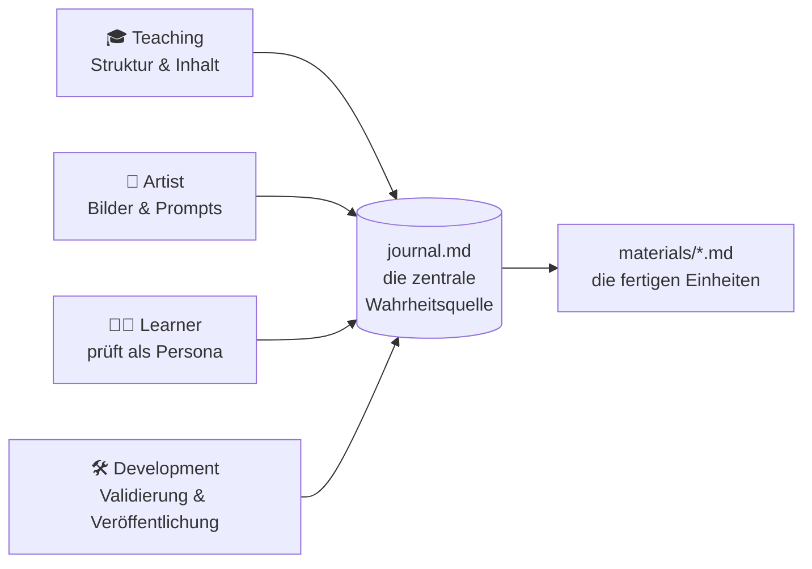

<!--
author:   Sebastian Zug, André Dietrich
email:    sebastian.zug@informatik.tu-freiberg.de
version:  0.1.0
language: de

comment:  Ein Blick hinter die Kulissen des Kurses „NIS2 Ready" — eine behutsame Einführung von Grund auf in LiaScript, den KI-Agenten-Workflow und den liaex-Exporter, für Leserinnen und Leser, die alle drei noch nicht kennen.

import: https://raw.githubusercontent.com/liaScript/mermaid_template/master/README.md
        https://raw.githubusercontent.com/LiaTemplates/LiveEdit-Embeddings/refs/tags/0.0.1/README.md

-->

[](https://liascript.github.io/course/?https://github.com/LiaPlayground/nis2/blob/main/about-liascript.md)

# Ein Blick hinter die Kulissen

                  {{0-1}}
************************************************

Den ersten Prototypen eines NIS2-Kurs kennen Sie bereits. Er ist interaktiv, barrierearm, in Lernplattformen einsetzbar und bleibt aktuell, während sich die nationale Umsetzung von NIS2 weiterentwickelt. All das geschieht aus einer einzigen Textdatei. Dieses Dokument erklärt, wie das möglich ist.

| Einheit | Direkt aufrufen |
|---------|-----------------|
| **1 — Willkommen & Warum NIS2 wichtig ist** | [](https://liascript.github.io/course/?https://github.com/LiaPlayground/nis2/blob/main/materials/1-welcome-why-nis2-matters/README.md) |
| **2 — Fallen Sie in den Anwendungsbereich?** | [](https://liascript.github.io/course/?https://github.com/LiaPlayground/nis2/blob/main/materials/2-are-you-in-scope-essential-vs-important/README.md) |
| **3 — Die 10 Maßnahmen, die Sie wirklich brauchen** | [](https://liascript.github.io/course/?https://github.com/LiaPlayground/nis2/blob/main/materials/3-the-10-measures-you-actually-need/README.md) |

> [!TIP]
> **Was aber ist die Geschichte dahinter?**

************************************************

                  {{1-2}}
************************************************

> Das Werkzeug, mit dem das Material erstellt wurde, heißt [**LiaScript**](https://liascript.github.io/). In den nächsten Abschnitten bauen wir Schritt für Schritt auf, was es ist, zeigen dann, wie dieser Kurs tatsächlich mit Hilfe von KI geschrieben wurde, und schließlich, wie aus einer einzigen Textdatei jedes Format wird, das eine Institution benötigt.
>
> 0. **Warum nicht einfach PowerPoint oder PDF?** — die Risse im gewohnten Vorgehen
> 1. **Was LiaScript ist** — gezeigt, nicht nur beschrieben, anhand dreierP einfacher Ideen
> 2. **Wie eine ganze Sprache wächst** — aus ein paar Satzzeichen
> 3. **LiaScript und KI** — wie dieser Kurs tatsächlich geschrieben wurde
> 4. **Der Exporter** — eine Textdatei, umgewandelt in jedes Format, das eine Institution braucht

************************************************

## 0 · Warum nicht einfach PowerPoint oder PDF?

Nehmen wir die Frage ernst, denn sie ist der richtige Ausgangspunkt. Stellen Sie sich den NIS2-Kurs auf die gewohnte Weise gebaut vor — als Foliensatz oder als PDF-Handout. Für viele Inhalte wäre das völlig in Ordnung. Doch sehen Sie sich an, was genau dieser Kurs leisten musste, und die Risse zeigen sich schnell.

**Stellen Sie sich diesen NIS2-Kurs als PowerPoint oder PDF vor. Vier Dinge, die er brauchte — und was mit jedem davon geschieht:**

<section>

| Der Kurs brauchte …                          | Als PowerPoint / PDF                                  |
|----------------------------------------------|-------------------------------------------------------|
| Eine **Live-Selbstbewertung** (Regler bewegen, Readiness-Score aktualisiert sich) | Unmöglich — ein statisches Bild eines Reglers; nichts rechnet |
| **Barrierearme Vorlesefunktion** für gemischtes, fachfremdes Personal | Bestenfalls nachgerüstet; PDFs sind bekanntlich schwer barrierefrei zu machen |
| In den **Lernplattformen** der Behörden (Moodle, ILIAS, …) laufen und Abschlüsse erfassen | Ein Foliensatz ist kein interaktives SCORM-Paket; keine echte Nachverfolgung |
| **Aktuell bleiben**, während sich die nationale NIS2-Umsetzung weiterentwickelt | Neue Datei, per E-Mail erneut versandt — bald ein Dutzend Versionen im Umlauf |

</section>

> [!NOTE] Der Kern dieses ganzen Dokuments
> Alles, was Sie im NIS2-Kurs gesehen haben — die Regler, das Live-Diagramm, die Quizze, die Vorlesefunktion — stammte aus einer einzigen Textdatei. Dieses Dokument erklärt von Grund auf, wie das möglich ist und warum es zählt. Kein technisches Vorwissen nötig.

## 1 · Was ist LiaScript?

Im Kern ist ein LiaScript-Kurs einfach eine Textdatei — die Art einfacher, gut lesbarer Schrift, die Sie in jedem Texteditor tippen würden, mit ein paar kleinen Formatierungszeichen wie einem Stern für ein **fettes** Wort oder einem Bindestrich für eine Liste. Den Kurs kann jeder in einem Texteditor öffnen — das Format bleibt offen und unter Ihrer Kontrolle. 

> **LiaScript ist einfacher Text — zum Leben erweckt durch drei Ideen:** 
> 
> - Trennung von Inhalt und Darstellung
> - Interaktivität als Sprachmerkmal
> - Erweiterbarkeit über ein Modulsystem

```markdown 
## 1 · Was ist LiaScript?

Im Kern ist ein LiaScript-Kurs einfach eine Textdatei — die Art einfacher, gut lesbarer Schrift, 
die Sie in jedem Texteditor tippen würden, mit ein paar kleinen Formatierungszeichen wie einem 
Stern für ein **fettes** Wort oder einem Bindestrich für eine Liste. Den Kurs kann jeder in einem 
Texteditor öffnen — das Format bleibt offen und unter Ihrer Kontrolle. 

> **LiaScript ist einfacher Text — zum Leben erweckt durch drei Ideen:** 
> 
> - Trennung von Inhalt und Darstellung
> - Interaktivität als Sprachmerkmal
> - Erweiterbarkeit über ein Modulsystem
```

### Idee 1 — Trennung von Inhalt und Darstellung

Sie schreiben, *was* Sie sagen möchten, und überlassen *wie es aussieht* der Darstellung. Dieselbe Datei wird zur scrollbaren Webseite, zum Foliensatz, zum PDF oder zum gesprochenen Hörbuch — die Darstellung wird zum Anzeigezeitpunkt gewählt, getrennt von Ihrem Text. Achten Sie im Rahmen unten darauf: Die Quelle ist reiner Inhalt — eine Überschrift, eine Liste, ein Satz — und dennoch wird sie als navigierbare Seite mit Inhaltsverzeichnis gerendert (und, auf Geräten, wo verfügbar, optional mit Vorlesefunktion).

**Die Quelle beschreibt Struktur und Bedeutung — die Darstellung entscheidet über das Aussehen.**

```markdown @embed.style(height: 480px; min-width: 100%; border: 1px solid #003399; border-radius: 8px)
# Trennung von Inhalt und Darstellung

Nirgends in diesem Text hat die Autorin oder der Autor etwas 
darüber geschrieben,  *wie* es aussehen soll.

Sie schreiben schlichten Inhalt wie diesen:

- eine Überschrift
- eine Liste
- ein **fettes** Wort

... und das Gerät der Lesenden entscheidet den Rest: heller
oder dunkler Modus, Folien- oder Scroll-Ansicht, am Bildschirm,
im Druck oder als Übersetzung.
```

> [!NOTE] Warum das zählt
> Das ist die erste Idee in einem Rahmen: Die Autorin bestimmte die Bedeutung, das Medium bestimmte das Aussehen.

### Idee 2 — Interaktivität: der Schritt von Markdown zu LiaScript

Genau hier *wird* Markdown zu LiaScript. Reines Markdown kann einen Text, eine Formel oder eine Tabelle startisch anzeigen. Mit LiaScript wird eine Tabelle durchsuchbar, ein Textfeld editierbar, ein Quiz interaktiv.

```markdown @embed.style(height: 480px; min-width: 100%; border: 1px solid #003399; border-radius: 8px)
# Von Markdown zu LiaScript

Reines Markdown gibt Ihnen eine Tabelle — nützlich, aber statisch:

| Bereich    | Abdeckung |
| ---------- | --------- |
| Governance | 40        |
| Schulung   | 55        |
| Technik    | 70        |

Dieselbe Frage in LiaScript — Klammern hinzufügen, und sie wird interaktiv:

Ist ein LiaScript-Kurs eine Textdatei? (ja / nein)

- [(X)] Ja
- [( )] Nein
```

> [!NOTE] Warum das zählt
> Weil Interaktion ein *Sprachmerkmal* ist, ist das Schreiben eines Quiz eine Frage der Zeichensetzung, nicht des Programmierens — kein JavaScript, kein Framework erforderlich. Das ist es, was interaktive OER überhaupt für Nicht-Programmierer schreibbar macht.

### Idee 3 — Sie ist erweiterbar

Die ersten beiden Ideen drehten sich ums Schreiben und Interagieren. Die dritte ist es, die LiaScript nahezu grenzenlos macht: Sie ist offen angelegt. Über die eingebauten Funktionen hinaus kann ein Kurs bei Bedarf spezialisierte Fähigkeiten hinzuladen — echten Programmcode ausführen, Text vorlesen, ein 3D-Modell darstellen, einen Schaltkreis zeichnen, Noten setzen. Nichts davon ist fest in die Sprache verdrahtet; es wird nur geladen, wenn ein Kurs es braucht.

**Ab Werk — und weit darüber hinaus:**

+ **Code ausführen** — Python, JavaScript, C++, R, SQL, ...
+ **Sprachausgabe** — beliebige Passagen vorlesen lassen (Barrierefreiheit)
+ **Daten speichern** — den Lernstand im Browser sichern
+ **3D-Modelle, Simulationen, Notenschrift, Schaltkreise und mehr**

> [!TIP] Wie die Erweiterungen funktionieren
> LiaScript nutzt ein leichtgewichtiges Plugin-System für fachspezifische Funktionen: Sie fügen im Kopf eine `import`-URL hinzu, und diese liefert die eigentliche Funktionalität — von ausführbarem Code bis zur 3D-Darstellung. Das Dokument bleibt eine Textdatei; die Fähigkeit reist mit ihr.

Hier ist das in Aktion. Der Rahmen unten ist ein eigenständiges LiaScript-Dokument, das ein Notenschrift-Template importiert — und aus wenigen Zeilen Text abspielbare Noten rendert. Nichts an Musik ist in LiaScript eingebaut; die `import`-Zeile hat es hereingeholt.

**Ein Live-Beispiel — ein importiertes Notations-Template macht aus Text abspielbare Noten:**

````markdown @embed.style(height: 600px; min-width: 100%; border: 1px solid #003399; border-radius: 8px)
<!--
import: https://raw.githubusercontent.com/liaTemplates/ABCjs/main/README.md
-->

# Der Browser als Plattform

__Ein importiertes Template__ — ein paar Zeilen Text werden zu Noten, die Sie ansehen und abspielen können:

``` abc
X:353
T: GLUECK AUF DER STEIGER KOEMMT
N: E1512
O: Europa, Mitteleuropa, Deutschland
R: Staende -, Bergmanns - Lied
M: 4/4
L: 1/16
K: G
| G8F4A4 | G8z8 | B8A4c4 | B8z4G2A2 | B4B4B4A2B2 | c4A3AA4
A2B2 | c4c4c4B2c2 | d4B3BB4A4 | G8F8 | G4e4d4c2A2 | B8A8 | G8z8
```
@ABCJS.eval
````

> [!NOTE] Warum das gerade für den öffentlichen Sektor zählt
> Erweiterbarkeit über textbasierte Importe bedeutet, dass ein Kurs alles erreicht, was ein Fachgebiet braucht — barrierefreie Vorlesefunktion, Datenschutz durch clientseitige Speicherung, fachspezifische Darstellung — ohne sich an den Funktionsumfang eines einzelnen Anbieters zu binden, und während er eine Textdatei bleibt, die auch in zehn Jahren noch öffnet.

---

## 2 · Wie eine ganze Sprache aus wenigen Zeichen wächst

Hier ist der Teil, der LiaScript leicht erlernbar macht: Es verlangt nicht, sich Hunderte von Befehlen zu merken. Es verwendet ein paar alltägliche Zeichen wieder — ein Ausrufezeichen und ein Fragezeichen — und kombiniert sie auf eine Weise, die Sie fast erraten können.

Denken Sie es sich so: Ein Ausrufezeichen **`!`** bedeutet *„etwas zeigen"*, und ein Fragezeichen **`?`** bedeutet *„etwas abspielen"*. Sobald Sie diese beiden kennen, liest sich der Rest der Tabelle von selbst — einschließlich der Zeile, in der Sie *beide* zugleich für ein Video verwenden (es zeigt **und** spielt ab).

<section>

| Zum Einbinden von …      | Sie schreiben | So liest man es       |
|--------------------------|---------------|-----------------------|
| **Bild**                 | ``     | ! = zeigen            |
| **Audio-Clip**           | `?[…](…)`     | ? = abspielen         |
| **Video**                | `!?[…](…)`    | zeigen **und** abspielen |
| **Ganze eingebettete Seite** | `??[…](…)` | alles hereinholen     |

</section>

Beachten Sie: Es gibt nichts auswendig zu lernen — die Zeichen *beschreiben*, was sie tun. Ein Video zeigt und spielt ab, also schreiben Sie beide Zeichen. Dieselbe „erratbare" Logik zieht sich durch die gesamte Sprache — deshalb kann man in ihr innerhalb eines Nachmittags produktiv werden, nicht erst nach einem Schulungskurs.

Und hier ist der beruhigende Teil — der Grund, warum nichts davon einschüchternd wirken sollte:

> [!TIP] Sie müssen diese Zeichen nicht einmal selbst lernen
> Weil die gesamte Sprache einfacher, konsistenter Text ist, kann eine KI-Assistenz sie für Sie schreiben. Sie beschreiben, was Sie wollen — „hier ein Quiz", „ein Diagramm dieser Zahlen", „dort ein Bild" — und sie erzeugt das korrekte LiaScript. Die Zeichen oben lohnt es sich zu *erkennen*, damit Sie das Ergebnis lesen und anpassen können, aber Sie müssen sie nie auswendig tippen. Genau darum geht es im nächsten Abschnitt.

## 3 · LiaScript, KI und Agenten

**Ein textbasierter Kurs ist das ideale Material für eine KI.** Ein Agent liest und schreibt ihn wie gewöhnlichen Text — genauso, wie er mit jedem anderen Text umgeht.

Dieser Kurs wurde nicht von einem einzelnen Chatbot in einem Rutsch geschrieben. Er wurde von einem kleinen System spezialisierter Agenten gebaut, jeder mit einer festgelegten Rolle, alle arbeiten rund um eine gemeinsame Datei.

<section>

Das **Teaching-Agent**-System, mit dem dieser Kurs gebaut wurde, koordiniert vier Rollen rund um eine einzige Projektdatei:



</section>

Die entscheidende Entwurfsentscheidung ist diese eine Datei in der Mitte. Jede Entscheidung — die Lernziele, das didaktische Konzept, die fiktiven Fallorganisationen, der Plan jeder Einheit — steckt in einer einzigen Markdown-Datei namens `journal.md`. Die Agenten tragen das Projekt nicht im Kopf; sie lesen und aktualisieren diese Datei. Das macht den gesamten Prozess nachvollziehbar und wiederholbar.

> [!NOTE] Spezifikationsgetrieben, nicht improvisiert
> Der Kurs wurde definiert, *bevor* er geschrieben wurde: zuerst Zielgruppe und Ziele, dann Didaktik, dann ein Plan je Einheit, und erst dann das eigentliche Material — jeder Schritt in `journal.md` festgehalten und gegen die vorherigen geprüft. Die KI beschleunigt die Arbeit; sie ersetzt nicht den Plan.

Und weil die Wahrheitsquelle einfacher Text ist, ist nichts davon an ein einzelnes KI-Werkzeug gebunden. Dieselbe Spezifikation erzeugt Konfigurationen für mehrere Assistenten — die Anbieterunabhängigkeit reicht bis nach ganz unten.

> [!TIP] Editor-unabhängig durch Konstruktion
> Dieselbe Agenten-Spezifikation läuft in Claude Code, GitHub Copilot, Cursor und anderen. Das Prinzip des einfachen Texts, das den *Kurs* von Bindung befreit, befreit auch den *Erstellungsprozess* davon.

---

## 4 · Eine Datei, viele Formate — der Exporter

Das letzte Werkzeug beantwortet die praktische Frage, die jede Institution irgendwann stellt: „Ein schöner Web-Kurs, aber unsere Lernplattform braucht SCORM", oder „Wir brauchen ein PDF fürs Archiv". Mit LiaScript bauen Sie nichts neu. Ein einziger Befehl verwandelt dieselbe Quelldatei in das Format, das Sie brauchen.

**`liaex` — der LiaScript-Exporter.** Dieselbe `.md`-Datei, umgewandelt in das Format, das die Situation erfordert:

<section>

| Sie brauchen …                   | Format        | Befehl (Skizze)                          |
|----------------------------------|---------------|------------------------------------------|
| Upload zu Moodle / ILIAS / OPAL  | SCORM 1.2/2004| `liaex -i README.md -f scorm2004`        |
| Ein druckbares / Archiv-Dokument | PDF           | `liaex -i README.md -f pdf`              |
| Eine E-Reader-Fassung            | ePub          | `liaex -i README.md -f epub`             |
| Ein Word-Dokument                | DOCX          | `liaex -i README.md -f docx`             |
| Eine selbst gehostete interaktive Seite | Web    | `liaex -i README.md -f web`             |
| Eine Offline-Mobil-App           | Android APK   | `liaex -i README.md -f android`          |
| Lern-Analytik                    | xAPI          | `liaex -i README.md -f xapi`             |

</section>

Beachten Sie, was das in einem Satz bedeutet: Das SCORM-Paket, das Ihre Lernplattform aufnimmt, das PDF in Ihrem Archiv und der interaktive Web-Kurs sind nicht drei getrennte Produkte, die gepflegt werden müssen. Sie sind drei Ansichten einer Textdatei. Beheben Sie einen Tippfehler einmal, exportieren Sie neu, und jedes Format ist korrigiert.

> [!IMPORTANT] Was „Bindung vermeiden" konkret bringt
> Eine Wahrheitsquelle, viele Auslieferungsformate, alle offen und standardbasiert (SCORM, xAPI, ePub, PDF). Die Quelle bleibt Ihre und ist portabel, unabhängig vom Export-Knopf einer einzelnen Plattform — und jedes Dokument in diesem Repository wurde mit genau diesem Exporter geprüft.

---

## In einem Satz

Hier also das ganze Argument, verdichtet. Alles, was Sie im NIS2-Kurs gesehen haben — und alles in diesem Dokument — ist eine Textdatei, erweitert um eine kleine, konsistente Grammatik, geschrieben mit Hilfe von KI-Agenten und in jedes Format exportierbar, das eine Institution braucht. Das ist das Argument für LiaScript: keine Plattform, die man übernimmt, sondern eine Textdatei, die man behält.

> Ein LiaScript-Kurs ist **eine Textdatei, die vollständig Ihnen gehört** — mit einer kleinen, konsistenten Grammatik für Interaktion, einem Erstellungsprozess, den KI beschleunigen kann, und einem Exporter, der jedes wichtige Format ohne Bindung erreicht.
>
> Der NIS2-Kurs nebenan ist der Beweis. Dieses Dokument ist die Erklärung.

**Ein kurzer Check — was hat dieses Dokument eigentlich behauptet?**

- [[X]] Ein LiaScript-Kurs ist eine Textdatei
- [[X]] Interaktion ist ein Sprachmerkmal, kein Plugin
- [[X]] Eine Quelldatei exportiert in viele Formate
- [[ ]] Man braucht einen proprietären Editor und einen Server, damit es läuft
***********************************************

Die ersten drei sind der ganze Kern; das letzte ist genau das, was LiaScript vermeidet — eine gewöhnliche Textdatei, im Browser geöffnet, ist alles, was es braucht.

***********************************************
