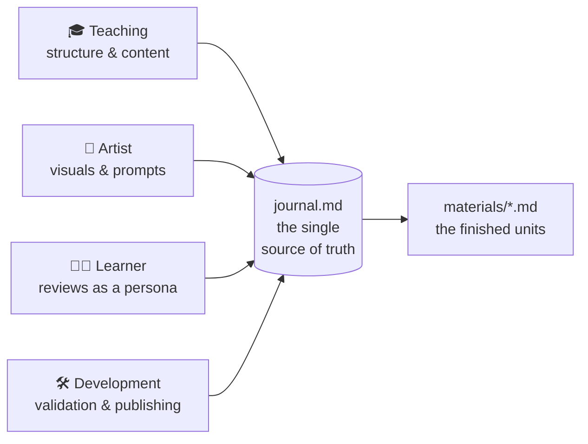

<!--
author:   Sebastian Zug, André Dietrich
email:    sebastian.zug@informatik.tu-freiberg.de
version:  0.1.0
language: en

comment:  Behind the scenes of the "NIS2 Ready" course — a gentle, from-scratch introduction to LiaScript, the AI agent workflow, and the liaex exporter, for readers new to all three.

import: https://raw.githubusercontent.com/liaScript/mermaid_template/master/README.md
        https://raw.githubusercontent.com/LiaTemplates/LiveEdit-Embeddings/refs/tags/0.0.1/README.md

-->


# Behind the Scenes

> [!IMPORTANT]
> **You've seen the NIS2 course. Now: the story behind it.**
>
> You have just seen a training course on the NIS2 directive. Before we look at how it was made, one honest question — the kind anyone responsible for training actually asks: why go to any trouble at all? 

---

      {{1}}
> The tool is called [**LiaScript**](https://liascript.github.io/). Over the next sections we'll build up what it is in plain terms, then show how the whole course was actually written with the help of AI, and finally how one text file becomes every format an institution might need.
>
> 0. **Why not just PowerPoint or PDF?** — the cracks in the ordinary approach
> 1. **What LiaScript is** — shown, not just described, through three simple ideas
> 2. **How a whole language grows** from a couple of punctuation marks
> 3. **LiaScript and AI** — how this course was actually written
> 4. **The exporter** — one text file, turned into every format an institution needs


## 0 · Why Not Just PowerPoint or PDF?

Let's take that seriously, because it's the right starting point. Picture the NIS2 course built the ordinary way — as a slide deck or a PDF handout. For a lot of material, that would be perfectly fine. But look at what this particular course actually needed to do, and the cracks show quickly.

**Imagine this NIS2 course as a PowerPoint or a PDF. Four things it needed — and what happens to each:**

<section>

| The course needed…                          | As PowerPoint / PDF                                  |
|---------------------------------------------|-----------------------------------------------------|
| A **live self-assessment** (move a slider, see your readiness score update) | Impossible — a static image of a slider; nothing computes |
| **Read-aloud accessibility** for mixed, non-expert staff | Bolt-on at best; PDFs are notoriously hard to make accessible |
| To run inside each agency's **learning system** (Moodle, ILIAS, …) and track completion | A slide deck is not an interactive SCORM package; no real tracking |
| To **stay current** as national NIS2 implementation evolves | New file, re-sent by email — soon a dozen versions in circulation |

</section>

> [!NOTE] The point of this whole document
> Everything you saw in the NIS2 course — the sliders, the live chart, the quizzes, the read-aloud narration — came from a single plain-text file. This document explains, from scratch, how that is possible and why it matters. No technical background assumed.

## 1 · What Is LiaScript?

At its heart, LiaScript is just plain text — the kind of simple, readable writing you'd type in any text editor, with a few small formatting marks like a star for a bold word or a dash for a list. That's the whole foundation. A course is an ordinary text file that any editor can open and anyone can read and edit — the format stays open and under your control. What turns that plain text into a living, interactive course is three simple ideas — and rather than describe them, we'll let you watch each one happen.

**LiaScript is plain text — brought to life by three ideas.** Each one appears below as a live example: on top the plain text an author writes, underneath, that very same text running as an interactive page. You don't need to change anything — just look at both halves.

```markdown
# 1 · What Is LiaScript?

At its heart, LiaScript is just plain text — the kind of simple, 
readable writing you'd type in any text editor, with a few small 
...
```

### Idea 1 — Separation of content and presentation

You write *what* you want to say, and leave *how it looks* to the display. The same file becomes a scrollable webpage, a slide deck, a PDF, or a spoken audiobook — the presentation is chosen at display time, separate from your text. In the frame below, notice: the source is pure content — a heading, a list, a sentence — yet it renders as a navigable page with a table of contents (and, on devices where it's available, optional read-aloud).

**The source describes structure and meaning — the rendering decides the looks.**

```markdown @embed.style(height: 480px; min-width: 100%; border: 1px solid #003399; border-radius: 8px)
# Separation of Content and Presentation

Nowhere in this text did the author write anything about *how* it should look.

You write plain content like this:

- a heading
- a list
- a **bold** word

...and the reader's device decides the rest: light or dark mode, a slide view or a scroll view, on screen or in print.

## A second slide

The same file becomes a webpage, a presentation, and a PDF — from one source.
```

That is the first idea in one frame: the author controlled meaning, the medium controlled appearance.

> [!NOTE] Why this matters
> Separation of content and presentation is what lets one source file serve every channel — and what makes the text survive when today's tools are gone.

### Idea 2 — Interactivity: the step from Markdown to LiaScript

This is the exact point where Markdown *becomes* LiaScript. Plain Markdown can show a question — but it is just text; nothing happens when you answer. Add a pair of brackets, and the same question becomes a real, checkable quiz. Watch the frame: the first question is inert Markdown, the second is LiaScript. One small piece of punctuation is the whole difference.

**Add brackets, and static text becomes interaction. That is the transition.**

```markdown @embed.style(height: 480px; min-width: 100%; border: 1px solid #003399; border-radius: 8px)
# From Markdown to LiaScript

Plain Markdown gives you a table — useful, but static:

| Area       | Coverage |
| ---------- | -------- |
| Governance | 40       |
| Training   | 55       |
| Technical  | 70       |

And a question — as plain text, nothing happens when you answer:

> Is a LiaScript course a plain text file? (yes / no)

The same question in LiaScript — add brackets, and it becomes interactive:

- [(X)] Yes
- [( )] No
```

That quiz worked the moment it was written — and it is written the same way you'd write the table above it: with a little punctuation, not a line of code. Interactivity is not a plugin bolted onto Markdown; in LiaScript it is part of the language itself.

> [!NOTE] Why this matters
> Because interaction is a *language feature*, writing a quiz is a matter of punctuation, not programming — no JavaScript or framework required. That is what makes interactive OER writable by non-programmers.

### Idea 3 — It is extendable

The first two ideas were about writing and interacting. The third is what gives LiaScript almost no ceiling: it is open-ended. Beyond the built-in features, a course can pull in specialized capabilities on demand — run real program code, read text aloud, render a 3D model, draw a circuit, typeset music. None of it is hard-wired into the language; it is loaded only when a course needs it.

**Out of the box, and far beyond it:**

+ **Run code** — Python, JavaScript, C++, R, SQL, ...
+ **Text-to-speech** — have any passage read aloud (accessibility)
+ **Persist data** — store the learner's progress in the browser
+ **3D models, simulations, musical notation, circuits, and more**

The mechanism is simple and, again, just plain text: a single `import` line names a URL that provides the extra capability. The course declares what it needs, and the browser fetches it on the spot — installation and package managers stay out of the picture.

> [!TIP] How the extensions work
> LiaScript uses a lightweight plugin system for domain-specific features: you add an `import` URL in the header, and it supplies the actual functionality — from executable code to 3D rendering. The document stays a plain text file; the capability travels with it.

Here is that in action. The frame below is a self-contained LiaScript document that imports a music-notation template — and renders playable sheet music from a few lines of text. Nothing about music is built into LiaScript; the `import` line brought it in.

**A live example — an imported notation template turns text into playable sheet music:**

````markdown @embed.style(height: 600px; min-width: 100%; border: 1px solid #003399; border-radius: 8px)
<!--
import: https://raw.githubusercontent.com/liaTemplates/ABCjs/main/README.md
-->

# The Browser as a Platform

__An imported template__ — a few lines of text become musical notation you can view and play:

``` abc
X:353
T: GLUECK AUF DER STEIGER KOEMMT
N: E1512
O: Europa, Mitteleuropa, Deutschland
R: Staende -, Bergmanns - Lied
M: 4/4
L: 1/16
K: G
| G8F4A4 | G8z8 | B8A4c4 | B8z4G2A2 | B4B4B4A2B2 | c4A3AA4
A2B2 | c4c4c4B2c2 | d4B3BB4A4 | G8F8 | G4e4d4c2A2 | B8A8 | G8z8
```
@ABCJS.eval
````

Runnable code, read-aloud text, 3D scenes, sheet music — none of it bloats the core language, and all of it is one `import` line away. Content over layout, interaction as a language feature, and open-ended extendability: those three ideas, which you just watched rather than read, are the whole of LiaScript. Everything after this is one of them, made bigger.

> [!NOTE] Why this matters for the public sector specifically
> Extendability with plain-text imports means a course reaches whatever a subject needs — accessibility read-aloud, data protection through client-side storage, domain-specific rendering — without locking into any one vendor's feature set, and while staying a text file that still opens in ten years.

---

## 2 · How a Whole Language Grows From a Few Symbols

Here is the part that makes LiaScript easy to learn: it doesn't ask you to memorize hundreds of commands. It reuses a couple of everyday symbols — an exclamation mark and a question mark — and combines them in ways you can almost guess.

Think of it like this: an exclamation mark **`!`** means *"show something"*, and a question mark **`?`** means *"play something"*. Once you know those two, the rest of the table reads itself — including the row where you use *both* at once for a video (it shows **and** plays).

<section>

| To include a…            | You write | Read it as        |
|--------------------------|-----------|-------------------|
| **Image**                | `` | ! = show          |
| **Audio clip**           | `?[…](…)` | ? = play          |
| **Video**                | `!?[…](…)`| show **and** play |
| **Whole embedded page**  | `??[…](…)`| bring it all in   |

</section>

Notice there is nothing to memorize: the symbols *describe* what they do. A video shows and plays, so you write both marks. That same "guess-able" logic runs through the entire language — which is why someone can become productive in it within an afternoon, not a training course.

And here is the reassuring part — the reason none of this should feel intimidating:

> [!TIP] You don't even need to learn these symbols yourself
> Because the whole language is simple, consistent plain text, an AI assistant can write it for you. You describe what you want — "a quiz here", "a chart of these numbers", "an image there" — and it produces the correct LiaScript. The symbols above are worth *recognizing*, so you can read and tweak the result, but you never have to type them from memory. That is exactly what the next section is about.

## 3 · LiaScript, AI, and Agents

**A plain-text course is the ideal material for an AI to work with.** An agent reads and writes it as ordinary text — the same way it handles any other writing.

This course was not written by a single chatbot in one sitting. It was built by a small system of specialized agents, each with a defined role, all working around one shared file.

<section>

The **Teaching-Agent** system used to build this course coordinates four roles around a single project file:



</section>

The key design choice is that single file in the middle. Every decision — the learning objectives, the didactic concept, the fictional case organizations, each unit's plan — lives in one Markdown file called `journal.md`. The agents don't hold the project in their heads; they read and update that file. That makes the whole process inspectable and repeatable.

> [!NOTE] Spec-driven, not improvised
> The course was defined *before* it was written: audience and objectives first, then didactics, then a per-unit plan, and only then the actual material — each step recorded in `journal.md` and checked against the previous ones. The AI accelerates the work; it does not replace the plan.

And because the source of truth is plain text, none of this is locked to one AI tool either. The same specification builds configurations for several assistants — the vendor-independence goes all the way down.

> [!TIP] Editor-agnostic by construction
> The same agent specification runs in Claude Code, GitHub Copilot, Cursor, and others. The plain-text principle that frees the *course* from lock-in frees the *authoring process* from it too.

---

## 4 · One File, Many Formats — the Exporter

The last tool answers the practical question every institution eventually asks: "that's a nice web course, but our learning-management system needs SCORM," or "we need a PDF for the archive." With LiaScript, you don't rebuild anything. One command turns the same source file into whatever format you need.

**`liaex` — the LiaScript exporter.** The same `.md` file, transformed into the format the situation requires:

<section>

| You need…                        | Format        | Command (sketch)                         |
|----------------------------------|---------------|------------------------------------------|
| Upload to Moodle / ILIAS / OPAL  | SCORM 1.2/2004| `liaex -i README.md -f scorm2004`        |
| A printable / archival document  | PDF           | `liaex -i README.md -f pdf`              |
| An e-reader version              | ePub          | `liaex -i README.md -f epub`             |
| A Word document                  | DOCX          | `liaex -i README.md -f docx`             |
| A self-hosted interactive site   | Web           | `liaex -i README.md -f web`             |
| An offline mobile app            | Android APK   | `liaex -i README.md -f android`          |
| Learning analytics               | xAPI          | `liaex -i README.md -f xapi`             |

</section>

Notice what this means in one sentence: the SCORM package your LMS ingests, the PDF in your archive, and the interactive web course are not three separate products to maintain. They are three views of one text file. Fix a typo once, re-export, and every format is corrected.

> [!IMPORTANT] What "avoiding lock-in" concretely buys you
> One source of truth, many delivery formats, all open and standards-based (SCORM, xAPI, ePub, PDF). The source stays yours and portable, independent of any single platform's export button — and every document in this repository was validated with exactly this exporter.

---

## In One Sentence

So here is the whole argument, compressed. Everything you saw in the NIS2 course — and everything in this document — is one plain-text file, extended by a small consistent grammar, written with the help of AI agents, and exportable to any format an institution needs. That is the case for LiaScript: not a platform you adopt, but a text file you keep.

> A LiaScript course is **a plain text file you fully own** — with a small, consistent grammar for interaction, an authoring process that AI can accelerate, and an exporter that reaches every major format without lock-in.
>
> The NIS2 course next door is the proof. This document is the explanation.

**A quick check — what did this document actually claim?**

- [[X]] A LiaScript course is a plain text file
- [[X]] Interaction is a language feature, not a plugin
- [[X]] One source file exports to many formats
- [[ ]] You need a proprietary editor and a server to run it
*************

Exactly the point: none of it needs a proprietary tool or a backend. That is the whole idea.

*************
