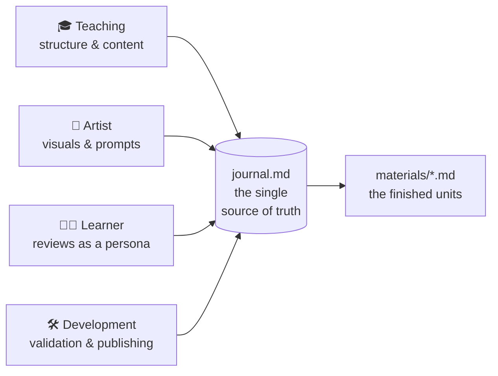

<!--
author:   Sebastian Zug, André Dietrich
email:    sebastian.zug@informatik.tu-freiberg.de
version:  0.1.0
language: en
narrator: English Female
mode:     Presentation

comment:  How this NIS2 course was built — the three tools behind it: LiaScript, an AI agent system, and the liaex exporter. A companion document to the "NIS2 Ready" course.

import: https://raw.githubusercontent.com/liaScript/mermaid_template/master/README.md
        https://raw.githubusercontent.com/LiaTemplates/LiveEdit-Embeddings/refs/tags/0.0.1/README.md

@style
.pillar-grid {
  display: grid;
  grid-template-columns: repeat(3, 1fr);
  gap: 1rem;
  margin: 1rem 0;
}
@media (max-width: 720px) {
  .pillar-grid { grid-template-columns: 1fr; }
}
.pillar {
  border: 1px solid #d7e0ea;
  border-top: 4px solid #003399;
  border-radius: 8px;
  padding: 1rem;
  background: #ffffff;
}
@end
-->

# How This Course Was Built

    --{{0}}--
The NIS2 course next to this document is the finished product. This document is about the other half of the story: the tools that produced it, and why they were chosen. Three of them — a markup language called LiaScript, an AI agent system, and an exporter — and a single idea running through all three: an interactive course should be nothing more than a plain text file you fully control.

> **A companion to "NIS2 Ready."**
>
> Everything you saw in that course — the sliders, the live chart, the quizzes, the diagrams — is plain text in a Markdown file. No app, no server, no editor lock-in. This document explains how, in four steps:
>
> 1. **What LiaScript is** — and the three ideas behind it
> 2. **How a whole language grows** from `!` → `?` → `!?` → …
> 3. **LiaScript, AI, and agents** — how this course was actually written
> 4. **The exporter** — one text file, many formats, no lock-in

---

## 1 · What Is LiaScript?

    --{{0}}--
Start from the smallest possible claim. LiaScript is Markdown — the same plain-text formatting you already know from README files and chat apps — with a handful of extensions. That's it. If you can write a bulleted list and a bold word, you can already write a LiaScript course.

**LiaScript is Markdown — plus a few extensions.**

Nothing you write is hidden in a proprietary file format. A course is a `.md` text file. You can read it, diff it in Git, and open it in any editor.

    --{{1}}--
The interesting part is not the syntax. It's the three design decisions underneath it — the reason a plain text file can behave like an interactive application.

      {{1}}
<section>

<div class="pillar-grid">

<div class="pillar">

### ① Content, not layout

You write **what** you want to say. How it looks — slides, fonts, dark mode, text-to-speech — is decided at display time, by the reader's device. The same file is a webpage, a slide deck, a PDF, and an audiobook.

</div>

<div class="pillar">

### ② Interaction is built in

A quiz, a slider, a chart is not a plugin you install. It is a **language feature** — as basic as a heading. Interactivity is part of the grammar, not bolted on afterwards.

</div>

<div class="pillar">

### ③ It runs in the browser

Code executes, charts render, media plays — all client-side. **No server, no backend, no account.** A course is a file; open it and it works, offline included.

</div>

</div>

</section>

    --{{2}}--
Keep those three in mind — content over layout, interaction as a language feature, browser-native execution. Every concrete feature in the next sections is just one of these three ideas made visible.

      {{2}}
> [!NOTE] Why this matters for the public sector specifically
> "A course is a text file you fully control" is not a slogan — it is the answer to vendor lock-in, to accessibility requirements, and to "can we still open this in ten years?" A plain-text OER outlives any single tool that made it.

**On the left, plain text. Below it, that same text — running.** Try the slider and the quiz inside the frame.

```markdown @embed.style(height: 520px; min-width: 100%; border: 1px solid #003399; border-radius: 8px)
# A miniature interactive page

    --{{0}}--
Everything here is plain text — and yet it responds to you.

How many of the NIS2 measures are in place at your organization?

<script input="range" value="4" min="0" max="10" step="1" output="Have">@input</script> in place

<script output="Pct">
"HTML: <b>" + Math.round(@input(`Have`) / 10 * 100) + "% coverage</b>"
</script>

Which of these is true of this page?

- [(X)] It is written in plain text
- [( )] It needs a special server to run
```

    --{{1}}--
Read that again with the three ideas in mind. Content, not layout — you wrote *what*, not *how it looks*. Interaction built in — the slider is a language feature, not a plugin. Browser-native — it computed that percentage with no server anywhere. Three ideas, one small block of text, one interactive page.

      {{1}}
> [!TIP] This is the whole pitch in one frame
> If you take one image away from this document, take this one: the box you just used is nothing but the text printed above it. That is LiaScript.

---

## 2 · How a Whole Language Grows From a Few Symbols

    --{{0}}--
Here is the part that makes LiaScript easy to learn: it doesn't ask you to memorize hundreds of commands. It takes the handful of symbols Markdown already has and extends them by analogy. Learn one, and the next three are obvious. Watch how far two characters — the exclamation mark and the question mark — will take us.

**You already know one Markdown symbol.** A link is `[text](url)`. Everything below is that same bracket, with a prefix that says *what kind* of thing it is.

    --{{1}}--
Add an exclamation mark in front, and the link becomes an image. This is standard Markdown — the starting point everyone already knows.

      {{1}}
<section>

**`` — an image.** The `!` means "show this."


</section>

    --{{2}}--
Now swap the exclamation mark for a question mark. If `!` means "show," then `?` means "play." Same bracket, one character different — and now it's audio.

      {{2}}
<section>

**`?[ ]( )` — audio.** The `?` means "play this."

```text
?[Narration](path/to/audio.mp3)
```

</section>

    --{{3}}--
And what is a video? It shows *and* it plays. So — naturally — you combine both symbols. Nobody has to teach you this; you can guess it.

      {{3}}
<section>

**`!?[ ]( )` — video.** It shows *and* plays, so you write both symbols.

```text
!?[An intro video](path/to/intro.mp4)
```

</section>

    --{{4}}--
Two question marks, and the bracket embeds a whole external resource — a live map, a repository, another interactive page. The pattern never breaks: the meaning is always readable from the symbols.

      {{4}}
<section>

**`??[ ]( )` — embed an external resource.** Two question marks: "bring the whole thing in."

</section>

    --{{5}}--
The same idea reaches interaction. A pair of round brackets is a single choice; double square brackets are multiple choice. You are not learning a quiz *engine* — you are learning a punctuation rule.

      {{5}}
<section>

**Interaction follows the same logic** — brackets, again:

Single choice — `[( )]` empty, `[(X)]` correct:

- [( )] Vendor lock-in is unavoidable
- [(X)] A plain-text course avoids it

Multiple choice — double brackets `[[ ]]`:

- [[X]] Runs in the browser
- [[X]] Is a plain text file
- [[ ]] Requires a special server

</section>

    --{{6}}--
And at the far end of the same path sits everything you met in the NIS2 course — a text input, a slider, a reactive calculation, a chart. Same grammar, all the way up. That is the whole trick: not a big language to memorize, but a small, consistent one that scales from a bold word to a live chart.

      {{6}}
> [!TIP] One consistent idea, from `**bold**` to a live chart
> `!` show · `?` play · `!?` show + play · `??` embed · `[( )]` choose one · `[[ ]]` choose many · `<script>` compute. You don't memorize a toolbox — you learn a grammar, and it scales.

---

## 3 · LiaScript, AI, and Agents

    --{{0}}--
Here is the second reason a plain-text format matters — one that only became obvious recently. Because a LiaScript course is just text, it is exactly the kind of thing a language model can read, write, and revise. There is no proprietary editor to automate, no binary file to parse. The medium an AI works in best is plain text — and that is precisely what LiaScript is.

**A plain-text course is the ideal material for an AI to work with.** No binary format, no editor API — just text an agent can read and write directly.

    --{{1}}--
This course was not written by a single chatbot in one sitting. It was built by a small system of specialized agents, each with a defined role, all working around one shared file.

      {{1}}
<section>

The **Teaching-Agent** system used to build this course coordinates four roles around a single project file:



</section>

    --{{2}}--
The key design choice is that single file in the middle. Every decision — the learning objectives, the didactic concept, the fictional case organizations, each unit's plan — lives in one Markdown file called `journal.md`. The agents don't hold the project in their heads; they read and update that file. That makes the whole process inspectable and repeatable.

      {{2}}
> [!NOTE] Spec-driven, not improvised
> The course was defined *before* it was written: audience and objectives first, then didactics, then a per-unit plan, and only then the actual material — each step recorded in `journal.md` and checked against the previous ones. The AI accelerates the work; it does not replace the plan.

    --{{3}}--
And because the source of truth is plain text, none of this is locked to one AI tool either. The same specification builds configurations for several assistants — the vendor-independence goes all the way down.

      {{3}}
> [!TIP] Editor-agnostic by construction
> The same agent specification runs in Claude Code, GitHub Copilot, Cursor, and others. The plain-text principle that frees the *course* from lock-in frees the *authoring process* from it too.

---

## 4 · One File, Many Formats — the Exporter

    --{{0}}--
The last tool answers the practical question every institution eventually asks: "that's a nice web course, but our learning-management system needs SCORM," or "we need a PDF for the archive." With LiaScript, you don't rebuild anything. One command turns the same source file into whatever format you need.

**`liaex` — the LiaScript exporter.** The same `.md` file, transformed into the format the situation requires:

<section>

| You need…                        | Format        | Command (sketch)                         |
|----------------------------------|---------------|------------------------------------------|
| Upload to Moodle / ILIAS / OPAL  | SCORM 1.2/2004| `liaex -i README.md -f scorm2004`        |
| A printable / archival document  | PDF           | `liaex -i README.md -f pdf`              |
| An e-reader version              | ePub          | `liaex -i README.md -f epub`             |
| A Word document                  | DOCX          | `liaex -i README.md -f docx`             |
| A self-hosted interactive site   | Web           | `liaex -i README.md -f web`             |
| An offline mobile app            | Android APK   | `liaex -i README.md -f android`          |
| Learning analytics               | xAPI          | `liaex -i README.md -f xapi`             |

</section>

    --{{1}}--
Notice what this means in one sentence: the SCORM package your LMS ingests, the PDF in your archive, and the interactive web course are not three separate products to maintain. They are three views of one text file. Fix a typo once, re-export, and every format is corrected.

      {{1}}
> [!IMPORTANT] This is what "no lock-in" concretely buys you
> One source of truth, many delivery formats, all open and standards-based (SCORM, xAPI, ePub, PDF). You are never trapped in a single platform's export button — and every document in this very repository was validated with exactly this exporter.

---

## In One Sentence

    --{{0}}--
So here is the whole argument, compressed. Everything you saw in the NIS2 course — and everything in this document — is one plain-text file, extended by a small consistent grammar, written with the help of AI agents, and exportable to any format an institution needs. That is the case for LiaScript: not a platform you adopt, but a text file you keep.

> A LiaScript course is **a plain text file you fully own** — with a small, consistent grammar for interaction, an authoring process that AI can accelerate, and an exporter that reaches every major format without lock-in.
>
> The NIS2 course next door is the proof. This document is the explanation.

**A quick check — what did this document actually claim?**

- [[X]] A LiaScript course is a plain text file
- [[X]] Interaction is a language feature, not a plugin
- [[X]] One source file exports to many formats
- [[ ]] You need a proprietary editor and a server to run it
*************

Exactly the point: none of it needs a proprietary tool or a backend. That is the whole idea.

*************
