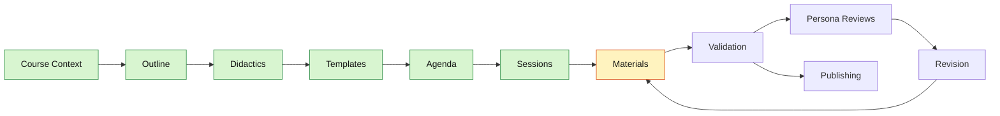
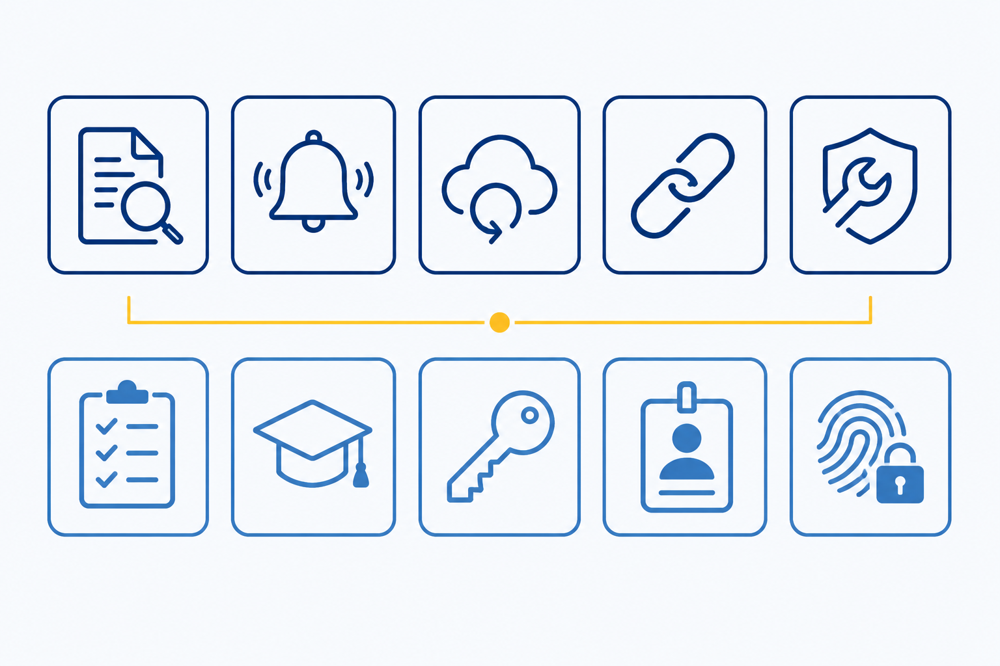

<!--
color: <span style="display:inline-block;width:1.5rem;height:1.5rem;background-color:@0;border:1px solid #ccc;border-radius:2px;vertical-align:middle;"></span> `@0`

comment:  The project's own planning journal for "NIS2 Ready" — course context, didactics, visual identity, agenda, session drafts, validation state, and agent memory, kept live throughout development. Read this to see how the course was actually built, not just the finished result.

import: https://raw.githubusercontent.com/liaScript/mermaid_template/master/README.md

@style
.dashboard {
  margin: 1.5rem 0 2rem;
  padding: 1rem;
  border: 1px solid #d7e0ea;
  border-radius: 8px;
  background: #f8fafc;
}

.dashboard-grid {
  display: flex;
  flex-wrap: wrap;
  gap: 1rem;
}

.dashboard-card {
  flex: 1 1 260px;
  min-width: 240px;
  padding: 1rem;
  border: 1px solid #d7e0ea;
  border-radius: 8px;
  background: #ffffff;
}

.dashboard-card-wide {
  flex-basis: 100%;
}

.dashboard-status {
  display: inline-block;
  padding: 0.18rem 0.5rem;
  border-radius: 999px;
  font-weight: 700;
}

.dashboard-status-done { background: #d8f5d0; color: #1b5e20; }
.dashboard-status-current { background: #fff3bf; color: #7a4d00; }
.dashboard-status-blocked { background: #ffe3e3; color: #8a1f1f; }

.dashboard table {
  width: 100%;
  border-collapse: collapse;
}

.dashboard th,
.dashboard td {
  padding: 0.35rem 0.45rem;
  border-bottom: 1px solid #e5edf5;
  text-align: left;
}

@media (max-width: 600px) {
  .dashboard-card {
    flex-basis: 100%;
    min-width: 0;
  }
}
@end
-->

# NIS2 Ready

## Dashboard

<article class="dashboard">

_Generated from the project sections below. Do not edit manually._

<div class="dashboard-grid">

<div class="dashboard-card">

### Current State

__Current step:__ <span class="dashboard-status dashboard-status-current">Materials in progress</span>

__Course validation:__ <span class="dashboard-status dashboard-status-blocked">not run</span>

__Sessions complete:__ 0 / 6 (6 / 6 skeletons, 4 materials drafted)

__Last updated:__ 2026-07-06

</div>

<div class="dashboard-card">

### Next Commands

1. `:promote-session 5 lecture` (draft full material for Unit 5's skeleton)
2. `:validate-course 4 lecture` (spot-check Unit 4's new Mermaid timeline and significance test)
3. `:promote-session 6 exercise` (draft full material for Unit 6's skeleton, incl. the Readiness Score calculator)

</div>

<div class="dashboard-card">

### Quality State

<!-- data-type="none" -->
| Area | State |
| --- | --- |
| Course context | <span class="dashboard-status dashboard-status-done">done</span> |
| Templates | <span class="dashboard-status dashboard-status-done">done</span> |
| Materials | <span class="dashboard-status dashboard-status-current">4 / 6 (6 / 6 skeletons)</span> |
| Course validation | <span class="dashboard-status dashboard-status-blocked">not run</span> |
| Persona reviews | <span class="dashboard-status dashboard-status-current">optional</span> |

</div>

<div class="dashboard-card dashboard-card-wide">

### Workflow Map



</div>

<div class="dashboard-card dashboard-card-wide">

### Session Progress

| # | Title | Type | Skeleton | Material | Done |
|---|-------|------|----------|----------|------|
| 1 | Welcome & Why NIS2 Matters | lecture | ✅ | ✅ | ❌ |
| 2 | Are You in Scope? Essential vs. Important Entities | exercise | ✅ | ✅ | ❌ |
| 3 | The 10 Measures You Actually Need | exercise | ✅ | ✅ | ❌ |
| 4 | Handling & Reporting Incidents | lecture | ✅ | ✅ | ❌ |
| 5 | Who's Responsible? Governance & Consequences | lecture | ✅ | ❌ | ❌ |
| 6 | Your NIS2 Readiness Score | exercise | ✅ | ❌ | ❌ |

</div>

<div class="dashboard-card">

### Open Blockers

None — all six unit skeletons are complete. Units 1–4 have full material drafted, each in its own folder with per-session assets (`materials/1-welcome-why-nis2-matters/README.md`, `materials/2-are-you-in-scope-essential-vs-important/README.md`, `materials/3-the-10-measures-you-actually-need/README.md`, `materials/4-handling-reporting-incidents/README.md`); Units 5–6 still need `:promote-session`. Unit 4 has one newly inserted `<!-- IMAGE -->` placeholder (hero scene) not yet handed to Artist-Agent. No `:validate-course` run yet. Logo not yet generated (`:create-logo`).

</div>

<div class="dashboard-card">

### Quick Links

[Course Context](#course-context) · [Outline](#outline) · [Didactics](#didactics) · [Visual Identity](#visual-identity) · [Templates](#templates) · [Agenda](#agenda) · [Sessions](#sessions) · [Validation](#validation)

</div>

</div>
</article>

---

## Course Context

* __Course Type:__
  1. Type: self-paced
  2. Working Title: NIS2 Ready — Cybersicherheits-Compliance für öffentliche Verwaltung & kritische Infrastruktur

* __Terminology:__
  1. sessions-called: unit
  2. lectures-called: module

* __Course Profile:__
  1. Persona type: coach
  2. Agenda required: yes
  3. Pacing: learner-driven
  4. Assessment defaults: self-check quizzes

* __File Structure:__
  1. Mode: multi-file — see `data/file-structure-modes.md`
  2. Session folder naming: `{number}-{slug}` (e.g. `materials/1-welcome-why-nis2-matters/`)

* __Conventions & Standards:__
  1. Language: de
  2. Tone: formal
  3. Person: Sie
  4. Accessibility: required
  5. NIS2 terminology: use the official German Amtsfassung of Directive (EU) 2022/2555 — *wesentliche Einrichtung* (essential entity), *wichtige Einrichtung* (important entity), *erheblicher Sicherheitsvorfall* (significant incident), *Risikomanagementmaßnahmen* (risk-management measures), *Anhang I/II* (Annex I/II), *Leitungsorgan* (management body), *Sicherheit der Lieferkette* (supply-chain security). Verbatim quotes from the directive text stay in English and are marked as quotes.

* __LiaScript conventions:__
  - Knowledge checks: native quiz syntax (single/multi-choice, text, matrix) — no template needed
  - Tables: native Markdown tables — no template needed
  - Checklists: native multi-choice (`[[X]]`) or survey-matrix syntax — no template needed
  - Videos: native `!?[title](url)` embedding — no template needed
  - Diagrams: Mermaid template (already imported), see `## Templates` → `### Mermaid`
  - Interactive calculator (e.g. "NIS2 Readiness Score"): native reactive `<script input=... output=...>` pattern, see `## Templates` → `### Reactive JavaScript Inputs`; `<lia-chart>` charting confirmed to work natively (no extra import). Verified working in Unit 3 (`materials/3-the-10-measures-you-actually-need/README.md`): two `range` sliders driving a live-recomputing `<lia-chart>` bar chart. Reactive `@input(`Name`)` reads only resolve **inside** a `<script>` block — never place a bare `@input(...)` as standalone markdown text (it will not update). A slider shows its own value via `@input` returned inside its own `<script ...>@input</script>` tag; no separate text reference is needed.
  - __Interactive-element marker (course convention):__ immediately before any non-obvious interactive element (reactive sliders, live `<lia-chart>`, calculators), place a short `[!TIP]` alert with a leading 👉 and a title of the form "This one is interactive — …" telling the learner to interact and what will happen live. Do NOT mark self-explanatory standard interactions (quizzes, checklists, `<details>` boxes) — a marker there is noise. Purpose: consistent learner cue + repeated "this is interactive" signal for the LiaScript showcase. First applied in Unit 3.
  - No further template imports needed at this time
  - Fixed heading depth for all materials: `#` Course Title (once) → `##` Chapter (new slide) → `###` Section (bare, no container needed) → `####` Subsection, always wrapped in `<section>…</section>` (belongs to its `###` Section). No headings deeper than `####` are used in this course. See corrected rule in `data/liascript-cheat-sheet.md` → "Additional Rule: Subheadings within a Slide".

* __Additional Notes:__
  - Primary source material: EU Directive (EU) 2022/2555 (NIS2), German Official Journal text at `data/cybersichert.pdf` (73 pages, 9 chapters, 46 articles, Annex I/II sector lists) — use as the authoritative legal reference when drafting Outline/Didactics/Sessions
  - Target audience and exact scope (e.g. IT/security staff vs. management vs. mixed) not yet defined — clarify in `:create-outline`

---

## Outline

* __Title:__
  NIS2 Ready — Cybersicherheits-Compliance für öffentliche Verwaltung & kritische Infrastruktur

* __Target Audience:__
  Mitarbeitende in Ministerien, öffentlichen Verwaltungen und Organisationen der kritischen Infrastruktur (Energie, Gesundheit, digitale Infrastruktur, Verkehr usw.), die unter die EU-NIS2-Richtlinie fallen — ein gemischtes Publikum aus Entscheidungsträgerinnen und Entscheidungsträgern, IT-/Sicherheitspersonal und allgemeinen Beschäftigten, ohne vorausgesetztes tiefes technisches oder juristisches Vorwissen.

* __Time Commitment:__
  Insgesamt ca. 4–6 Stunden, aufgeteilt in kurze, selbstgesteuerte Einheiten (je 20–40 Min.), die sich in den Arbeitsalltag einfügen.

* __Abstract:__
  Dieser Kurs führt in die EU-NIS2-Richtlinie (2022/2555) ein und übersetzt ihre rechtlichen Anforderungen in praxisnahe, umsetzbare Orientierung für Organisationen der öffentlichen Verwaltung und der kritischen Infrastruktur. Die Teilnehmenden erfahren, warum NIS2 existiert, ob ihre Organisation betroffen ist, welche konkreten Cybersicherheitsmaßnahmen gefordert sind, wie Sicherheitsvorfälle zu behandeln und zu melden sind und welche Folgen die Missachtung der Pflichten hat. Über interaktive Szenarien, Checklisten und Diagramme wird ein dichter Rechtstext in ein sicheres, praktisches Verständnis überführt — damit die Teilnehmenden handeln können und nicht nur auf dem Papier Compliance erfüllen.

* __Learning Objectives:__
  1. Bestimmen, ob Ihre Organisation oder Rolle als „wesentliche" oder „wichtige" Einrichtung unter NIS2 fällt — anhand der Sektorkriterien in Art. 2–3 und den Anhängen I–II.
  2. Die zentralen Risikomanagementmaßnahmen für Cybersicherheit nach Art. 21 (der 10-Punkte-Katalog) erläutern und in konkrete Handlungen für den eigenen Verantwortungsbereich übersetzen.
  3. Den Melde­prozess und die Meldefristen (Art. 23) auf ein realistisches Vorfallszenario anwenden — wissen, was, an wen und bis wann zu melden ist.
  4. Die Auswirkungen von NIS2 auf Governance und die Haftung der Leitung (Art. 20) einschätzen, einschließlich der Folgen von Verstößen (Sanktionen, Art. 32–34).
  5. Anhand einer Selbstbewertungs-Checkliste die aktuelle NIS2-Readiness der eigenen Organisation bewerten.

---

## Didactics

* __Didactic Concept:__
  Modulare, selbstgesteuerte Einheiten mit festem Rhythmus: Aufhänger (ein realistisches Szenario aus Verwaltung/kritischer Infrastruktur) → Beispiel → Erläuterung (mit Rückbezug auf den tatsächlichen Artikeltext) → Aufgabe/Checkliste → Selbstkontroll-Quiz. Das Scaffolding folgt dem Prinzip „Relevanz zuerst, Details danach" — jede Einheit beginnt damit, die Bedeutung zu klären, bevor es ins Detail geht. Die Fehlerkultur ist niedrigschwellig: Quizze dienen der Selbstdiagnose, nicht der Bewertung; niemand „besteht" oder „fällt durch", Fehler werden als Teil des Lernens verstanden.

* __Professor Persona:__
  Mika Reinhardt — Coach für Cybersicherheits-Compliance, der seit einem Jahrzehnt öffentliche Verwaltungen und Infrastrukturbetreiber in ganz Europa dabei unterstützt, EU-Regulierung in den Arbeitsalltag zu übersetzen. Weder Jurist noch Hacker — jemand, der zwischen IT, Recht und Leitung steht und darauf spezialisiert ist, dichte Richtlinien für Nicht-Fachleute verständlich zu machen. Spricht mit ruhiger, praktischer Souveränität, bevorzugt konkrete Beispiele statt Juristendeutsch und traut jeder und jedem Lernenden zu, dieses Material zu verstehen — ohne von oben herab zu belehren.

* __Teaching Style:__
  praktisch + gesprächsnah (gemischt). Zeigt sich im Material als: direkte „Sie"-Anrede, reale Szenarien statt abstrakter Rechtssprache, kurze prägnante Einstiegssätze gefolgt von strukturierten Erläuterungen, juristische/technische Begriffe werden stets zuerst in Alltagssprache umschrieben, bevor sie benannt werden, und ein grundsätzliches Vermeiden von Fachjargon als Selbstzweck.

* __Course Type:__
  Selbstlernend, modular. Vollständig selbstgesteuert — keine Live-Sitzungen; die Lernenden bestimmen das Tempo und können die Einheiten innerhalb der vorgeschlagenen Reihenfolge umstellen, und jede Einheit ist so in sich abgeschlossen, dass sie für sich allein steht.

* __Difficulty Level:__
  Einsteiger. Kein technisches oder juristisches Vorwissen vorausgesetzt; jedes Konzept und jeder Begriff wird von Grund auf eingeführt. Spätere Einheiten wenden diese Konzepte auf realistische Compliance-Szenarien an (z. B. Meldung von Sicherheitsvorfällen, Selbstbewertung), sodass die Komplexität sanft ansteigt, aber bei einem wirklich praktischen, angewandten Verständnis endet — nicht nur bei Definitionen.

* __Persona Voice Sample:__
  „Seien wir ehrlich — niemand steht morgens auf und freut sich darauf, eine EU-Richtlinie mit 46 Artikeln zu lesen. Also tun wir das auch nicht. Stattdessen beginnen wir mit einer einzigen Frage: Gilt NIS2 überhaupt für Sie? Sobald wir die beantwortet haben, wird alles Weitere viel weniger abstrakt — es ist dann nicht mehr ‚das Gesetz', sondern ‚die fünf Dinge, die mein Team bis Freitag prüfen muss'. Ich zeige Ihnen, wo das echte Risiko sitzt, nicht nur, wo die Papierarbeit liegt."

* __Recurring Case Examples:__
  Ein kleines, wiederkehrendes Ensemble fiktiver Organisationen, das über die Einheiten hinweg gelegentlich wiederverwendet wird — statt einer durchgehend eskalierenden Geschichte, um Vertrautheit/Kontinuität zu wahren, ohne die Anforderung „in sich abgeschlossene, umstellbare Einheit" aus `## Course Context` zu verletzen. Der Aufhänger jeder Einheit muss die Organisation in 1–2 Sätzen neu einführen (Name, Sektor, eine relevante Tatsache), bevor sie verwendet wird — keine Einheit darf voraussetzen, dass Lernende das Szenario oder Ergebnis einer vorherigen Einheit gesehen haben.
  1. __Stadtverwaltung Nordholm__ — eine mittelgroße deutsche Kommunalverwaltung (öffentlicher Sektor, Anhang I). Verwendet für Governance/Haftung und die allgemeine Rahmung „Gilt das für uns?". Erscheint in Einheit 1 (Aufhänger) und Einheit 5 (Governance & Haftung).
  2. __Nordholm Nahverkehr__ — der regionale ÖPNV-Betreiber der Stadt, eine Tochtergesellschaft der Stadtverwaltung Nordholm (Sektor Verkehr, Anhang I; betreibt sowohl Busse als auch Straßenbahnen — der Straßenbahn-/Schienenverkehr verankert das Unternehmen eindeutig im Verkehrs-Teilsektor des Anhangs I, da reiner Busverkehr in einigen nationalen Umsetzungen in einer echten Grauzone liegt). Die mittlere Größe macht es zu einem guten Grenzfall für die Schwelle „wesentlich vs. wichtig". Verwendet in Einheit 2 (Einordnung in den Anwendungsbereich).
  3. __Klinikum Ostheide__ — ein regionaler Klinikverbund (Sektor Gesundheit, Anhang I), ohne Bezug zu den Nordholm-Einrichtungen. Verwendet in Einheit 3 (Risikomanagementmaßnahmen nach Art. 21, konkrete IT-/OT-Umgebung) und Einheit 4 (Behandlung und Meldung von Sicherheitsvorfällen, kritische Fristen).
  Einheit 6 (Readiness Score) ist lernendenzentriert und persönlich — sie benötigt keine fiktive Organisation; sie kann optional die Bilanz der Stadtverwaltung Nordholm neben den Live-Eingaben der Lernenden als durchgerechnetes Beispiel heranziehen.

---

## Visual Identity

* __Logo Generation Guidelines:__
  1. Style: flat, geometric illustration — a widescreen multi-scene collage, not a scalable icon mark
  2. Format: 16:9 widescreen illustration. Superseded (2026-07-05): no favicon/single-mark requirement — replaced the earlier shield-icon logo concept; no separate small icon/favicon exists yet
  3. Elements: a mosaic of three connected vignette scenes drawn from the course's recurring case organizations — Stadtverwaltung Nordholm (municipal office), Nordholm Nahverkehr (transit control room), Klinikum Ostheide (hospital) — unified by a thin gold connecting line and small shield-and-node accents rather than one dominant central shield
  4. Mood: professional, trustworthy, approachable — not cold corporate blue without warmth
  5. Additional notes: avoid literal/official EU emblem reproduction; the stars motif, where used, is an evocation, not a copy

* __Default Logo Prompt Base:__
  "A widescreen flat-design collage illustration divided into three connected vignette scenes, each representing a different sector under the EU NIS2 directive: on the left, a small municipal administration office with a person reviewing documents at a desk; in the center, a public-transport control room with an operator looking at an abstract route map showing a bus and tram icon; on the right, a hospital corridor with an IT professional beside a server rack and ward equipment. The three scenes blend into one continuous horizontal composition, unified by a thin gold (#FFCC00) connecting line that threads through all three scenes like a subtle network path, with small recurring shield-and-node icons (evoking security and the EU stars motif without reproducing the official emblem) appearing faintly at a few points along the line. Rendered in the course's established flat, geometric illustration style — deep EU blue (#003399) as the dominant color across all three scenes, lighter institutional blue (#336FB5) for secondary elements, gold (#FFCC00) reserved for the connecting line and small accent details, off-white neutral background (#F5F7FA). Consistent character style with the rest of the course's illustrations, diverse representation of public-sector and critical-infrastructure staff. Rule-of-thirds composition across the full 16:9 frame, clear and uncluttered despite the multi-scene layout, generous negative space between vignettes. Soft natural lighting, professional, approachable, and cohesive educational mood, no photorealism, no gradients, no readable text."

* __Logo Color Palette:__
  1. Primary: @color(#003399) — EU Blue
  2. Secondary: @color(#336FB5) — Lighter Institutional Blue
  3. Accent: @color(#FFCC00) — EU Gold
  4. Background: @color(#F5F7FA) — Off-White

* __Color Usage:__
  - Primary: Main logo elements, headings
  - Secondary: Supporting elements, borders, secondary UI
  - Accent: Sparingly — highlights, stars motif, CTAs (not body text; contrast on white is too weak for accessible text)
  - Background: Canvas, backgrounds

* __Course Image Generation Guidelines:__
  1. Visual style: flat/geometric illustration — no photorealism, no "hoodie hacker" cliché
  2. Color scheme: EU blue + gold accents on neutral background
  3. Composition: rule-of-thirds, clear, uncluttered
  4. Lighting: soft, natural
  5. Mood: educational, professional, approachable
  6. In-image text language: English

* __Default Image Prompt Base:__
  "A flat, geometric illustration of public-sector employees collaboratively reviewing a digital security checklist in a modern government office, EU blue and gold accent color scheme, soft neutral background, rule-of-thirds composition, soft natural lighting, professional and approachable educational mood, clean vector illustration style."

* __Image Specifications:__
  - Aspect ratio: 16:9 (course images), 1:1 (icons/logo)
  - Resolution: 1600×900 minimum for course images
  - Format: PNG (transparency where needed), SVG for logo/icons
  - Accessibility: every image requires meaningful alt text

* __Image Consistency Rules:__
  1. Color palette: reuse the logo color palette across all images
  2. Style: flat/geometric illustration throughout, no mixing with photorealism
  3. Characters: if depicting people, keep consistent flat-illustration character style, diverse representation of public-sector/critical-infrastructure staff
  4. Icons: consistent outline icon set
  5. Typography in images: Inter/IBM Plex Sans only
  6. Spacing: consistent padding/margins across generated assets
  7. Background: consistent off-white/neutral treatment

* __Website Color Palette:__
  1. Primary: @color(#003399) — headings, section headers, primary UI elements
  2. Accent: @color(#FFCC00) — highlights, call-to-action, important elements
  3. Text: @color(#1B2733) — main body text
  4. Background: @color(#F5F7FA) — page background
  5. Surface: @color(#FFFFFF) — content boxes, cards

* __Typography:__
  1. Headings: Inter or IBM Plex Sans
  2. Body: Inter or IBM Plex Sans
  3. Monospace (article references, code): IBM Plex Mono

* __Example Prompts:__
  1. Logo: "A widescreen flat-design collage illustration divided into three connected vignette scenes, each representing a different sector under the EU NIS2 directive: on the left, a small municipal administration office with a person reviewing documents at a desk; in the center, a public-transport control room with an operator looking at an abstract route map showing a bus and tram icon; on the right, a hospital corridor with an IT professional beside a server rack and ward equipment. The three scenes blend into one continuous horizontal composition, unified by a thin gold (#FFCC00) connecting line that threads through all three scenes like a subtle network path, with small recurring shield-and-node icons (evoking security and the EU stars motif without reproducing the official emblem) appearing faintly at a few points along the line. Rendered in the course's established flat, geometric illustration style — deep EU blue (#003399) as the dominant color across all three scenes, lighter institutional blue (#336FB5) for secondary elements, gold (#FFCC00) reserved for the connecting line and small accent details, off-white neutral background (#F5F7FA). Consistent character style with the rest of the course's illustrations, diverse representation of public-sector and critical-infrastructure staff. Rule-of-thirds composition across the full 16:9 frame, clear and uncluttered despite the multi-scene layout, generous negative space between vignettes. Soft natural lighting, professional, approachable, and cohesive educational mood, no photorealism, no gradients, no readable text."
  2. Course image: "A flat, geometric illustration of public-sector employees collaboratively reviewing a digital security checklist in a modern government office, EU blue and gold accent color scheme, soft neutral background, rule-of-thirds composition, soft natural lighting, professional and approachable educational mood, clean vector illustration style."
  3. Diagram: "A clean flat-style infographic showing the NIS2 incident-reporting timeline (24h early warning → 72h notification → 1 month final report), EU blue timeline bar with gold accent milestone markers, minimalist icons, high-contrast accessible colors, English labels."

---

## Templates

_Managed by `:manage-templates` from `templates/course-templates.yaml`._

LiaScript templates used by this project are imported in the main metadata header at the top of `journal.md` and should also be imported in any standalone material file that uses their macros.

More community templates can be found at [topics/liascript-template](https://github.com/topics/liascript-template). When a useful template is selected, add its `import:` line to the project header, document it here, and use the same import in materials that need the template.

### Mermaid

* __Import:__
  `https://raw.githubusercontent.com/liaScript/mermaid_template/master/README.md`

* __Header entry:__
  `import: https://raw.githubusercontent.com/liaScript/mermaid_template/master/README.md` (already present in the header)

* __Purpose:__
  Renders Mermaid diagrams (flowcharts, sequence diagrams) for visualizing processes such as the incident-reporting timeline or NIS2 entity-classification logic.

* __Use when:__
  1. Showing a process/decision flow (e.g. "Am I in scope?" classification flow)
  2. Showing the incident-reporting timeline (24h / 72h / 1 month)
  3. Visualizing relationships between NIS2 actors (CSIRTs, competent authorities, Cooperation Group)

* __Basic example:__

  ```mermaid   @mermaid
  graph TD;
      A-->B;
      A-->C;
      B-->D;
      C-->D;
  ```

* __How to use:__
  1. Keep the `import:` line in the main header (already present).
  2. Use a fenced code block tagged ` ```mermaid   @mermaid `.
  3. No per-material import needed as long as the material is embedded in `journal.md`'s rendering context; standalone material files that use Mermaid independently need their own `import:` line.

* __Special usage notes:__
  1. None beyond standard Mermaid syntax.

### Reactive JavaScript Inputs (Interactive Calculators)

* __Import:__
  none — this is native LiaScript `<script>` scripting, no template import required.

* __Header entry:__
  none required.

* __Purpose:__
  Enables interactive, reactive calculators (e.g. a "NIS2 Readiness Score" self-assessment) using linked input widgets (sliders, number fields, dropdowns) and calculation scripts that read each other's live values — confirmed working pattern, verified against `https://raw.githubusercontent.com/andre-dietrich/Lightning-Talk-HackOERthon/refs/heads/main/README.md`.

* __Use when:__
  1. Building the NIS2 Readiness self-assessment (planned — combines several risk-management checklist items into one computed score)
  2. Any other "adjust inputs, see the result update live" exercise

* __Basic example:__

  
  How many of the Art. 21 risk-management measures does your organization already have in place?
  <script input="range" value="0" min="0" max="10" step="1" output="Measures">@input</script> / 10

  <script output="Score">
  let measures = @input(`Measures`)
  Math.round((measures / 10) * 100)
  </script> % readiness
  

* __How to use:__
  1. Declare each input with `<script input="range|number|select" value="..." min="..." max="..." output="Name">@input</script>` (for `select`, add `options="a|b|c"`).
  2. Reference any named input's live value from another script via `` @input(`Name`) ``.
  3. The last expression of a calculation `<script>` block is what gets rendered — return a number, string, or an `"HTML: ..."` string for richer output.

* __Special usage notes:__
  1. `<lia-chart option='...'>` (ECharts-based) is confirmed to work natively — no additional import required. Useful for rendering the NIS2 Readiness Score (or sub-scores) as a bar/gauge chart, as in the reference example.
  2. Keep calculations simple and transparent — this project's didactic style favors trustworthy, inspectable logic over clever code (learners can double-click results in LiaScript to inspect the underlying code).

---

## Agenda

* __Overview:__
  Sechs selbstgesteuerte Einheiten, insgesamt rund vier Stunden — ohne Füllstoff. Wir klären zunächst, ob NIS2 überhaupt für Sie gilt, gehen dann durch, was Sie konkret tun müssen, wie Sie einen Sicherheitsvorfall behandeln, wenn er eintritt, wer bei Verstößen zur Verantwortung gezogen wird, und schließen mit einer Live-Selbstbewertung ab, die alles Gelernte in eine einzige Zahl überführt: Ihren NIS2 Readiness Score. Die Einheiten sind selbstgesteuert und können der Reihe nach oder einzeln bearbeitet werden.

* __Modules / Sessions:__

  | # | Titel | Typ | Dauer | Lernziel | Material |
  |---|-------|-----|-------|----------|----------|
  | 1 | Willkommen & Warum NIS2 wichtig ist | Vortrag | 25 Min. | Etabliert Kursrhythmus und Bedeutung; grundlegt den Rest des Kurses | materials/1-welcome-why-nis2-matters/README.md |
  | 2 | Fallen Sie in den Anwendungsbereich? Wesentliche vs. wichtige Einrichtungen | Übung | 40 Min. | LZ1 — bestimmen, ob Ihre Organisation/Rolle unter NIS2 fällt (Art. 2–3, Anhang I–II) | materials/2-are-you-in-scope-essential-vs-important/README.md |
  | 3 | Die 10 Maßnahmen, die Sie wirklich brauchen | Übung | 50 Min. | LZ2 — die Risikomanagementmaßnahmen nach Art. 21 erläutern und anwenden | materials/3-the-10-measures-you-actually-need/README.md |
  | 4 | Sicherheitsvorfälle behandeln & melden | Vortrag | 45 Min. | LZ3 — Meldeprozess und Fristen (Art. 23) anwenden | materials/4-handling-reporting-incidents/README.md |
  | 5 | Wer ist verantwortlich? Governance & Konsequenzen | Vortrag | 40 Min. | LZ4 — Governance-/Haftungsfolgen und Sanktionen einschätzen (Art. 20, 32–34) | materials/5-whos-responsible-governance-consequences/README.md |
  | 6 | Ihr NIS2 Readiness Score | Übung | 35 Min. | LZ5 — mit Selbstbewertungs-Checkliste/Rechner die Readiness bewerten | materials/6-your-nis2-readiness-score/README.md |

---

## Sessions

_Managed by `:create-session`, `:promote-session`, `:coauthor-materials`, and `:validate-course`. Overview table first, then one `### {n}. {title}` subsection per session._

| # | Title | Type | Skeleton | Material | Done | Notes |
|---|-------|------|----------|----------|------|-------|
| 1 | Welcome & Why NIS2 Matters | lecture | ✅ | ✅ | ❌ | |
| 2 | Are You in Scope? Essential vs. Important Entities | exercise | ✅ | ✅ | ❌ | |
| 3 | The 10 Measures You Actually Need | exercise | ✅ | ✅ | ❌ | material at materials/3-the-10-measures-you-actually-need/README.md; adds first interactive `<script>` coverage widget + survey matrix; hero image still prompt-ready |
| 4 | Handling & Reporting Incidents | lecture | ✅ | ✅ | ❌ | material at materials/4-handling-reporting-incidents/README.md; adds Mermaid reporting-timeline diagram; hero image still placeholder (not yet prompted) |
| 5 | Who's Responsible? Governance & Consequences | lecture | ✅ | ❌ | ❌ | |
| 6 | Your NIS2 Readiness Score | exercise | ✅ | ❌ | ❌ | |

### 1. Welcome & Why NIS2 Matters

**Type:** lecture

**Summary:**

This unit is the front door to the course. It sets the rhythm every later unit will follow — hook → example → explanation → task/checklist → self-check — and answers the one question that has to land before anything else does: why should a busy public-sector employee care about a 46-article EU directive at all? No article numbers, no scope-checking here yet — that's Unit 2's job. This unit's whole purpose is stakes, orientation, and trust: learners should leave knowing why NIS2 exists, how the course works, and what they're building toward.

Introduces the first recurring case organization, Stadtverwaltung Nordholm (see `## Didactics` → `__Recurring Case Examples:__`), which resurfaces in Unit 5. Because units are self-contained and reorderable, this unit's hook must fully stand on its own — it does not carry an unresolved cliffhanger into later units; any later reappearance of Stadtverwaltung Nordholm re-establishes context independently.

Known stumbling block: learners who assume "this is legal, therefore it's not for me" will disengage in the first two minutes if the hook doesn't feel concrete. The opening scenario has to be specific enough that "not applicable to me" stops being the easy reaction.

**Content:**

1. Opening hook: Stadtverwaltung Nordholm, a mid-size municipal administration, discovers a small, preventable gap that nearly becomes a real incident — self-contained scenario with its own resolution, not a cliffhanger.
   <!-- IMAGE: flat-illustration hero scene of a public-sector team facing a developing incident on screens, EU blue/gold palette -->
2. What NIS2 is, in one plain sentence — no jargon, no article numbers yet.
3. Why it exists: the EU's response to growing digital dependency and cyber risk across essential and important services.
4. Who this course is for, and why "probably not me" is usually the wrong first guess.
5. How the course works: six self-paced units, learner-driven order, the hook → example → explanation → task → self-check rhythm, and that self-check quizzes are for self-diagnosis, never grading.
6. Preview of the destination: by Unit 6, learners compute their own NIS2 Readiness Score.
7. Meet your guide: a short, credible introduction to the course voice (Mika Reinhardt) — practical, not legal, not technical-elitist.

**Activities:**

1. Reflect: name one system or service your organization depends on daily — could its failure become "everyone's problem" within 24 hours?
2. Skim the six-unit agenda and mark which unit you expect to need most for your role.

**References:**

1. Directive (EU) 2022/2555 (NIS2), Recitals 1–10 (context and rationale) — `data/cybersichert.pdf`
2. Course Agenda — `journal.md` → `## Agenda`

#### Images

<section>

#### incident-monday-morning-hero

* __Datei:__ materials/1-welcome-why-nis2-matters/assets/images/incident-monday-morning-hero.png
* __Status:__ generated
* __Alt-Text:__ Flat geometric illustration of a public-sector IT team in a modern municipal office reacting to amber warning indicators on large wall monitors, rendered in EU blue and gold on a neutral background.
* __Prompt:__
  "A flat, geometric vector illustration of a small public-sector IT team in a modern municipal administration office on an early Monday morning, gathered around a desk and looking up at large wall-mounted monitors showing abstract amber warning indicators and a stylized login screen with alert symbols — concerned but composed, not panicked. Diverse public-sector staff in business-casual clothing, consistent flat-illustration character style. Color palette: deep EU blue (#003399) as the dominant color, gold (#FFCC00) accents reserved for the warning indicators and small highlights, off-white neutral background (#F5F7FA). Rule-of-thirds composition with the monitors on the upper-right third and the team on the lower-left third, clear and uncluttered, generous negative space. Soft natural morning lighting, professional and approachable educational mood, no photorealism, no dark 'hooded hacker' imagery, clean minimalist vector style. The image must not contain any readable text; any unavoidable screen elements must be abstract shapes only."


</section>

<section>

#### probably-not-me-staff-lineup

* __Datei:__ materials/1-welcome-why-nis2-matters/assets/images/probably-not-me-staff-lineup.png
* __Status:__ generated
* __Alt-Text:__ Flat geometric illustration of four workers side by side — a public administrator, a nurse, a bus driver, and an IT technician — each with a small blue-and-gold shield symbol floating above them.
* __Prompt:__
  "A flat, geometric vector illustration of four diverse workers standing side by side in a friendly lineup, each representing a sector covered by EU cybersecurity rules: a public administrator holding a document folder, a nurse in scrubs with a stethoscope, a bus driver with a cap, and an IT technician with a laptop. Above each person floats one identical small shield icon in deep EU blue (#003399) with a gold (#FFCC00) outline accent, visually connecting all four. Consistent flat-illustration character style, diverse in gender, age, and ethnicity. Color palette: deep EU blue (#003399) dominant, gold (#FFCC00) accents only on the shields and small details, off-white neutral background (#F5F7FA). Balanced horizontal composition with even spacing and generous negative space, clear and uncluttered. Soft natural lighting, professional, warm, and approachable educational mood, no photorealism, clean minimalist vector style. The image must not contain any readable text."


</section>

<section>

#### mika-reinhardt-guide-portrait

* __Datei:__ materials/1-welcome-why-nis2-matters/assets/images/mika-reinhardt-guide-portrait.png
* __Status:__ generated
* __Alt-Text:__ Flat geometric illustration of Mika Reinhardt, a friendly compliance coach, seated at a desk between a legal codebook, a network diagram, and an organizational chart.
* __Prompt:__
  "A flat, geometric vector illustration of a friendly, approachable compliance coach in their mid-forties, gender-ambiguous, with short practical hair and smart-casual clothing (blazer over a plain shirt, no tie), seated confidently at a tidy desk and facing the viewer with a calm, warm expression. The desk composition places three symbolic objects around the person: a thick legal codebook on one side, a framed abstract network diagram on the wall behind, and a small organizational chart on a stand on the other side — visually positioning the person between law, IT, and leadership. Consistent flat-illustration character style. Color palette: deep EU blue (#003399) dominant, a single gold (#FFCC00) accent (e.g. a pen or a bookmark ribbon), off-white neutral background (#F5F7FA). Rule-of-thirds composition with the person slightly off-center, clear and uncluttered, generous negative space. Soft natural lighting, professional, trustworthy, and approachable educational mood, no photorealism, clean minimalist vector style. The image must not contain any readable text; the book, diagram, and chart must show abstract shapes and lines only."


</section>

<section>

#### preview-card

* __Datei:__ materials/1-welcome-why-nis2-matters/assets/images/preview-card.png
* __Status:__ generated
* __Alt-Text:__ Flat geometric illustration of Mika Reinhardt standing in a bright open doorway with a welcoming gesture, a path of six stepping stones leading into the distance behind them, in EU blue and gold on a neutral background.
* __Prompt:__
  "A flat, geometric vector illustration of Mika Reinhardt — a friendly, approachable compliance coach in their mid-forties, gender-ambiguous, short practical hair, smart-casual blazer, matching the character design used elsewhere in this course — standing in a bright open doorway or threshold, one arm extended in a warm, welcoming gesture toward the viewer. Behind them, a soft abstract pathway of six evenly spaced stepping-stone shapes leads away into the distance, suggesting the six units ahead. No other characters. Consistent flat-illustration character style matching the course's established visuals. Color palette: deep EU blue (#003399) dominant, gold (#FFCC00) accent on the stepping stones and a small detail on Mika's clothing, off-white neutral background (#F5F7FA). Rule-of-thirds composition with Mika slightly left of center and the path leading right into the background, clear and uncluttered, generous negative space. Soft natural lighting, professional, warm, and approachable educational mood, no photorealism, clean minimalist vector style. The image must not contain any readable text."
* __Note:__ Referenced via the LiaScript `logo:` header field in `materials/1-welcome-why-nis2-matters/README.md`, not inline in the material body.


</section>

### 2. Are You in Scope? Essential vs. Important Entities

**Type:** exercise

**Summary:**

This unit is the exercise-weighted counterpart to Unit 1's orientation: minimal new explanation, most of the time spent applying a two-step test to a real case, then to the learner's own organization. It directly serves LO1 and is the moment the course stops being "about NIS2 in general" and starts being "about you."

Introduces the second recurring case organization, Nordholm Nahverkehr (see `## Didactics` → `__Recurring Case Examples:__`), self-recapped independently of Unit 1 even though it is a subsidiary of Stadtverwaltung Nordholm — no prior-unit knowledge assumed. Its medium size makes it a good borderline example for the essential/important threshold, rather than an obvious large-utility case.

Known stumbling block: learners tend to treat "in scope" as size-only (like GDPR's "big company" intuition). The unit must make the two-step test explicit — sector first (Annex I/II), size second — so learners don't wrongly rule themselves out based on size alone.

**Content:**

1. Hook: Nordholm Nahverkehr, the regional public-transport operator (buses and trams) for a mid-size German city, isn't sure whether NIS2 applies to it at all.
   <!-- IMAGE: flat-illustration hero scene of a transit-operator control room team looking at a route/network map with a shield motif, EU blue/gold palette -->
2. Plain-language framing: NIS2 scope is sector-driven, not purely a size test — correcting the GDPR-style "big company" assumption.
3. The two-step scope test: (1) is your sector listed in Annex I or Annex II (Art. 2–3)? (2) does your organization meet the size-class thresholds (with named exceptions for entities that are in scope regardless of size)?
   <!-- IMAGE: Mermaid decision-flow diagram walking through the two-step "am I in scope?" test — see `## Templates` → `### Mermaid` -->
4. Essential vs. important entities (Art. 3): what actually differs (supervision regime, ex-ante vs. ex-post oversight) versus what stays the same (the core Art. 21 duties apply to both).
5. Worked example: walk Nordholm Nahverkehr through the two-step test step by step, landing on "important entity" — showing the reasoning, not just the answer.
6. Hand-off: the learner applies the same two-step test to their own organization/role.

**Activities:**

1. Self-classification exercise: apply the two-step test to your own organization using the worksheet, and write down which entity type (essential/important) you land on and why.
2. Reflection: if you're unsure, name the one piece of information (e.g. headcount, turnover, sector classification) you'd need to check with your compliance or IT lead to be certain.

**References:**

1. Directive (EU) 2022/2555 (NIS2), Art. 2–3 and Annexes I–II — `data/cybersichert.pdf`
2. Course Agenda — `journal.md` → `## Agenda`

#### Images

<section>

#### nahverkehr-control-room-hero

* __Datei:__ materials/2-are-you-in-scope-essential-vs-important/assets/images/nahverkehr-control-room-hero.png
* __Status:__ generated
* __Alt-Text:__ Flat geometric illustration of a diverse public-transport control-room team studying an abstract route network map with a small shield icon overlay, rendered in EU blue and gold on a neutral background.
* __Prompt:__
  "A flat, geometric vector illustration of a diverse public-transport control-room team — three operators in smart-casual uniforms — standing and seated at a control desk, looking up together at a large wall-mounted display showing an abstract, stylized transit network map (simple lines and node dots suggesting bus and tram routes), with one small shield icon overlaid near the center of the map. The team's expression is attentive and curious, not alarmed — echoing a routine operational check, not a crisis. Diverse public-sector staff in business-casual clothing, consistent flat-illustration character style. Color palette: deep EU blue (#003399) as the dominant color, gold (#FFCC00) accent reserved for the shield icon and small highlight details, off-white neutral background (#F5F7FA). Rule-of-thirds composition with the wall display on the upper-right third and the control-room team on the lower-left third, clear and uncluttered, generous negative space. Soft natural lighting, professional and approachable educational mood, no photorealism, clean minimalist vector style. The image must not contain any readable text; the network map and any screen elements must show abstract shapes, dots, and lines only."


</section>

<section>

#### preview-card

* __Datei:__ materials/2-are-you-in-scope-essential-vs-important/assets/images/preview-card.png
* __Status:__ generated
* __Alt-Text:__ Flat geometric illustration of a transit-operations staff member standing between a bus and a tram, comparing the two with a clipboard, with a small shield-and-checkmark icon floating above, rendered in EU blue and gold on a neutral background.
* __Prompt:__
  "A flat, geometric vector illustration of a Nordholm Nahverkehr staff member in a smart-casual uniform standing in a depot yard between a simplified side-elevation bus and a simplified side-elevation tram, holding an abstract clipboard and looking back and forth between the two vehicles as if comparing them. A small shield icon with a gold checkmark floats above the tram, marking it as the relevant one. Consistent flat-illustration character style matching the course's established visuals, diverse representation. Color palette: deep EU blue (#003399) dominant for the vehicles and uniform, gold (#FFCC00) accent reserved for the shield-and-checkmark motif, off-white neutral background (#F5F7FA). Rule-of-thirds composition with the staff member centered and the two vehicles flanking left and right, clear and uncluttered, generous negative space. Soft natural lighting, professional and approachable educational mood, no photorealism, clean minimalist vector style. The image must not contain any readable text; the bus and tram must be simple abstract geometric shapes, not detailed vehicles."
* __Note:__ Referenced via the LiaScript `logo:` header field in `materials/2-are-you-in-scope-essential-vs-important/README.md`, not inline in the material body.


</section>

### 3. The 10 Measures You Actually Need

**Type:** exercise

**Summary:**

This unit is the heart of "what do I actually have to do" — LO2. It's exercise-weighted: minimal new explanation, most time spent mapping Art. 21's ten cybersecurity risk-management measures onto a concrete, recognizable IT/OT environment, then onto the learner's own area of responsibility. It's the first unit to work with genuinely technical territory (backups, access control, MFA, supply chain security), so the didactic risk is tipping into IT-jargon overload for a mixed, non-technical-by-default audience — each measure must land as a plain-language "what does this mean I actually do" before any technical vocabulary is named.

Introduces the third recurring case organization, Klinikum Ostheide (see `## Didactics` → `__Recurring Case Examples:__`), self-recapped independently of Units 1–2 (unrelated to the Nordholm entities). Its combined IT/OT environment (patient-record systems alongside medical devices and building infrastructure) makes it a natural fit for demonstrating supply-chain and asset-management measures concretely, not just administratively.

Known stumbling block: learners with no IT background may read "ten measures" and assume this is entirely an IT department's problem, disengaging from measures that are actually organizational (governance, training, access policies) rather than technical. The unit must keep surfacing which of the ten are org-wide, not IT-only.

**Content:**

1. Hook: Klinikum Ostheide, a regional hospital network, is preparing for its first NIS2 compliance review, and its interim IT lead doesn't know where to start — "ten measures, risk-appropriate" feels abstract until it's translated to their actual environment.
   <!-- IMAGE: flat-illustration hero scene of a hospital IT/facilities team reviewing a checklist against ward equipment and server racks, EU blue/gold palette -->
2. Plain-language framing: Art. 21 doesn't prescribe specific tools or products — it requires "appropriate and proportionate" technical, operational, and organizational measures, sized to the entity's actual risk exposure, size, and the likelihood/severity of incidents.
3. The ten measures (Art. 21(2), points a–j), each introduced with a one-line plain-language paraphrase before the formal name:
   1. Risk analysis & information system security policies
   2. Incident handling
   3. Business continuity — backup management, disaster recovery, crisis management
   4. Supply chain security (including direct suppliers/service providers)
   5. Security in system acquisition, development & maintenance, including vulnerability handling and disclosure
   6. Policies and procedures to assess the effectiveness of the measures themselves
   7. Basic cyber hygiene practices & cybersecurity training
   8. Policies on the use of cryptography and, where appropriate, encryption
   9. Human resources security, access control policies, and asset management
   10. Multi-factor/continuous authentication and secured emergency communications
   <!-- IMAGE: icon-grid diagram mapping the 10 measures, grouped visually as "people/process" vs. "technical" -->
4. Worked example: walk Klinikum Ostheide through 3–4 of the ten measures against its actual environment (e.g., patient-records backup, MFA for clinical-staff logins, supplier security for a medical-device vendor) — showing the reasoning, not a checklist recitation.
5. "Risk-appropriate" in practice: proportionality — a large hospital network's implementation of a measure looks different from a small municipal office's implementation of the same measure.
6. Hand-off: the learner maps the ten measures against their own area of responsibility, marking status (in place / partial / missing).

**Activities:**

1. Self-assessment worksheet: for each of the 10 measures, mark your organization's/team's status (in place / partial / missing) and note one concrete next step for any "missing" or "partial" item.
2. Reflection: which of the ten measures surprised you by being more organizational than technical? Why might that be easy to overlook?

**References:**

1. Directive (EU) 2022/2555 (NIS2), Art. 21 (cybersecurity risk-management measures, incl. points a–j) — `data/cybersichert.pdf`
2. Directive (EU) 2022/2555 (NIS2), Art. 20 (governance — management-body approval/oversight, previewed further in Unit 5) — `data/cybersichert.pdf`
3. Course Agenda — `journal.md` → `## Agenda`

#### Images

<section>

#### klinikum-compliance-review-hero

* __Datei:__ materials/3-the-10-measures-you-actually-need/assets/images/klinikum-compliance-review-hero.png
* __Status:__ prompt-ready
* __Alt-Text:__ Flat geometric illustration of a hospital IT and facilities team reviewing an abstract checklist against server racks and ward equipment, rendered in EU blue and gold on a neutral background.
* __Prompt:__
  "A flat, geometric vector illustration of a hospital IT lead and a facilities technician standing together in a server and equipment room adjacent to a hospital ward, both looking down at an abstract checklist clipboard held by the IT lead, which shows a small gold shield icon in one corner. Behind them, a row of server racks and pieces of abstract medical-adjacent equipment (rendered as simple geometric shapes, not detailed machinery) line the wall. Diverse public-sector/healthcare staff in practical work attire (the IT lead in a blazer over smart-casual wear, the facilities technician in a utility vest), consistent flat-illustration character style. Color palette: deep EU blue (#003399) as the dominant color, gold (#FFCC00) accent reserved for the shield icon and small highlight details on the server racks, off-white neutral background (#F5F7FA). Rule-of-thirds composition with the server racks on the right third and the two-person team on the left two-thirds, clear and uncluttered, generous negative space. Soft natural lighting, professional and approachable educational mood, no photorealism, clean minimalist vector style. The image must not contain any readable text; the checklist, racks, and equipment must show abstract shapes and lines only."


</section>

<section>

#### preview-card

* __Datei:__ materials/3-the-10-measures-you-actually-need/assets/images/preview-card.png
* __Status:__ prompt-ready
* __Alt-Text:__ Flat geometric illustration of a hospital IT lead and facilities technician standing before a wall-mounted board showing a grid of ten small icons, in EU blue and gold on a neutral background.
* __Prompt:__
  "A flat, geometric vector illustration of a Klinikum Ostheide IT lead and a facilities technician standing together in a hospital corridor, both looking up and pointing at a large wall-mounted board that displays a neat 2-row-by-5-column grid of ten small abstract icons (simple line-icon representations only — a lock, a backup arrow, a key, a document, a handshake, a gear, a chain link, a padlock-shield, a person silhouette, a clock), with one icon on the board highlighted in gold. Diverse public-sector/healthcare staff in practical work attire, consistent flat-illustration character style matching the course's established visuals. Color palette: deep EU blue (#003399) dominant, lighter institutional blue (#336FB5) for the icon grid, gold (#FFCC00) accent reserved for the one highlighted icon, off-white neutral background (#F5F7FA). Rule-of-thirds composition with the board on the right two-thirds and the two-person team on the left third, clear and uncluttered, generous negative space. Soft natural lighting, professional and approachable educational mood, no photorealism, clean minimalist vector style. The image must not contain any readable text; the board and its icons must show abstract shapes and lines only."


</section>

<section>

#### ten-measures-icon-grid

* __Datei:__ materials/3-the-10-measures-you-actually-need/assets/images/ten-measures-icon-grid.png
* __Status:__ prompt-ready
* __Alt-Text:__ Flat geometric infographic showing a 2x5 grid of ten abstract icons representing NIS2 Article 21 risk-management measures, split into two color-coded groups for organizational and technical measures, in EU blue and gold on a neutral background.
* __Prompt:__
  "A flat, geometric infographic-style illustration showing a clean 2-row-by-5-column grid of ten small abstract icons, each representing one NIS2 Article 21 risk-management measure (a document with a magnifying glass for risk analysis, an alert bell for incident handling, a backup cloud-arrow for business continuity, a linked-chain icon for supply chain security, a wrench-and-shield for secure system development, a checklist for effectiveness assessment, a graduation cap for training and cyber hygiene, a key for cryptography, a person-badge for HR security and access control, and a fingerprint-lock for multi-factor authentication). The grid is visually split into two clearly separated color-coded clusters: icons representing organizational/people/process measures rendered in deep EU blue (#003399), and icons representing technical measures rendered in lighter institutional blue (#336FB5), with a single thin gold (#FFCC00) connecting line subtly linking the two clusters to show they are part of one unified framework. Clean geometric line-icon style, generous even spacing, off-white neutral background (#F5F7FA), rule-of-thirds composition with the grid centered and slightly upper-frame, professional and approachable educational mood, no photorealism, no gradients, no readable text or labels — icons must be self-contained abstract pictograms only."



</section>

### 4. Handling & Reporting Incidents

**Type:** lecture

**Summary:**

This unit answers Unit 1's third promised question — "what to do when the Monday-morning moment isn't a false alarm" — and delivers LO3. Unlike Units 2–3 (self-classification, self-assessment), this unit is explanation-and-recognition-weighted: learners need to internalize a precise timeline (severity test → 24h → 72h → 1 month) rather than run an extended self-assessment, so it's typed as a lecture despite still ending in an applied task.

Reuses Klinikum Ostheide (see `## Didactics` → `__Recurring Case Examples:__`), self-recapped independently of Unit 3 — this time the hospital network is living through an actual significant incident rather than preparing for a compliance review, giving the same organization a second, unrelated narrative role.

Known stumbling block: learners tend to treat the 24h/72h/1-month deadlines as three independent alarms rather than stages of one continuous, escalating disclosure obligation about the same incident. A second stumbling block: confusing "significant incident" (the actual reporting threshold, Art. 23(3)) with any anomaly at all — not every burst of failed logins triggers this duty, which is exactly the callback to Unit 1's false alarm.

**Content:**

1. Hook: Klinikum Ostheide, self-recapped (regional hospital network, health sector), this time living through a real significant incident (e.g., a ransomware event affecting a patient-scheduling system) — self-contained scenario with its own resolution.
   <!-- IMAGE: flat-illustration hero scene of a hospital IT/crisis team responding to an active incident alert, EU blue/gold palette -->
2. Callback to Unit 1's three unanswered questions — *Is this serious? Who do we tell? How long do we have?* — this unit answers all three, in order.
3. Question 1 — "Is this serious?": the Art. 23(3) significant-incident test (severe operational disruption or financial loss for the entity, or considerable material/non-material damage to others) — distinguishing a true significant incident from Unit 1's false alarm.
4. Question 2 — "Who do we tell?": your CSIRT or competent authority, briefly — national implementation specifics vary by member state and stay out of scope for this course.
5. Question 3 — "How long do we have?": the three-stage reporting timeline (Art. 23(4)).
   <!-- IMAGE: Mermaid timeline diagram: 24h early warning → 72h incident notification → 1 month final report -->
   1. Early warning — within 24 hours of becoming aware of the incident.
   2. Incident notification — within 72 hours, updating the early warning with an initial severity/impact assessment.
   3. Final report — within one month of the 72-hour notification (or a progress report plus final report if the incident is still ongoing at that point).
6. Worked example: walk Klinikum Ostheide's incident through all three stages, showing what content is actually due at each stage, not just the deadline.
7. Reassurance: the 24-hour early warning is a heads-up, not a full investigation — accuracy is expected to improve stage by stage, not be complete on hour one.

**Activities:**

1. Timeline application: given a short incident scenario, fill in what should be reported at the 24h, 72h, and 1-month marks.
2. Reflection: think of a real or hypothetical incident in your own organization — would it meet the Art. 23(3) significance threshold? What's the one piece of information you'd need to decide?

**References:**

1. Directive (EU) 2022/2555 (NIS2), Art. 23 (reporting obligations, incl. the significance test and the 24h/72h/1-month timeline) — `data/cybersichert.pdf`
2. Course Agenda — `journal.md` → `## Agenda`

#### Images

<section>

#### preview-card

* __Datei:__ materials/4-handling-reporting-incidents/assets/images/preview-card.png
* __Status:__ prompt-ready
* __Alt-Text:__ Flat geometric illustration of a hospital crisis-response team gathered around a workstation, pointing at a wall display showing a three-stage timeline with a small alert icon, in EU blue and gold on a neutral background.
* __Prompt:__
  "A flat, geometric vector illustration of a small Klinikum Ostheide crisis-response team — two or three staff in practical work attire — gathered around a workstation, one team member pointing at a wall-mounted display showing a simple abstract timeline divided into three marked stages with a small gold alert-bell icon above it, the others reacting with focused, composed attention (concerned but not panicked). Diverse public-sector/healthcare staff, consistent flat-illustration character style matching the course's established visuals. Color palette: deep EU blue (#003399) dominant, gold (#FFCC00) accent reserved for the alert icon and small highlight details on the timeline, off-white neutral background (#F5F7FA). Rule-of-thirds composition with the wall display on the upper-right third and the team on the lower-left third, clear and uncluttered, generous negative space. Soft natural lighting, professional and approachable educational mood, no photorealism, clean minimalist vector style. The image must not contain any readable text; the timeline and any screen elements must show abstract shapes and lines only."


</section>

### 5. Who's Responsible? Governance & Consequences

**Type:** lecture

**Summary:**

This unit delivers LO4 — the "who's personally on the hook" question Unit 1 flagged for decision-makers, and that Unit 2's essential-vs-important classification set up (different supervision regimes) without explaining. Like Unit 4, it's explanation-weighted: governance and liability content sounds abstract and "someone else's problem" unless made concrete about what a manager is actually required to do, and what happens if they don't.

Reuses Stadtverwaltung Nordholm (see `## Didactics` → `__Recurring Case Examples:__`), self-recapped independently of Unit 1 — this time the story isn't the false alarm but a compliance review some months later, giving municipal leadership a governance decision to make.

Known stumbling block: two groups tend to disengage for opposite reasons. Non-managers assume "governance" doesn't apply to them at all (it does — Unit 1's "everyone is part of the reporting chain" point resurfaces here). Managers may assume liability is abstract and theoretical unless shown the concrete escalation ladder — warning → binding instruction → suspension → personal liability — that precedes any fine.

**Content:**

1. Hook: Stadtverwaltung Nordholm, self-recapped, some months after Unit 1's false alarm — a scheduled compliance review raises an uncomfortable question in the mayor's office: if that Monday morning had been real, who would have been personally responsible?
   <!-- IMAGE: flat-illustration hero scene of municipal leadership reviewing a governance/compliance report in a meeting room, EU blue/gold palette -->
2. Governance duty (Art. 20): management bodies of essential and important entities must approve the Art. 21 risk-management measures, oversee their implementation, and can be held personally liable for the entity's infringements of Art. 21 — plus a training duty covering both the management body and, more broadly, all staff.
3. Who "management body" means in practice — mayors, department heads, boards, executive leadership — not IT, and not compliance officers alone.
4. Two supervision regimes, explained concretely (callback to Unit 2's essential-vs-important distinction): essential entities face proactive, ex-ante oversight — routine on-site inspections and regular security audits (Art. 32); important entities face reactive, ex-post oversight only, triggered by evidence of non-compliance (Art. 33).
5. The enforcement ladder, before any fine: warnings → binding instructions with remediation deadlines → (for essential entities specifically) temporary suspension of certifications or services, or temporary suspension of a named manager from their duties, if instructions go unmet (Art. 32(4)–(5)).
   <!-- IMAGE: icon-ladder diagram of the enforcement escalation: warning → binding instruction → suspension → fine -->
6. Sanctions recap and completion (callback to Unit 1's preview): up to €10 million or 2% of turnover for essential entities, €7 million or 1.4% for important entities — plus the aggravating factors that make a fine worse: repeated violations, failing to report an incident, ignoring binding instructions, obstructing audits, submitting false information (Art. 34(7)).
7. Worked example: Nordholm's compliance review surfaces a documentation gap — walk through what a binding instruction and remediation deadline look like in practice, and what happens if it's ignored.

**Activities:**

1. Self-check: identify who in your own organization would be the "management body" responsible for Art. 20 approval and oversight — is that clear today, or is it assumed and undefined?
2. Reflection: which stage of the enforcement ladder (warning, binding instruction, suspension, fine) would actually change behavior in your organization, and why that one?

**References:**

1. Directive (EU) 2022/2555 (NIS2), Art. 20 (governance, management-body liability, training duty) — `data/cybersichert.pdf`
2. Directive (EU) 2022/2555 (NIS2), Art. 32–33 (supervisory and enforcement measures for essential vs. important entities) — `data/cybersichert.pdf`
3. Directive (EU) 2022/2555 (NIS2), Art. 34 (fines and aggravating factors) — `data/cybersichert.pdf`
4. Course Agenda — `journal.md` → `## Agenda`

#### Images

<section>

#### preview-card

* __Datei:__ materials/5-whos-responsible-governance-consequences/assets/images/preview-card.png
* __Status:__ prompt-ready
* __Alt-Text:__ Flat geometric illustration of municipal leadership seated around a meeting table reviewing an abstract compliance report, with a small balance-scale motif on the wall behind them, in EU blue and gold on a neutral background.
* __Prompt:__
  "A flat, geometric vector illustration of Stadtverwaltung Nordholm's leadership — a mayor figure and two department heads — seated around a meeting table in a municipal office, looking down together at an abstract compliance report document on the table, expressions calm and serious. On the wall behind them hangs a small framed balance-scale motif in gold, subtly signaling accountability. Diverse public-sector staff in business-casual clothing, consistent flat-illustration character style matching the course's established visuals. Color palette: deep EU blue (#003399) dominant, gold (#FFCC00) accent reserved for the balance-scale motif and small highlight details, off-white neutral background (#F5F7FA). Rule-of-thirds composition with the meeting table spanning the lower two-thirds and the wall motif in the upper third, clear and uncluttered, generous negative space. Soft natural lighting, professional and approachable educational mood, no photorealism, clean minimalist vector style. The image must not contain any readable text; the report and any documents must show abstract shapes and lines only."


</section>

### 6. Your NIS2 Readiness Score

**Type:** exercise

**Summary:**

This is the capstone unit, delivering LO5 — turning everything covered in Units 2–5 into one computed, personal number via the reactive-input calculator pattern already validated in `## Templates` → `### Reactive JavaScript Inputs`. Unlike the other units, it's learner-facing rather than case-driven: per `## Didactics` → `__Recurring Case Examples:__`, no fictional organization carries this unit — Stadtverwaltung Nordholm's own tally may optionally appear as a worked example alongside the learner's live inputs, not as the primary vehicle.

Because units are reorderable and self-contained, this unit can't assume the learner completed Units 2–5 in order, or at all, before arriving here. Each score component needs a one-line reminder of what it's asking and why, not just a bare input — otherwise a learner who jumped straight to Unit 6 gets a number with no meaning behind it.

Known stumbling block: turning "how compliant am I" into a single percentage risks implying false precision or a pass/fail grade — directly cutting against the course's stated error culture (nobody passes or fails). The framing must keep the score positioned as a self-diagnosis snapshot, explicitly revisitable, never a certification.

**Content:**

1. Hook: no fictional organization this time — a direct address to the learner: "You've done the thinking. Let's turn it into one number."
2. Recap: what the score is built from — four components, one per learning objective already covered.
   1. Scope clarity (Unit 2) — do you know your entity type, and why?
   2. Risk-management coverage (Unit 3) — how many of the 10 Art. 21 measures are in place? (reuses the Unit 3 self-assessment worksheet)
   3. Incident-reporting readiness (Unit 4) — do you know who to report to, and the 24h/72h/1-month timeline?
   4. Governance clarity (Unit 5) — is your organization's Art. 20 management-body responsibility clearly assigned?
3. Interactive calculator: one reactive input per component (sliders/selects per `## Templates` → `### Reactive JavaScript Inputs`), combining into a single live-updating readiness score plus a `<lia-chart>` visualization broken down by component — not just one aggregate number, so the learner sees where the gaps actually are.
4. Worked example (optional, secondary): Stadtverwaltung Nordholm's own tally shown alongside the learner's, purely as an illustration of what a partial score looks like in practice — not a benchmark to beat.
5. Interpretation guidance: what a low score means (a starting point, not a failure) and what a high score doesn't mean (NIS2 compliance is never "done" — the Art. 21 measures must be reassessed as risk evolves).
6. Closing: course wrap-up — pointers back to the relevant unit for whichever component scored lowest, and a final reminder that the score is private and revisitable, not a record kept anywhere.

**Activities:**

1. Complete the interactive NIS2 Readiness Score calculator using your own honest inputs.
2. Reflection: pick the one component that scored lowest — what's the single next action you'd take in the next month to move it up?

**References:**

1. Course Agenda — `journal.md` → `## Agenda`
2. `## Templates` → `### Reactive JavaScript Inputs` — implementation pattern for the calculator
3. Directive (EU) 2022/2555 (NIS2), Art. 21 (risk-management measures, referenced in the score) — `data/cybersichert.pdf`

#### Images

<section>

#### preview-card

* __Datei:__ materials/6-your-nis2-readiness-score/assets/images/preview-card.png
* __Status:__ prompt-ready
* __Alt-Text:__ Flat geometric illustration of a person seated at a desk looking at a tablet showing an abstract gauge chart mid-fill, in EU blue and gold on a neutral background.
* __Prompt:__
  "A flat, geometric vector illustration of a single diverse, gender-ambiguous person in smart-casual clothing, seated at a tidy desk, looking down at a tablet propped in front of them that displays an abstract speedometer-style gauge chart with a gold needle pointing to roughly the midpoint, their expression calm and reflective rather than anxious. No other people — an individual, personal framing distinct from the organization-based scenes elsewhere in the course. Consistent flat-illustration character style matching the course's established visuals. Color palette: deep EU blue (#003399) dominant, gold (#FFCC00) accent reserved for the gauge needle and a small highlight detail, off-white neutral background (#F5F7FA). Rule-of-thirds composition with the person slightly left of center and the tablet screen in the lower-right third, clear and uncluttered, generous negative space. Soft natural lighting, professional, encouraging, and approachable educational mood, no photorealism, clean minimalist vector style. The image must not contain any readable text or numbers; the tablet screen must show only the abstract gauge shape."


</section>

<!-- One subsection per session, structured like this:

### {{n}}. {{Session Title}}

**Type:** {{lecture | exercise | ...}}

**Summary:**

{{2–4 sentences: focus, didactic intent, known stumbling blocks}}

**Content:**

{{topic list / content skeleton per templates/session-skeleton.yaml}}

**Activities:**

1. {{activity}}

**References:**

1. {{reference}}

After :validate-course in session mode, a `#### Validation Report` block is
inserted at the top of the subsection. After :review-as-persona, a
`#### Persona Reviews` block is appended.
-->

---

## Agents

_Agent-specific project customizations and learner personas._
_Read-scope rule: Coauthor and specialist agents are direct `###` subsections; each agent reads only its assigned subsection._

### Coauthor

* __Customization Status:__ active
* __Role / Persona:__
  Mika Reinhardt — a cybersecurity compliance coach who has spent the last decade helping public administrations and infrastructure operators across Europe translate EU regulation into everyday practice. Not a lawyer, not a hacker — sits between IT, legal, and leadership, making dense directives make sense to non-specialists. Calm, practical confidence; concrete examples over legalese; never talks down to the learner.
* __Behavior Additions:__
  1. Open every unit with a realistic ministry/critical-infrastructure scenario before introducing theory (hook → example → explanation → task/checklist → self-check).
  2. Always paraphrase legal/technical terms in plain language before naming them formally; tie explanations back to the actual NIS2 article text (e.g. "Art. 21").
  3. Treat quizzes and self-checks as low-stakes self-diagnosis, never as pass/fail grading.
  4. Favor tables, diagrams, checklists, and short interactive elements over long prose blocks — production quality matters as much as correctness for this project.
  5. Whenever a point in the material would benefit from a visual, insert an inline placeholder comment `<!-- IMAGE: {short description of the desired image} -->` directly at that point in the LiaScript text (invisible on render, doesn't disrupt slide/heading structure). Do not write a full image prompt inline — the Artist-Agent later turns each placeholder into a concrete prompt via `:create-image {number} {type} {description}` and files it under that session's `#### Images` block. After a co-authoring pass, list all newly inserted placeholders so the instructor can hand them to the Artist-Agent.
  6. Use the recurring case examples defined in `## Didactics` → `__Recurring Case Examples:__` (Stadtverwaltung Nordholm, Nordholm Nahverkehr, Klinikum Ostheide) instead of inventing new fictional organizations. Re-establish the organization in 1–2 sentences in each unit's hook — never assume the learner has seen it in a prior unit.
  7. Before any non-obvious interactive element (reactive `<script>` sliders, live `<lia-chart>`, calculators), insert the course's interactive-element marker: a short `[!TIP]` alert led by 👉 with a "Dies ist interaktiv — …" title (see `## Course Context` → `__LiaScript conventions:__`). Do not mark self-explanatory interactions (quizzes, checklists, `<details>`). Keep the reactive-input syntax rules from that same conventions list (no bare `@input(...)` in markdown text).
  8. **Language: German.** All learner-facing material is written in **German** with the formal **"Sie"** register (see the 2026-07-06 decision in `## Notes Backup`). Use the official German NIS2 Amtsfassung terminology from `## Course Context` → `__Conventions & Standards:__` (*wesentliche/wichtige Einrichtung*, *erheblicher Sicherheitsvorfall*, *Risikomanagementmaßnahmen*, *Anhang I/II*, *Leitungsorgan*, *Sicherheit der Lieferkette*). Keep the persona's plain-spoken, practical tone, but in "Sie". Material headers use `language: de` (and a German narrator if a narrator is used). Only genuine verbatim quotes from the directive text stay English and are marked as quotes. Proper names (Stadtverwaltung Nordholm, Nordholm Nahverkehr, Klinikum Ostheide, Mika Reinhardt), article references (Art. 21 etc.), file paths, folder slugs, and LiaScript syntax stay unchanged.
* __Preferred Interaction Style:__
  practical + conversational (mixed): direct **"Sie"** address (German), short punchy framing sentences followed by structured explanations, no unexplained jargon.
* __Project-Specific Rules:__
  1. Course type is self-paced/modular — each unit must be self-contained and reorderable, no assumption of a live session.
  2. Target difficulty is beginner — no prior technical or legal background assumed, but later units should reach genuinely applied, practical depth (not just definitions).
  3. Language: German, formal tone, "Sie" address, official NIS2 Amtsfassung terminology, accessibility required.
  4. Primary source of truth for legal content is the NIS2 directive text at `data/cybersichert.pdf` — verify article references against it rather than general knowledge.
  5. Fixed heading depth, no exceptions: `#` Course Title → `##` Chapter → `###` Section (bare) → `####` Subsection (always inside `<section>…</section>`). Never use `#####` or deeper.
* __Persona Voice Sample:__
  „Seien wir ehrlich — niemand steht morgens auf und freut sich darauf, eine EU-Richtlinie mit 46 Artikeln zu lesen. Also tun wir das auch nicht. Stattdessen beginnen wir mit einer einzigen Frage: Gilt NIS2 überhaupt für Sie? Sobald wir die beantwortet haben, wird alles Weitere viel weniger abstrakt — es ist dann nicht mehr ‚das Gesetz', sondern ‚die fünf Dinge, die mein Team bis Freitag prüfen muss'. Ich zeige Ihnen, wo das echte Risiko sitzt, nicht nur, wo die Papierarbeit liegt."
* __Boundaries / Never:__
  1. Do not override base workflow, validation, safety, or epistemic rules.

### Teaching-Agent

* __Customization Status:__ inactive
* __Behavior Additions:__
  1. none
* __Preferred Interaction Style:__
  none
* __Project-Specific Rules:__
  1. none
* __Boundaries / Never:__
  1. Do not override base workflow, validation, safety, or epistemic rules.

### Artist-Agent

* __Customization Status:__ inactive
* __Behavior Additions:__
  1. none
* __Preferred Visual Priorities:__
  none
* __Project-Specific Rules:__
  1. none
* __Boundaries / Never:__
  1. Do not override base visual consistency, accessibility, or uncertainty rules.

### Development-Agent

* __Customization Status:__ inactive
* __Behavior Additions:__
  1. none
* __Preferred Publishing Workflow:__
  none
* __Project-Specific Rules:__
  1. none
* __Boundaries / Never:__
  1. Do not override validation gates, git safety, or publishing checks.

### Learner Personas

_Optional — filled by `:create-learner-persona`. One `#### Persona: {icon} {name}` subsection per persona (structure defined in `tasks/create-learner-persona.md`)._

---

## Validation

_Replaced by `:validate-course` (course mode). The `### Latest Validation Summary` below is the authoritative publishing gate — publishing requires `Mode: course` and `Result: PASS`. Per-session reports live in `## Sessions` → `#### Validation Report`, not here._

### Latest Validation Summary

_Not yet run — run `:validate-course`. Format defined in `tasks/validate-course.md`, course mode step 9 (Date, Mode, Course type, Result, findings, recommended actions)._

---

## Analysis Status

_Only used for improve-existing courses — filled by `:analyze-existing`._

---

## Notes Backup

_Appended to by `:save-notes` and `:save-decision` from `templates/note-backup.yaml`._
_Each note is one append-only `### {Type}: {Descriptive Title} ({YYYY-MM-DD})` subsection._

### Decision: Recurring Case Examples Instead Of Single Escalating Story (2026-07-04)

* __Type:__ decision
* __Topic:__ Choice of fictional example organizations used as hooks/examples across units
* __Related:__ Didactics, Sessions (Unit 1)
* __Source:__ chat discussion

* __Context:__
  While drafting Unit 1's skeleton, its hook was written as an unresolved scenario "referenced again in later units." That assumes learners take units in order, which directly contradicts the course's stated design: self-paced, modular, learner-driven units that must each stand alone and be reorderable (`## Course Context`, `## Didactics`).

* __Options considered:__
  1. One recurring company with escalating complexity per unit — strong narrative payoff and low re-orientation cost, but structurally requires linear order; rejected.
  2. Fully distinct example per unit, matched to that unit's theme/sector — fits modularity perfectly and gives sector variety across the mixed audience, but loses continuity and can feel like six unrelated mini-courses.
  3. A small recurring cast (2–3 fictional orgs across sectors), reused opportunistically, each self-recapped in 1–2 sentences per appearance — partial continuity without a hard ordering dependency.

* __Decision:__
  Option 3. Defined three recurring organizations in `## Didactics` → `__Recurring Case Examples:__`: Stadtverwaltung Nordholm (municipal administration), Nordholm Nahverkehr (its transport subsidiary, used for scope-threshold nuance), and Klinikum Ostheide (hospital network, unrelated to the other two). Each is assigned to specific units and must be re-introduced briefly wherever it reappears.

* __Rationale:__
  Preserves the modularity/reorderability requirement while still giving learners some cross-unit familiarity and sector variety matching the mixed target audience (public administration, transport, health).

* __Consequences:__
  1. Unit 1's skeleton was revised to remove the "unresolved, referenced later" cliffhanger language and to name Stadtverwaltung Nordholm explicitly as a self-contained scenario.
  2. Coauthor's `## Agents` → `### Coauthor` behavior additions now instruct reuse of this cast instead of inventing new fictional organizations.
  3. Future `:create-session` and `:coauthor-materials` passes for Units 2–6 must pull the assigned organization from `## Didactics` → `__Recurring Case Examples:__` and re-establish it locally.

### Decision: Repository Serves A Dual Purpose — Sample Course And Tooling Showcase (2026-07-05)

* __Type:__ decision
* __Topic:__ The overarching purpose of this repository and the audience of its material, made explicit
* __Related:__ Outline, README
* __Source:__ chat discussion

* __Context:__
  This repository is a worked example showing the LiaScript toolchain in practice, using a NIS2 compliance course as the concrete case (the wider motivation is outreach toward the public sector, but the README is deliberately framed as a factual "tool shown by example," not as a sales pitch). Until now the dual intent lived only in the maintainers' heads: the README described only the generic Teaching-Agent tooling, and `journal.md` described only the NIS2 course — nowhere was it written that this specific repository is meant to demonstrate *both* a finished course *and* the tools that produced it. The README was also noted to jump too quickly into technical realization without first stating purpose and audience, and an early draft of the new section read too promotional ("make the case … to decision-makers") and was rewritten in a more neutral, defensive register.

* __Options considered:__
  1. Leave purpose implicit (status quo) — lowest effort, but an outsider (or the maintainers months later) cannot tell what the repo is for or who the material targets; rejected.
  2. Record purpose only internally (journal decision) — captures the "why" but keeps it invisible to anyone reading the README; partial.
  3. Record purpose in both the README (visible, up top, before the technical details) and as a versioned journal decision (the reasoning) — makes the goal externally visible and internally traceable, at the cost of light duplication. Chosen.

* __Decision:__
  Option 3. Two goals are now stated explicitly: (1) a solid standalone NIS2 sample course (six units), and (2) a separate, self-referential LiaScript document explaining the tooling (LiaScript + Teaching-Agent + `liaex` exporter) that points at concrete course features as live proof. A new "Purpose & Audience of This Repository" section was added to the top of the README, before the technical description, quoting the course's target audience verbatim from `## Outline`. Build order agreed: course first (Units 3–6), tooling document second. Course language stays English for now (EU-breadth signal); a German version is a possible later step. The course is deliberately built *with* the Teaching-Agent so the tooling document can authentically claim it.

* __Rationale:__
  The two strands address two audiences in the same room — the course convinces decision-makers on content, the tooling document convinces implementers on the "how." The course is the proof; the tooling document explains the vendor-independent, standards-based method. Stating purpose and audience before technical realization directly addresses the feedback that the README went too fast into implementation.

* __Consequences:__
  1. README now opens (after the intro) with a "Purpose & Audience of This Repository" section; the rest of the README is explicitly framed as describing the generic tooling, with a pointer to `journal.md` for the course itself.
  2. The tooling-showcase document is a new, tracked deliverable to be produced after Units 3–6 are complete; it should be authored as a LiaScript document and reference concrete course features.
  3. Course-material depth stays calibrated to the beginner, mixed, non-specialist audience (see finished Units 1–2): plain-language first, encapsulated legal/technical precision, no two-track deep-dives.

### Decision: Switch Course And Tooling Document To German (2026-07-06)

* __Type:__ decision
* __Topic:__ Language of the entire deliverable — course materials, tooling document, and journal configuration
* __Related:__ Course Context, Didactics, Sessions, README, about-liascript.md
* __Source:__ chat discussion

* __Context:__
  The earlier decision (see "Repository Serves A Dual Purpose") set the course language to English as an "EU-breadth signal," with a German version noted only as a possible later step. The upcoming presentation to the (German) public sector will now be delivered **in German**, so the whole deliverable is being switched to German. This supersedes the English-language choice.

* __Options considered:__
  1. Keep English, present with verbal German commentary — avoids rework but leaves the audience reading English while hearing German; rejected as inconsistent for a public-administration audience.
  2. Translate everything to German, but anglicize NIS2 terms — rejected: German public administration expects the official German directive terminology.
  3. Translate everything to German using the **official German Amtsfassung** of Directive (EU) 2022/2555 for all established NIS2 terms, keeping only genuine verbatim quotes from the directive in English. Chosen.

* __Decision:__
  Option 3. All course materials, the `about-liascript.md` tooling document, and the journal configuration (Course Context, Didactics incl. persona voice, Sessions) move to German. Established NIS2 terminology uses the official German Amtsfassung: *wesentliche Einrichtung* (essential entity), *wichtige Einrichtung* (important entity), *erheblicher Sicherheitsvorfall* (significant incident), *Risikomanagementmaßnahmen* (risk-management measures), *Anhang I/II* (Annex I/II), *Leitungsorgan* (management body), *Sicherheit der Lieferkette* (supply-chain security). Only verbatim quotations lifted directly from the directive text remain in English and are marked as quotes. Course Context `Language:` becomes `de`; material headers use `language: de` and a German narrator where a narrator is used (about-liascript.md keeps TTS off entirely).

* __Rationale:__
  The audience is German public administration; a German presentation with German reading material is coherent and expected. Using the Amtsfassung terminology (rather than anglicisms) matches how these organizations already refer to their own NIS2 obligations.

* __Consequences:__
  1. Every material file, the tooling document, and the journal config sections are translated to German; the `Language:` / `language:` fields change from `en` to `de`.
  2. The persona voice sample and didactic style descriptions are rewritten in German using the **formal "Sie" register** (chosen to fit the public-administration / government audience), replacing the English direct-"you" address. The Mika Reinhardt persona keeps its practical, plain-spoken character but addresses learners with "Sie".
  3. NIS2 term glossary above becomes the authoritative mapping for all future units, so Units 4–6 must be drafted in German with the same terminology from the start.
  4. This supersedes the "course language stays English" line in the previous decision record.
