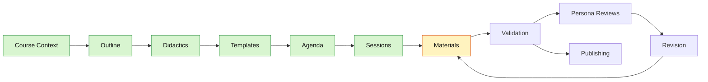

<!--
color: <span style="display:inline-block;width:1.5rem;height:1.5rem;background-color:@0;border:1px solid #ccc;border-radius:2px;vertical-align:middle;"></span> `@0`

import: https://raw.githubusercontent.com/liaScript/mermaid_template/master/README.md

@style
.dashboard {
  margin: 1.5rem 0 2rem;
  padding: 1rem;
  border: 1px solid #d7e0ea;
  border-radius: 8px;
  background: #f8fafc;
}

.dashboard-grid {
  display: flex;
  flex-wrap: wrap;
  gap: 1rem;
}

.dashboard-card {
  flex: 1 1 260px;
  min-width: 240px;
  padding: 1rem;
  border: 1px solid #d7e0ea;
  border-radius: 8px;
  background: #ffffff;
}

.dashboard-card-wide {
  flex-basis: 100%;
}

.dashboard-status {
  display: inline-block;
  padding: 0.18rem 0.5rem;
  border-radius: 999px;
  font-weight: 700;
}

.dashboard-status-done { background: #d8f5d0; color: #1b5e20; }
.dashboard-status-current { background: #fff3bf; color: #7a4d00; }
.dashboard-status-blocked { background: #ffe3e3; color: #8a1f1f; }

.dashboard table {
  width: 100%;
  border-collapse: collapse;
}

.dashboard th,
.dashboard td {
  padding: 0.35rem 0.45rem;
  border-bottom: 1px solid #e5edf5;
  text-align: left;
}

@media (max-width: 600px) {
  .dashboard-card {
    flex-basis: 100%;
    min-width: 0;
  }
}
@end
-->

# NIS2 Ready

## Dashboard

<article class="dashboard">

_Generated from the project sections below. Do not edit manually._

<div class="dashboard-grid">

<div class="dashboard-card">

### Current State

__Current step:__ <span class="dashboard-status dashboard-status-current">Materials in progress</span>

__Course validation:__ <span class="dashboard-status dashboard-status-blocked">not run</span>

__Sessions complete:__ 0 / 6 (2 skeletons, 1 material drafted)

__Last updated:__ 2026-07-04

</div>

<div class="dashboard-card">

### Next Commands

1. `:promote-session 2 exercise` (draft full material for Unit 2's skeleton)
2. `:create-session 3 exercise` (next unit skeleton — "The 10 Measures You Actually Need")
3. `:validate-course 1 lecture` (spot-check Unit 1's material before drafting more)

</div>

<div class="dashboard-card">

### Quality State

<!-- data-type="none" -->
| Area | State |
| --- | --- |
| Course context | <span class="dashboard-status dashboard-status-done">done</span> |
| Templates | <span class="dashboard-status dashboard-status-done">done</span> |
| Materials | <span class="dashboard-status dashboard-status-current">1 / 6 (2 skeletons)</span> |
| Course validation | <span class="dashboard-status dashboard-status-blocked">not run</span> |
| Persona reviews | <span class="dashboard-status dashboard-status-current">optional</span> |

</div>

<div class="dashboard-card dashboard-card-wide">

### Workflow Map



</div>

<div class="dashboard-card dashboard-card-wide">

### Session Progress

| # | Title | Type | Skeleton | Material | Done |
|---|-------|------|----------|----------|------|
| 1 | Welcome & Why NIS2 Matters | lecture | ✅ | ✅ | ❌ |
| 2 | Are You in Scope? Essential vs. Important Entities | exercise | ✅ | ❌ | ❌ |
| 3 | The 10 Measures You Actually Need | exercise | ❌ | ❌ | ❌ |
| 4 | Handling & Reporting Incidents | lecture | ❌ | ❌ | ❌ |
| 5 | Who's Responsible? Governance & Consequences | lecture | ❌ | ❌ | ❌ |
| 6 | Your NIS2 Readiness Score | exercise | ❌ | ❌ | ❌ |

</div>

<div class="dashboard-card">

### Open Blockers

None — Unit 1 has full material drafted (`materials/1-lecture.md`), Unit 2 has a skeleton only. Units 3–6 still need `:create-session`. No `:validate-course` run yet. Logo not yet generated (`:create-logo`).

</div>

<div class="dashboard-card">

### Quick Links

[Course Context](#course-context) · [Outline](#outline) · [Didactics](#didactics) · [Visual Identity](#visual-identity) · [Templates](#templates) · [Agenda](#agenda) · [Sessions](#sessions) · [Validation](#validation)

</div>

</div>
</article>

---

## Course Context

* __Course Type:__
  1. Type: self-paced
  2. Working Title: NIS2 Ready — Cybersecurity Compliance for Public Administration & Critical Infrastructure

* __Terminology:__
  1. sessions-called: unit
  2. lectures-called: module

* __Course Profile:__
  1. Persona type: coach
  2. Agenda required: yes
  3. Pacing: learner-driven
  4. Assessment defaults: self-check quizzes

* __Conventions & Standards:__
  1. Language: en
  2. Tone: formal
  3. Person: you
  4. Accessibility: required

* __LiaScript conventions:__
  - Knowledge checks: native quiz syntax (single/multi-choice, text, matrix) — no template needed
  - Tables: native Markdown tables — no template needed
  - Checklists: native multi-choice (`[[X]]`) or survey-matrix syntax — no template needed
  - Videos: native `!?[title](url)` embedding — no template needed
  - Diagrams: Mermaid template (already imported), see `## Templates` → `### Mermaid`
  - Interactive calculator (e.g. "NIS2 Readiness Score"): native reactive `<script input=... output=...>` pattern, see `## Templates` → `### Reactive JavaScript Inputs`; `<lia-chart>` charting confirmed to work natively (no extra import)
  - No further template imports needed at this time
  - Fixed heading depth for all materials: `#` Course Title (once) → `##` Chapter (new slide) → `###` Section (bare, no container needed) → `####` Subsection, always wrapped in `<section>…</section>` (belongs to its `###` Section). No headings deeper than `####` are used in this course. See corrected rule in `data/liascript-cheat-sheet.md` → "Additional Rule: Subheadings within a Slide".

* __Additional Notes:__
  - Primary source material: EU Directive (EU) 2022/2555 (NIS2), German Official Journal text at `data/cybersichert.pdf` (73 pages, 9 chapters, 46 articles, Annex I/II sector lists) — use as the authoritative legal reference when drafting Outline/Didactics/Sessions
  - Target audience and exact scope (e.g. IT/security staff vs. management vs. mixed) not yet defined — clarify in `:create-outline`

---

## Outline

* __Title:__
  NIS2 Ready — Cybersecurity Compliance for Public Administration & Critical Infrastructure

* __Target Audience:__
  Employees across ministries, public administrations, and critical-infrastructure organizations (energy, health, digital infrastructure, transport, etc.) that fall under the EU NIS2 Directive — a mixed audience of decision-makers, IT/security staff, and general employees, with no deep technical or legal background assumed.

* __Time Commitment:__
  ~4–6 hours total, split into short self-paced units (20–40 min each) that fit around daily work.

* __Abstract:__
  This course introduces the EU NIS2 Directive (2022/2555) and translates its legal requirements into practical, actionable guidance for public-sector and critical-infrastructure organizations. Learners explore why NIS2 exists, whether their organization is affected, what concrete cybersecurity measures it requires, how to handle and report incidents, and what happens if obligations are ignored. Through interactive scenarios, checklists, and diagrams, the course turns a dense legal text into a confident, practical understanding — enabling participants to act, not just comply on paper.

* __Learning Objectives:__
  1. Determine whether your organization or role falls under NIS2 as an "essential" or "important" entity, based on the sector criteria in Art. 2–3 and Annexes I–II.
  2. Explain the core cybersecurity risk-management measures required by Art. 21 (the 10-point catalogue) and translate them into concrete actions for your own area of responsibility.
  3. Apply the incident-reporting process and timeline (Art. 23) to a realistic incident scenario — knowing what to report, to whom, and by when.
  4. Assess the governance and management-liability implications of NIS2 (Art. 20), including the consequences of non-compliance (sanctions, Art. 32–34).
  5. Use a self-assessment checklist to evaluate your own organization's current NIS2 readiness.

---

## Didactics

* __Didactic Concept:__
  Modular, learner-driven units built around a fixed rhythm: Hook (a realistic ministry/critical-infrastructure scenario) → Example → Explanation (tied back to the actual article text) → Task/Checklist → Self-Check Quiz. Scaffolding follows a "relevance first, detail second" principle — each unit opens by establishing why it matters before going into specifics. Error culture is low-stakes: quizzes are for self-diagnosis, not grading; nobody "passes" or "fails," mistakes are treated as part of learning.

* __Professor Persona:__
  Mika Reinhardt — a cybersecurity compliance coach who has spent the last decade helping public administrations and infrastructure operators across Europe translate EU regulation into everyday practice. Not a lawyer, not a hacker — someone who sits between IT, legal, and leadership, and specializes in making dense directives make sense to people who aren't specialists. Speaks with calm, practical confidence, favors concrete examples over legalese, and treats every learner as capable of understanding this material without being talked down to.

* __Teaching Style:__
  practical + conversational (mixed). Shows up in the material as: direct "you" address, real-world scenarios instead of abstract legal language, short punchy framing sentences followed by structured explanations, legal/technical terms always paraphrased in plain language before being named, and a general refusal to hide behind jargon.

* __Course Type:__
  self-learning, modular. Fully learner-driven — no live sessions; learners control pace and can reorder units within the suggested sequence, and each unit is self-contained enough to stand alone.

* __Difficulty Level:__
  beginner. No prior technical or legal background assumed; every concept and term is introduced from scratch. Later units apply these concepts to realistic compliance scenarios (e.g. incident reporting, self-assessment), so complexity builds gently but ends at genuinely practical, applied understanding — not just definitions.

* __Persona Voice Sample:__
  "Let's be honest — nobody wakes up excited to read a 46-article EU directive. So we won't. Instead, we'll start with one question: does NIS2 actually apply to you? Once we've answered that, everything else gets a lot less abstract — it stops being 'the law' and starts being 'the five things my team needs to check before Friday.' I'll show you where the real risk sits, not just where the paperwork sits."

* __Recurring Case Examples:__
  A small recurring cast of fictional organizations, reused opportunistically across units rather than one continuously-escalating story — chosen to preserve familiarity/continuity without breaking the "self-contained, reorderable unit" requirement from `## Course Context`. Each unit's hook must re-establish the organization in 1–2 sentences (name, sector, one relevant fact) before using it — no unit may assume a learner has seen a previous unit's scenario or outcome.
  1. __Stadtverwaltung Nordholm__ — a mid-size German municipal administration (public-sector, Annex I). Used for governance/liability and general "does this apply to us" framing. Appears in Unit 1 (hook) and Unit 5 (governance & liability).
  2. __Nordholm Nahverkehr__ — the city's regional public-transport operator, a subsidiary of Stadtverwaltung Nordholm (transport sector, Annex I). Its medium size makes it a good borderline case for essential-vs-important thresholds. Used in Unit 2 (scope classification).
  3. __Klinikum Ostheide__ — a regional hospital network (health sector, Annex I), unrelated to the Nordholm city entities. Used in Unit 3 (Art. 21 risk-management measures, concrete IT/OT environment) and Unit 4 (incident handling & reporting, high-stakes timeline).
  Unit 6 (Readiness Score) is learner-facing and personal — it does not need a fictional org; it may optionally reference Stadtverwaltung Nordholm's tally alongside the learner's own live inputs as a worked example.

---

## Visual Identity

* __Logo Generation Guidelines:__
  1. Style: modern, minimalist, geometric
  2. Format: flat design, scalable (must work as a favicon)
  3. Elements: a stylized shield combined with a circular ring of small connected nodes, subtly evoking the 12 EU stars without reproducing the official EU emblem — signals security + networked infrastructure + EU context
  4. Mood: professional, trustworthy, approachable — not cold corporate blue without warmth
  5. Additional notes: avoid literal/official EU emblem reproduction; the stars motif is an evocation, not a copy

* __Default Logo Prompt Base:__
  "A modern, minimalist flat-design logo combining a subtle shield silhouette with a circular ring of small connected nodes evoking the EU stars motif, in deep EU blue (#003399) with a single gold (#FFCC00) accent, clean geometric lines, scalable vector style, professional and trustworthy, no text."

* __Logo Color Palette:__
  1. Primary: @color(#003399) — EU Blue
  2. Secondary: @color(#336FB5) — Lighter Institutional Blue
  3. Accent: @color(#FFCC00) — EU Gold
  4. Background: @color(#F5F7FA) — Off-White

* __Color Usage:__
  - Primary: Main logo elements, headings
  - Secondary: Supporting elements, borders, secondary UI
  - Accent: Sparingly — highlights, stars motif, CTAs (not body text; contrast on white is too weak for accessible text)
  - Background: Canvas, backgrounds

* __Course Image Generation Guidelines:__
  1. Visual style: flat/geometric illustration — no photorealism, no "hoodie hacker" cliché
  2. Color scheme: EU blue + gold accents on neutral background
  3. Composition: rule-of-thirds, clear, uncluttered
  4. Lighting: soft, natural
  5. Mood: educational, professional, approachable
  6. In-image text language: English

* __Default Image Prompt Base:__
  "A flat, geometric illustration of public-sector employees collaboratively reviewing a digital security checklist in a modern government office, EU blue and gold accent color scheme, soft neutral background, rule-of-thirds composition, soft natural lighting, professional and approachable educational mood, clean vector illustration style."

* __Image Specifications:__
  - Aspect ratio: 16:9 (course images), 1:1 (icons/logo)
  - Resolution: 1600×900 minimum for course images
  - Format: PNG (transparency where needed), SVG for logo/icons
  - Accessibility: every image requires meaningful alt text

* __Image Consistency Rules:__
  1. Color palette: reuse the logo color palette across all images
  2. Style: flat/geometric illustration throughout, no mixing with photorealism
  3. Characters: if depicting people, keep consistent flat-illustration character style, diverse representation of public-sector/critical-infrastructure staff
  4. Icons: consistent outline icon set
  5. Typography in images: Inter/IBM Plex Sans only
  6. Spacing: consistent padding/margins across generated assets
  7. Background: consistent off-white/neutral treatment

* __Website Color Palette:__
  1. Primary: @color(#003399) — headings, section headers, primary UI elements
  2. Accent: @color(#FFCC00) — highlights, call-to-action, important elements
  3. Text: @color(#1B2733) — main body text
  4. Background: @color(#F5F7FA) — page background
  5. Surface: @color(#FFFFFF) — content boxes, cards

* __Typography:__
  1. Headings: Inter or IBM Plex Sans
  2. Body: Inter or IBM Plex Sans
  3. Monospace (article references, code): IBM Plex Mono

* __Example Prompts:__
  1. Logo: "A modern, minimalist flat-design logo combining a subtle shield silhouette with a circular ring of small connected nodes evoking the EU stars motif, in deep EU blue (#003399) with a single gold (#FFCC00) accent, clean geometric lines, scalable vector style, professional and trustworthy, no text."
  2. Course image: "A flat, geometric illustration of public-sector employees collaboratively reviewing a digital security checklist in a modern government office, EU blue and gold accent color scheme, soft neutral background, rule-of-thirds composition, soft natural lighting, professional and approachable educational mood, clean vector illustration style."
  3. Diagram: "A clean flat-style infographic showing the NIS2 incident-reporting timeline (24h early warning → 72h notification → 1 month final report), EU blue timeline bar with gold accent milestone markers, minimalist icons, high-contrast accessible colors, English labels."

---

## Templates

_Managed by `:manage-templates` from `templates/course-templates.yaml`._

LiaScript templates used by this project are imported in the main metadata header at the top of `journal.md` and should also be imported in any standalone material file that uses their macros.

More community templates can be found at [topics/liascript-template](https://github.com/topics/liascript-template). When a useful template is selected, add its `import:` line to the project header, document it here, and use the same import in materials that need the template.

### Mermaid

* __Import:__
  `https://raw.githubusercontent.com/liaScript/mermaid_template/master/README.md`

* __Header entry:__
  `import: https://raw.githubusercontent.com/liaScript/mermaid_template/master/README.md` (already present in the header)

* __Purpose:__
  Renders Mermaid diagrams (flowcharts, sequence diagrams) for visualizing processes such as the incident-reporting timeline or NIS2 entity-classification logic.

* __Use when:__
  1. Showing a process/decision flow (e.g. "Am I in scope?" classification flow)
  2. Showing the incident-reporting timeline (24h / 72h / 1 month)
  3. Visualizing relationships between NIS2 actors (CSIRTs, competent authorities, Cooperation Group)

* __Basic example:__

  ```mermaid   @mermaid
  graph TD;
      A-->B;
      A-->C;
      B-->D;
      C-->D;
  ```

* __How to use:__
  1. Keep the `import:` line in the main header (already present).
  2. Use a fenced code block tagged ` ```mermaid   @mermaid `.
  3. No per-material import needed as long as the material is embedded in `journal.md`'s rendering context; standalone material files that use Mermaid independently need their own `import:` line.

* __Special usage notes:__
  1. None beyond standard Mermaid syntax.

### Reactive JavaScript Inputs (Interactive Calculators)

* __Import:__
  none — this is native LiaScript `<script>` scripting, no template import required.

* __Header entry:__
  none required.

* __Purpose:__
  Enables interactive, reactive calculators (e.g. a "NIS2 Readiness Score" self-assessment) using linked input widgets (sliders, number fields, dropdowns) and calculation scripts that read each other's live values — confirmed working pattern, verified against `https://raw.githubusercontent.com/andre-dietrich/Lightning-Talk-HackOERthon/refs/heads/main/README.md`.

* __Use when:__
  1. Building the NIS2 Readiness self-assessment (planned — combines several risk-management checklist items into one computed score)
  2. Any other "adjust inputs, see the result update live" exercise

* __Basic example:__

  
  How many of the Art. 21 risk-management measures does your organization already have in place?
  <script input="range" value="0" min="0" max="10" step="1" output="Measures">@input</script> / 10

  <script output="Score">
  let measures = @input(`Measures`)
  Math.round((measures / 10) * 100)
  </script> % readiness
  

* __How to use:__
  1. Declare each input with `<script input="range|number|select" value="..." min="..." max="..." output="Name">@input</script>` (for `select`, add `options="a|b|c"`).
  2. Reference any named input's live value from another script via `` @input(`Name`) ``.
  3. The last expression of a calculation `<script>` block is what gets rendered — return a number, string, or an `"HTML: ..."` string for richer output.

* __Special usage notes:__
  1. `<lia-chart option='...'>` (ECharts-based) is confirmed to work natively — no additional import required. Useful for rendering the NIS2 Readiness Score (or sub-scores) as a bar/gauge chart, as in the reference example.
  2. Keep calculations simple and transparent — this project's didactic style favors trustworthy, inspectable logic over clever code (learners can double-click results in LiaScript to inspect the underlying code).

---

## Agenda

* __Overview:__
  Six self-paced units, roughly four hours total — no filler. We start by figuring out whether NIS2 even applies to you, then walk through what you actually have to do about it, how to handle an incident when one happens, who's on the hook if things go wrong, and finish with a live self-assessment that turns everything you've learned into one number: your NIS2 Readiness Score. Units are learner-driven and can be taken in order or revisited individually.

* __Modules / Sessions:__

  | # | Title | Type | Duration | Learning Objective | Material |
  |---|-------|------|----------|--------------------|----------|
  | 1 | Welcome & Why NIS2 Matters | lecture | 25 min | Sets up course rhythm and stakes; grounds the rest of the course | materials/1-lecture.md |
  | 2 | Are You in Scope? Essential vs. Important Entities | exercise | 40 min | LO1 — determine whether your organization/role falls under NIS2 (Art. 2–3, Annex I–II) | materials/2-exercise.md |
  | 3 | The 10 Measures You Actually Need | exercise | 50 min | LO2 — explain and apply the Art. 21 risk-management measures | materials/3-exercise.md |
  | 4 | Handling & Reporting Incidents | lecture | 45 min | LO3 — apply the incident-reporting process and timeline (Art. 23) | materials/4-lecture.md |
  | 5 | Who's Responsible? Governance & Consequences | lecture | 40 min | LO4 — assess governance/liability implications and sanctions (Art. 20, 32–34) | materials/5-lecture.md |
  | 6 | Your NIS2 Readiness Score | exercise | 35 min | LO5 — use a self-assessment checklist/calculator to evaluate readiness | materials/6-exercise.md |

---

## Sessions

_Managed by `:create-session`, `:promote-session`, `:coauthor-materials`, and `:validate-course`. Overview table first, then one `### {n}. {title}` subsection per session._

| # | Title | Type | Skeleton | Material | Done | Notes |
|---|-------|------|----------|----------|------|-------|
| 1 | Welcome & Why NIS2 Matters | lecture | ✅ | ✅ | ❌ | |
| 2 | Are You in Scope? Essential vs. Important Entities | exercise | ✅ | ❌ | ❌ | |

### 1. Welcome & Why NIS2 Matters

**Type:** lecture

**Summary:**

This unit is the front door to the course. It sets the rhythm every later unit will follow — hook → example → explanation → task/checklist → self-check — and answers the one question that has to land before anything else does: why should a busy public-sector employee care about a 46-article EU directive at all? No article numbers, no scope-checking here yet — that's Unit 2's job. This unit's whole purpose is stakes, orientation, and trust: learners should leave knowing why NIS2 exists, how the course works, and what they're building toward.

Introduces the first recurring case organization, Stadtverwaltung Nordholm (see `## Didactics` → `__Recurring Case Examples:__`), which resurfaces in Unit 5. Because units are self-contained and reorderable, this unit's hook must fully stand on its own — it does not carry an unresolved cliffhanger into later units; any later reappearance of Stadtverwaltung Nordholm re-establishes context independently.

Known stumbling block: learners who assume "this is legal, therefore it's not for me" will disengage in the first two minutes if the hook doesn't feel concrete. The opening scenario has to be specific enough that "not applicable to me" stops being the easy reaction.

**Content:**

1. Opening hook: Stadtverwaltung Nordholm, a mid-size municipal administration, discovers a small, preventable gap that nearly becomes a real incident — self-contained scenario with its own resolution, not a cliffhanger.
   <!-- IMAGE: flat-illustration hero scene of a public-sector team facing a developing incident on screens, EU blue/gold palette -->
2. What NIS2 is, in one plain sentence — no jargon, no article numbers yet.
3. Why it exists: the EU's response to growing digital dependency and cyber risk across essential and important services.
4. Who this course is for, and why "probably not me" is usually the wrong first guess.
5. How the course works: six self-paced units, learner-driven order, the hook → example → explanation → task → self-check rhythm, and that self-check quizzes are for self-diagnosis, never grading.
6. Preview of the destination: by Unit 6, learners compute their own NIS2 Readiness Score.
7. Meet your guide: a short, credible introduction to the course voice (Mika Reinhardt) — practical, not legal, not technical-elitist.

**Activities:**

1. Reflect: name one system or service your organization depends on daily — could its failure become "everyone's problem" within 24 hours?
2. Skim the six-unit agenda and mark which unit you expect to need most for your role.

**References:**

1. Directive (EU) 2022/2555 (NIS2), Recitals 1–10 (context and rationale) — `data/cybersichert.pdf`
2. Course Agenda — `journal.md` → `## Agenda`

#### Images

<section>

#### incident-monday-morning-hero

* __Datei:__ assets/images/incident-monday-morning-hero.png
* __Status:__ generated
* __Alt-Text:__ Flat geometric illustration of a public-sector IT team in a modern municipal office reacting to amber warning indicators on large wall monitors, rendered in EU blue and gold on a neutral background.
* __Prompt:__
  "A flat, geometric vector illustration of a small public-sector IT team in a modern municipal administration office on an early Monday morning, gathered around a desk and looking up at large wall-mounted monitors showing abstract amber warning indicators and a stylized login screen with alert symbols — concerned but composed, not panicked. Diverse public-sector staff in business-casual clothing, consistent flat-illustration character style. Color palette: deep EU blue (#003399) as the dominant color, gold (#FFCC00) accents reserved for the warning indicators and small highlights, off-white neutral background (#F5F7FA). Rule-of-thirds composition with the monitors on the upper-right third and the team on the lower-left third, clear and uncluttered, generous negative space. Soft natural morning lighting, professional and approachable educational mood, no photorealism, no dark 'hooded hacker' imagery, clean minimalist vector style. The image must not contain any readable text; any unavoidable screen elements must be abstract shapes only."


</section>

<section>

#### probably-not-me-staff-lineup

* __Datei:__ assets/images/probably-not-me-staff-lineup.png
* __Status:__ generated
* __Alt-Text:__ Flat geometric illustration of four workers side by side — a public administrator, a nurse, a bus driver, and an IT technician — each with a small blue-and-gold shield symbol floating above them.
* __Prompt:__
  "A flat, geometric vector illustration of four diverse workers standing side by side in a friendly lineup, each representing a sector covered by EU cybersecurity rules: a public administrator holding a document folder, a nurse in scrubs with a stethoscope, a bus driver with a cap, and an IT technician with a laptop. Above each person floats one identical small shield icon in deep EU blue (#003399) with a gold (#FFCC00) outline accent, visually connecting all four. Consistent flat-illustration character style, diverse in gender, age, and ethnicity. Color palette: deep EU blue (#003399) dominant, gold (#FFCC00) accents only on the shields and small details, off-white neutral background (#F5F7FA). Balanced horizontal composition with even spacing and generous negative space, clear and uncluttered. Soft natural lighting, professional, warm, and approachable educational mood, no photorealism, clean minimalist vector style. The image must not contain any readable text."


</section>

<section>

#### mika-reinhardt-guide-portrait

* __Datei:__ assets/images/mika-reinhardt-guide-portrait.png
* __Status:__ generated
* __Alt-Text:__ Flat geometric illustration of Mika Reinhardt, a friendly compliance coach, seated at a desk between a legal codebook, a network diagram, and an organizational chart.
* __Prompt:__
  "A flat, geometric vector illustration of a friendly, approachable compliance coach in their mid-forties, gender-ambiguous, with short practical hair and smart-casual clothing (blazer over a plain shirt, no tie), seated confidently at a tidy desk and facing the viewer with a calm, warm expression. The desk composition places three symbolic objects around the person: a thick legal codebook on one side, a framed abstract network diagram on the wall behind, and a small organizational chart on a stand on the other side — visually positioning the person between law, IT, and leadership. Consistent flat-illustration character style. Color palette: deep EU blue (#003399) dominant, a single gold (#FFCC00) accent (e.g. a pen or a bookmark ribbon), off-white neutral background (#F5F7FA). Rule-of-thirds composition with the person slightly off-center, clear and uncluttered, generous negative space. Soft natural lighting, professional, trustworthy, and approachable educational mood, no photorealism, clean minimalist vector style. The image must not contain any readable text; the book, diagram, and chart must show abstract shapes and lines only."


</section>

### 2. Are You in Scope? Essential vs. Important Entities

**Type:** exercise

**Summary:**

This unit is the exercise-weighted counterpart to Unit 1's orientation: minimal new explanation, most of the time spent applying a two-step test to a real case, then to the learner's own organization. It directly serves LO1 and is the moment the course stops being "about NIS2 in general" and starts being "about you."

Introduces the second recurring case organization, Nordholm Nahverkehr (see `## Didactics` → `__Recurring Case Examples:__`), self-recapped independently of Unit 1 even though it is a subsidiary of Stadtverwaltung Nordholm — no prior-unit knowledge assumed. Its medium size makes it a good borderline example for the essential/important threshold, rather than an obvious large-utility case.

Known stumbling block: learners tend to treat "in scope" as size-only (like GDPR's "big company" intuition). The unit must make the two-step test explicit — sector first (Annex I/II), size second — so learners don't wrongly rule themselves out based on size alone.

**Content:**

1. Hook: Nordholm Nahverkehr, the regional public-transport operator for a mid-size German city, isn't sure whether NIS2 applies to it at all.
2. Plain-language framing: NIS2 scope is sector-driven, not purely a size test — correcting the GDPR-style "big company" assumption.
3. The two-step scope test: (1) is your sector listed in Annex I or Annex II (Art. 2–3)? (2) does your organization meet the size-class thresholds (with named exceptions for entities that are in scope regardless of size)?
   <!-- IMAGE: Mermaid decision-flow diagram walking through the two-step "am I in scope?" test — see `## Templates` → `### Mermaid` -->
4. Essential vs. important entities (Art. 3): what actually differs (supervision regime, ex-ante vs. ex-post oversight) versus what stays the same (the core Art. 21 duties apply to both).
5. Worked example: walk Nordholm Nahverkehr through the two-step test step by step, landing on "important entity" — showing the reasoning, not just the answer.
6. Hand-off: the learner applies the same two-step test to their own organization/role.

**Activities:**

1. Self-classification exercise: apply the two-step test to your own organization using the worksheet, and write down which entity type (essential/important) you land on and why.
2. Reflection: if you're unsure, name the one piece of information (e.g. headcount, turnover, sector classification) you'd need to check with your compliance or IT lead to be certain.

**References:**

1. Directive (EU) 2022/2555 (NIS2), Art. 2–3 and Annexes I–II — `data/cybersichert.pdf`
2. Course Agenda — `journal.md` → `## Agenda`

#### Images

_Filled by `:create-image` (Artist-Agent). One `<section>` per image belonging to this session; rendered by `:generate-image`. Empty until the first image prompt is created._

<!-- One subsection per session, structured like this:

### {{n}}. {{Session Title}}

**Type:** {{lecture | exercise | ...}}

**Summary:**

{{2–4 sentences: focus, didactic intent, known stumbling blocks}}

**Content:**

{{topic list / content skeleton per templates/session-skeleton.yaml}}

**Activities:**

1. {{activity}}

**References:**

1. {{reference}}

After :validate-course in session mode, a `#### Validation Report` block is
inserted at the top of the subsection. After :review-as-persona, a
`#### Persona Reviews` block is appended.
-->

---

## Agents

_Agent-specific project customizations and learner personas._
_Read-scope rule: Coauthor and specialist agents are direct `###` subsections; each agent reads only its assigned subsection._

### Coauthor

* __Customization Status:__ active
* __Role / Persona:__
  Mika Reinhardt — a cybersecurity compliance coach who has spent the last decade helping public administrations and infrastructure operators across Europe translate EU regulation into everyday practice. Not a lawyer, not a hacker — sits between IT, legal, and leadership, making dense directives make sense to non-specialists. Calm, practical confidence; concrete examples over legalese; never talks down to the learner.
* __Behavior Additions:__
  1. Open every unit with a realistic ministry/critical-infrastructure scenario before introducing theory (hook → example → explanation → task/checklist → self-check).
  2. Always paraphrase legal/technical terms in plain language before naming them formally; tie explanations back to the actual NIS2 article text (e.g. "Art. 21").
  3. Treat quizzes and self-checks as low-stakes self-diagnosis, never as pass/fail grading.
  4. Favor tables, diagrams, checklists, and short interactive elements over long prose blocks — production quality matters as much as correctness for this project.
  5. Whenever a point in the material would benefit from a visual, insert an inline placeholder comment `<!-- IMAGE: {short description of the desired image} -->` directly at that point in the LiaScript text (invisible on render, doesn't disrupt slide/heading structure). Do not write a full image prompt inline — the Artist-Agent later turns each placeholder into a concrete prompt via `:create-image {number} {type} {description}` and files it under that session's `#### Images` block. After a co-authoring pass, list all newly inserted placeholders so the instructor can hand them to the Artist-Agent.
  6. Use the recurring case examples defined in `## Didactics` → `__Recurring Case Examples:__` (Stadtverwaltung Nordholm, Nordholm Nahverkehr, Klinikum Ostheide) instead of inventing new fictional organizations. Re-establish the organization in 1–2 sentences in each unit's hook — never assume the learner has seen it in a prior unit.
* __Preferred Interaction Style:__
  practical + conversational (mixed): direct "you" address, short punchy framing sentences followed by structured explanations, no unexplained jargon.
* __Project-Specific Rules:__
  1. Course type is self-paced/modular — each unit must be self-contained and reorderable, no assumption of a live session.
  2. Target difficulty is beginner — no prior technical or legal background assumed, but later units should reach genuinely applied, practical depth (not just definitions).
  3. Language: English, formal tone, "you" address, accessibility required.
  4. Primary source of truth for legal content is the NIS2 directive text at `data/cybersichert.pdf` — verify article references against it rather than general knowledge.
  5. Fixed heading depth, no exceptions: `#` Course Title → `##` Chapter → `###` Section (bare) → `####` Subsection (always inside `<section>…</section>`). Never use `#####` or deeper.
* __Persona Voice Sample:__
  "Let's be honest — nobody wakes up excited to read a 46-article EU directive. So we won't. Instead, we'll start with one question: does NIS2 actually apply to you? Once we've answered that, everything else gets a lot less abstract — it stops being 'the law' and starts being 'the five things my team needs to check before Friday.' I'll show you where the real risk sits, not just where the paperwork sits."
* __Boundaries / Never:__
  1. Do not override base workflow, validation, safety, or epistemic rules.

### Teaching-Agent

* __Customization Status:__ inactive
* __Behavior Additions:__
  1. none
* __Preferred Interaction Style:__
  none
* __Project-Specific Rules:__
  1. none
* __Boundaries / Never:__
  1. Do not override base workflow, validation, safety, or epistemic rules.

### Artist-Agent

* __Customization Status:__ inactive
* __Behavior Additions:__
  1. none
* __Preferred Visual Priorities:__
  none
* __Project-Specific Rules:__
  1. none
* __Boundaries / Never:__
  1. Do not override base visual consistency, accessibility, or uncertainty rules.

### Development-Agent

* __Customization Status:__ inactive
* __Behavior Additions:__
  1. none
* __Preferred Publishing Workflow:__
  none
* __Project-Specific Rules:__
  1. none
* __Boundaries / Never:__
  1. Do not override validation gates, git safety, or publishing checks.

### Learner Personas

_Optional — filled by `:create-learner-persona`. One `#### Persona: {icon} {name}` subsection per persona (structure defined in `tasks/create-learner-persona.md`)._

---

## Validation

_Replaced by `:validate-course` (course mode). The `### Latest Validation Summary` below is the authoritative publishing gate — publishing requires `Mode: course` and `Result: PASS`. Per-session reports live in `## Sessions` → `#### Validation Report`, not here._

### Latest Validation Summary

_Not yet run — run `:validate-course`. Format defined in `tasks/validate-course.md`, course mode step 9 (Date, Mode, Course type, Result, findings, recommended actions)._

---

## Analysis Status

_Only used for improve-existing courses — filled by `:analyze-existing`._

---

## Notes Backup

_Appended to by `:save-notes` and `:save-decision` from `templates/note-backup.yaml`._
_Each note is one append-only `### {Type}: {Descriptive Title} ({YYYY-MM-DD})` subsection._

### Decision: Recurring Case Examples Instead Of Single Escalating Story (2026-07-04)

* __Type:__ decision
* __Topic:__ Choice of fictional example organizations used as hooks/examples across units
* __Related:__ Didactics, Sessions (Unit 1)
* __Source:__ chat discussion

* __Context:__
  While drafting Unit 1's skeleton, its hook was written as an unresolved scenario "referenced again in later units." That assumes learners take units in order, which directly contradicts the course's stated design: self-paced, modular, learner-driven units that must each stand alone and be reorderable (`## Course Context`, `## Didactics`).

* __Options considered:__
  1. One recurring company with escalating complexity per unit — strong narrative payoff and low re-orientation cost, but structurally requires linear order; rejected.
  2. Fully distinct example per unit, matched to that unit's theme/sector — fits modularity perfectly and gives sector variety across the mixed audience, but loses continuity and can feel like six unrelated mini-courses.
  3. A small recurring cast (2–3 fictional orgs across sectors), reused opportunistically, each self-recapped in 1–2 sentences per appearance — partial continuity without a hard ordering dependency.

* __Decision:__
  Option 3. Defined three recurring organizations in `## Didactics` → `__Recurring Case Examples:__`: Stadtverwaltung Nordholm (municipal administration), Nordholm Nahverkehr (its transport subsidiary, used for scope-threshold nuance), and Klinikum Ostheide (hospital network, unrelated to the other two). Each is assigned to specific units and must be re-introduced briefly wherever it reappears.

* __Rationale:__
  Preserves the modularity/reorderability requirement while still giving learners some cross-unit familiarity and sector variety matching the mixed target audience (public administration, transport, health).

* __Consequences:__
  1. Unit 1's skeleton was revised to remove the "unresolved, referenced later" cliffhanger language and to name Stadtverwaltung Nordholm explicitly as a self-contained scenario.
  2. Coauthor's `## Agents` → `### Coauthor` behavior additions now instruct reuse of this cast instead of inventing new fictional organizations.
  3. Future `:create-session` and `:coauthor-materials` passes for Units 2–6 must pull the assigned organization from `## Didactics` → `__Recurring Case Examples:__` and re-establish it locally.
