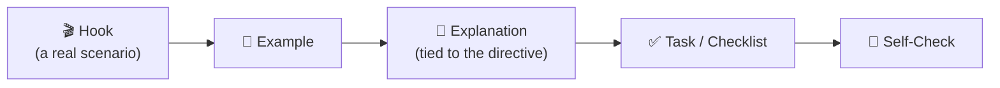

<!--
author:   André Dietrich
email:    LiaScript@web.de
version:  1.1.0
language: en
narrator: English Female

logo:     assets/images/preview-card.png

comment:  Unit 1 of "NIS2 Ready" — orientation to the EU NIS2 Directive and why it matters for public administration and critical infrastructure.

import: https://raw.githubusercontent.com/liaScript/mermaid_template/master/README.md
-->

# Welcome & Why NIS2 Matters

    --{{0}}--
Welcome to NIS2 Ready. In the next twenty-five minutes you'll find out what the NIS2 directive is, why it exists, and why it is very probably more relevant to your daily work than you think. No prior knowledge needed — not in law, and not in IT.

> **NIS2 Ready — Cybersecurity Compliance for Public Administration & Critical Infrastructure**
>
> *Unit 1 of 6 · module · ~25 minutes · no prior legal or technical knowledge required*

## A Monday Morning at Stadtverwaltung Nordholm

    --{{0}}--
Let's not start with the law. Let's start with an ordinary Monday morning in an ordinary city administration — because that is where NIS2 actually lives.

It's 8:14 on a Monday morning at **Stadtverwaltung Nordholm**, a mid-size German municipal administration — citizen services, permits, social benefits, the systems a whole city quietly depends on.

    --{{1}}--
An IT administrator notices a burst of failed login attempts against the citizen-services portal, accumulated overnight. Nothing has broken — yet. But pay attention to what happens next, because it's the important part: nobody in the building can immediately answer three simple questions.

      {{1}}
> [!WARNING] 08:14 — Something odd
> *Is this serious? Who do we tell? How long do we have?*

    --{{2}}--
Three tense hours later: all clear. The cause was a misconfigured monitoring bot, not an attacker — no data exposed, no citizen affected. Everyone goes back to work.

      {{2}}
> [!NOTE] 11:05 — All clear
> False alarm. No data exposed, no citizen affected.

    --{{3}}--
But the real story isn't the false alarm. It's that an ordinary Monday exposed a gap: nobody had a clear answer ready — and if it had been real, those three missing hours could have mattered.

      {{3}}

Sound familiar? If your organization has ever had a *"wait, who's actually responsible for this?"* moment, you're exactly who this course is for.

### Why This Matters Before We Talk Law

    --{{0}}--
You don't need to care about a 46-article EU directive for its own sake. You need exactly three things — and those three things are this whole course, compressed.

**Three things — that's the whole course, compressed:**

1. To know whether NIS2 **applies to you** — *that's Unit 2.*
2. To know what it **actually asks you to do** — *that's Units 3 to 5.*
3. To know what to do **when the Monday-morning moment isn't a false alarm** — *that's Unit 4.*

## What NIS2 Actually Is (And Why It Exists)

    --{{0}}--
Plain language first — the official name can wait a paragraph.

In plain terms: NIS2 is the EU's rulebook for keeping the organizations everyone depends on — hospitals, energy grids, public administrations, transport operators, digital infrastructure — reasonably safe from cyber incidents, and for making sure that when something *does* go wrong, the right people find out fast enough to act.

    --{{1}}--
Now the formal name — once, so you recognize it when you see it in a memo or a headline.

      {{1}}
> [!NOTE] The formal name — once, for recognition
> Officially, this rulebook is **[Directive (EU) 2022/2555](https://eur-lex.europa.eu/eli/dir/2022/2555/oj)**, known as **NIS2** — short for the second *"Network and Information Security"* directive. You'll see that name again, but you'll rarely need to think about it directly: this course translates it into decisions you can actually make.

### Why the EU Stepped In

    --{{0}}--
NIS2 didn't appear out of nowhere. Three developments made a shared European rulebook unavoidable.

- **Digital dependency.** Public services, healthcare, transport, and utilities now run on networked software — there is no "offline fallback" for most of what they do.
- **Cascading failures.** A single weak link in one organization's systems can become a problem for citizens, patients, passengers, or an entire region.
- **Uneven preparedness.** The first NIS directive (2016) was applied very differently across member states — how well an essential service was protected depended on where it happened to be located.

> [!NOTE] By the numbers
> NIS2 — Directive (EU) 2022/2555 — entered into force on 16 January 2023, replacing that original 2016 NIS Directive. EU member states had until 17 October 2024 to transpose it into national law.

### Not Just Another Compliance Checkbox

    --{{0}}--
NIS2 is the EU's answer to that risk: not paperwork for its own sake, but a **shared minimum standard**, so that *"we didn't know we had to check that"* stops being an acceptable excuse — anywhere in the EU, in any sector that people's daily lives depend on.

> [!NOTE] What "shared minimum standard" means in numbers
> Under Art. 34, supervisory authorities can fine **essential entities** up to €10 million or 2% of global annual turnover — whichever is higher. For **important entities**, it's up to €7 million or 1.4% of turnover. *(Unit 5 covers exactly who is personally on the hook for that.)*

> [!TIP] You will never need to read all 46 articles.
> That's this course's job — we've already done that part.

## "Probably Not Me" — The Most Expensive First Guess

    --{{0}}--
Here is the single most common first reaction to NIS2 — and why it's usually wrong.

The most common first reaction to NIS2 is some version of: *"That sounds like something for big tech companies or federal agencies. Probably not me."* It's an understandable guess. It's also, more often than not, wrong — and here's why.

      {{1}}
<section>

    --{{1}}--
Let's take the four most frequent versions of "probably not me." For each one: decide for yourself first — true or false? — then open it to check against reality.

❓ <em>"We're too small for this."</em> — true or false?

**Reality:** NIS2 scope is **sector-first, size second** — some organizations are covered regardless of size. Size alone never rules you out.

❓ <em>"We're public administration, not industry."</em> — true or false?

**Reality:** Public administration is **explicitly among the covered sectors** (Annex I).

❓ <em>"We've outsourced our IT."</em> — true or false?

**Reality:** You can outsource operations. You **cannot outsource responsibility**.

❓ <em>"We're not critical — we just run buses / billing / a clinic ward."</em> — true or false?

**Reality:** Transport, health, water, energy, digital services: precisely the everyday services NIS2 was written to protect.

> [!NOTE] By the numbers
> Annex I and Annex II together list **18 sectors** — 11 "high-criticality" sectors (energy, transport, banking, health, digital infrastructure, public administration, and more) and 7 "other critical" sectors (from postal services to food production to digital marketplaces). That breadth is exactly why "probably not me" fails so often.

</section>

    --{{2}}--
And "in scope" is not only an organizational label. It lands on individual desks — including, quite possibly, yours.

      {{2}}

Three places it lands, specifically:

- **Decision-makers** carry personal governance responsibility for cybersecurity. *Unit 5 covers exactly what that means.*
- **IT and security staff** implement the concrete measures the directive requires. *Unit 3 walks through all ten.*
- **Everyone else** is part of how incidents get noticed and reported — remember who spotted the odd logins in Nordholm. *Unit 4 shows how that chain works.*

    --{{3}}--
To be clear: whether NIS2 applies to your organization is not a matter of gut feeling. It's a precise, checkable question — and the next unit gives you the test.

      {{3}}
> [!IMPORTANT] "Probably not me" is a guess. Unit 2 replaces it with a test.
> Whether NIS2 applies to your organization is a **precise, checkable question** — sector first, size second. Unit 2 walks you through that two-step test on a real borderline case. Until then, treat "probably not me" as unverified.

## How This Course Works

    --{{0}}--
This course is built to fit around your actual job — not the other way around. Four things to know before you continue.

- **Six self-paced units**, roughly four to six hours total, in units of 20–40 minutes each.
- **You control the order.** Every unit is self-contained — take them in sequence, or jump straight to the one your role needs most.
- **Every unit follows the same rhythm** — in fact, you're inside it right now: this unit opened with a scenario, not a legal definition.
- **Self-checks are for you, not for a grade.** Nobody passes or fails this course. A "wrong" answer is useful information, not a problem.

### The Rhythm Every Unit Follows

    --{{0}}--
Every unit runs through the same five beats: a real scenario first, then an example, then the explanation behind it, then a short task or checklist, and finally a quick self-check.

### Your Path Through the Course

    --{{0}}--
Here is the full path. Note the last column — every unit ends with something concrete in your hands, and Unit 6 turns all of it into a single number: your personal NIS2 Readiness Score.

| #   | Unit                                                | Type     | ~Time  | You leave with…                                                       |
| --- | --------------------------------------------------- | -------- | ------ | --------------------------------------------------------------------- |
| 1   | Welcome & Why NIS2 Matters                          | module   | 25 min | orientation, stakes, and the course rhythm                             |
| 2   | Are You in Scope? Essential vs. Important Entities  | exercise | 40 min | your organization's classification — and the reasoning behind it       |
| 3   | The 10 Measures You Actually Need                   | exercise | 50 min | the measures catalogue, mapped to your own area of responsibility      |
| 4   | Handling & Reporting Incidents                      | module   | 45 min | the reporting timeline, applied to a realistic incident                |
| 5   | Who's Responsible? Governance & Consequences        | module   | 40 min | clarity on who is personally on the hook — and for what                |
| 6   | Your NIS2 Readiness Score                           | exercise | 35 min | a computed readiness score from your own self-assessment               |

> [!TIP] The destination is concrete.
> By the end of Unit 6 you'll have your own **NIS2 Readiness Score** — built from a short self-assessment you fill in as you go, not from theory.

### Meet Your Guide

    --{{0}}--
One more introduction before you go: me.\
I'm Mika Reinhardt. I've spent the last decade helping public administrations and critical-infrastructure operators across Europe make sense of exactly this kind of directive. I'm not a lawyer, and I'm not a hacker — I sit between IT, legal, and leadership, and my job is making dense regulation make sense to people who have a full-time job that isn't "reading EU directives."
!?

> I'll always show you where the real risk sits, not just where the paperwork sits.
>
> -- Mika Reinhardt

## Wrap-Up & Self-Check

    --{{0}}--
Before you move on, three quick questions and two reflections. None of it is graded — it's a private gut-check, just for you.

**1. What is NIS2, in one sentence?**

- [(X)] An EU directive requiring essential and important organizations to manage cybersecurity risk and report major incidents
- [( )] A voluntary EU certification you can apply for if you want a security badge
- [( )] A German-only cybersecurity law limited to federal ministries

> Not graded. If you picked something else, no problem — re-read the plain-language paraphrase in *What NIS2 Actually Is* and move on whenever it clicks.

**2. You answer a self-check question in this course incorrectly. What happens?**

- [( )] The unit counts as failed and must be repeated
- [( )] The result is reported to your training coordinator
- [(X)] Nothing — it's private self-diagnosis, and a useful signal about what to re-read

> Exactly — and this isn't a throwaway question. It's the working contract for the whole course: mistakes here are information, not failure.

**3. Which of these organizations could plausibly fall under NIS2? Select all that apply.**

- [[X]] A mid-size municipal administration
- [[X]] A regional hospital network
- [[X]] A city's public-transport operator
- [[ ]] Only large multinational tech companies

> All three real organizations are plausible candidates — because NIS2 scope is **sector-first, size second**, not a "big tech only" rule. Whether each one is *actually* in scope is exactly the test you'll learn in Unit 2.

### Before You Go: Two Quick Reflections

Name one system or service your organization depends on daily. Could its failure become "everyone's problem" within 24 hours?

[[___ ___]]

Which unit do you expect to need most for your role? (No wrong answer — this just helps you plan your path through the course.)

[[scope]] Unit 2 — Are You in Scope?
[[measures]] Unit 3 — The 10 Measures You Actually Need
[[incidents]] Unit 4 — Handling & Reporting Incidents
[[governance]] Unit 5 — Governance & Consequences
[[readiness]] Unit 6 — Your NIS2 Readiness Score

### Up Next

**Unit 2 — Are You in Scope? Essential vs. Important Entities.** We'll meet Nordholm Nahverkehr, the city's transport operator, and figure out — using a simple two-step test — exactly where the line is, and which side of it you're on.

**References:**

1. [Directive (EU) 2022/2555 (NIS2)](https://eur-lex.europa.eu/eli/dir/2022/2555/oj), Recitals 1–10 (context and rationale) — full German text in `data/cybersichert.pdf`
2. Directive (EU) 2022/2555 (NIS2), Art. 34 (administrative fines), Art. 41 (transposition deadline), Art. 45 (entry into force) — `data/cybersichert.pdf`
3. Directive (EU) 2022/2555 (NIS2), Annexes I–II (sector lists) — `data/cybersichert.pdf`
4. Course Agenda — `journal.md` → `## Agenda`
