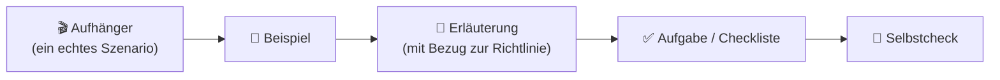

<!--
author:   André Dietrich
email:    LiaScript@web.de
version:  2.1.0
language: de
narrator: Deutsch Female

edit:     true

logo:     assets/images/preview-card.png

comment:  Einheit 1 von „NIS2 Ready" — Orientierung zur EU-NIS2-Richtlinie und warum sie für öffentliche Verwaltung und kritische Infrastruktur wichtig ist.

import: https://raw.githubusercontent.com/liaScript/mermaid_template/master/README.md
-->

# Willkommen & Warum NIS2 wichtig ist

    --{{0}}--
Willkommen bei NIS2 Ready. In den nächsten fünfundzwanzig Minuten erfahren Sie, was die NIS2-Richtlinie ist, warum es sie gibt und warum sie höchstwahrscheinlich relevanter für Ihre tägliche Arbeit ist, als Sie denken. Es sind keine Vorkenntnisse nötig — weder im Recht noch in der IT.
!?

> **NIS2 Ready — Cybersicherheits-Compliance für die öffentliche Verwaltung & kritische Infrastruktur**
>
> *Einheit 1 von 6 · Modul · ~25 Minuten · keine juristischen oder technischen Vorkenntnisse erforderlich*

## Ein Montagmorgen in der Stadtverwaltung Nordholm

    --{{0}}--
Fangen wir nicht mit dem Gesetz an. Fangen wir mit einem ganz gewöhnlichen Montagmorgen in einer ganz gewöhnlichen Stadtverwaltung an — denn genau dort lebt NIS2 tatsächlich.
!?

Es ist 8:14 Uhr an einem Montagmorgen in der **Stadtverwaltung Nordholm**, einer mittelgroßen deutschen Kommunalverwaltung — Bürgerservice, Genehmigungen, Sozialleistungen, all die Systeme, auf die sich eine ganze Stadt still und leise verlässt.

    --{{1}}--
Eine IT-Administratorin bemerkt eine Häufung fehlgeschlagener Anmeldeversuche gegen das Bürgerportal, die sich über Nacht angesammelt haben. Es ist noch nichts kaputtgegangen — noch nicht. Aber achten Sie darauf, was als Nächstes passiert, denn das ist der entscheidende Punkt: Niemand im Gebäude kann drei einfache Fragen sofort beantworten.
!?

      {{1}}
> [!WARNING] 08:14 — Etwas Seltsames
> *Ist das ernst? Wen informieren wir? Wie viel Zeit haben wir?*

    --{{2}}--
Drei angespannte Stunden später: Entwarnung. Die Ursache war ein falsch konfigurierter Überwachungs-Bot, kein Angreifer — keine Daten offengelegt, kein Bürger betroffen. Alle machen sich wieder an die Arbeit.
!?

      {{2}}
> [!NOTE] 11:05 — Entwarnung
> Fehlalarm. Keine Daten offengelegt, kein Bürger betroffen.

    --{{3}}--
Aber die eigentliche Geschichte ist nicht der Fehlalarm. Es ist die Tatsache, dass ein ganz gewöhnlicher Montag eine Lücke offenbart hat: Niemand hatte eine klare Antwort parat — und wäre es echt gewesen, hätten diese drei fehlenden Stunden entscheidend sein können.
!?

      {{3}}

Kommt Ihnen das bekannt vor? Wenn Ihre Organisation je einen *"Moment, wer ist dafür eigentlich zuständig?"*-Moment hatte, dann sind Sie genau die Person, für die dieser Kurs gemacht ist.

### Warum das wichtig ist, bevor wir über das Gesetz sprechen

    --{{0}}--
Sie müssen sich nicht um ihrer selbst willen für eine EU-Richtlinie mit 46 Artikeln interessieren. Sie brauchen genau drei Dinge — und diese drei Dinge sind dieser ganze Kurs in komprimierter Form.
!?

**Drei Dinge — das ist der ganze Kurs, komprimiert:**

1. Zu wissen, ob NIS2 **auf Sie zutrifft** — *das ist Einheit 2.*
2. Zu wissen, was es **tatsächlich von Ihnen verlangt** — *das sind die Einheiten 3 bis 5.*
3. Zu wissen, was zu tun ist, **wenn der Montagmorgen-Moment kein Fehlalarm ist** — *das ist Einheit 4.*

## Was NIS2 tatsächlich ist (und warum es das gibt)

    --{{0}}--
Zuerst in klaren Worten — der offizielle Name kann einen Absatz warten.
!?

Einfach ausgedrückt: NIS2 ist das Regelwerk der EU, um jene Organisationen, auf die sich alle verlassen — Krankenhäuser, Energienetze, öffentliche Verwaltungen, Verkehrsbetreiber, digitale Infrastruktur — angemessen vor Cybervorfällen zu schützen und sicherzustellen, dass, wenn doch etwas schiefgeht, die richtigen Leute schnell genug davon erfahren, um handeln zu können.

    --{{1}}--
Nun der formelle Name — einmal, damit Sie ihn wiedererkennen, wenn Sie ihm in einem Vermerk oder einer Schlagzeile begegnen.
!?

      {{1}}
> [!NOTE] Der formelle Name — einmal, zum Wiedererkennen
> Offiziell heißt dieses Regelwerk **[Richtlinie (EU) 2022/2555](https://eur-lex.europa.eu/eli/dir/2022/2555/oj)**, bekannt als **NIS2** — kurz für die zweite *"Network and Information Security"*-Richtlinie. Sie werden diesen Namen wiedersehen, aber Sie werden selten direkt über ihn nachdenken müssen: Dieser Kurs übersetzt ihn in Entscheidungen, die Sie tatsächlich treffen können.

### Warum die EU eingegriffen hat

    --{{0}}--
NIS2 ist nicht aus dem Nichts entstanden. Drei Entwicklungen machten ein gemeinsames europäisches Regelwerk unumgänglich.
!?

- **Digitale Abhängigkeit.** Öffentliche Dienste, Gesundheitswesen, Verkehr und Versorgungsbetriebe laufen heute auf vernetzter Software — für das meiste, was sie tun, gibt es keine "Offline-Rückfallebene".
- **Kaskadierende Ausfälle.** Ein einziges schwaches Glied in den Systemen einer Organisation kann zu einem Problem für Bürgerinnen und Bürger, Patienten, Fahrgäste oder eine ganze Region werden.
- **Ungleiche Vorbereitung.** Die erste NIS-Richtlinie (2016) wurde in den Mitgliedstaaten sehr unterschiedlich angewandt — wie gut ein wesentlicher Dienst geschützt war, hing davon ab, wo er sich zufällig befand.

> [!NOTE] In Zahlen
> NIS2 — Richtlinie (EU) 2022/2555 — trat am 16. Januar 2023 in Kraft und ersetzte die ursprüngliche NIS-Richtlinie von 2016. Die EU-Mitgliedstaaten hatten bis zum 17. Oktober 2024 Zeit, sie in nationales Recht umzusetzen.

### Nicht nur ein weiteres Compliance-Kästchen zum Abhaken

    --{{0}}--
NIS2 ist die Antwort der EU auf dieses Risiko: kein Papierkram um seiner selbst willen, sondern ein **gemeinsamer Mindeststandard**, damit *"wir wussten nicht, dass wir das prüfen müssen"* aufhört, eine akzeptable Ausrede zu sein — überall in der EU, in jedem Sektor, von dem das tägliche Leben der Menschen abhängt.
!?

> [!NOTE] Was "gemeinsamer Mindeststandard" in Zahlen bedeutet
> Nach Art. 34 können Aufsichtsbehörden gegen **wesentliche Einrichtungen** Geldbußen von bis zu 10 Millionen € oder 2 % des weltweiten Jahresumsatzes verhängen — je nachdem, welcher Betrag höher ist. Für **wichtige Einrichtungen** sind es bis zu 7 Millionen € oder 1,4 % des Umsatzes. *(Einheit 5 behandelt genau, wer dafür persönlich in der Verantwortung steht.)*

> [!TIP] Sie werden niemals alle 46 Artikel lesen müssen.
> Das ist die Aufgabe dieses Kurses — diesen Teil haben wir bereits für Sie erledigt.

## "Wahrscheinlich nicht ich" — die teuerste erste Vermutung

    --{{0}}--
Hier ist die mit Abstand häufigste erste Reaktion auf NIS2 — und warum sie meistens falsch ist.
!?

Die häufigste erste Reaktion auf NIS2 ist eine Variante von: *"Das klingt nach etwas für große Tech-Konzerne oder Bundesbehörden. Wahrscheinlich nicht ich."* Das ist eine verständliche Vermutung. Sie ist aber, häufiger als nicht, falsch — und hier ist der Grund.

      {{1}}
<section>

    --{{1}}--
Nehmen wir die vier häufigsten Varianten von "wahrscheinlich nicht ich". Entscheiden Sie bei jeder zuerst selbst — wahr oder falsch? — und öffnen Sie sie dann, um sie mit der Realität abzugleichen.
!?

❓ <em>"Wir sind zu klein dafür."</em> — wahr oder falsch?

**Realität:** Der Anwendungsbereich von NIS2 ist **zuerst sektor-, dann größenbasiert** — manche Organisationen sind unabhängig von ihrer Größe erfasst. Die Größe allein schließt Sie nie aus.

❓ <em>"Wir sind öffentliche Verwaltung, keine Industrie."</em> — wahr oder falsch?

**Realität:** Die öffentliche Verwaltung gehört **ausdrücklich zu den erfassten Sektoren** (Anhang I).

❓ <em>"Wir haben unsere IT ausgelagert."</em> — wahr oder falsch?

**Realität:** Sie können den Betrieb auslagern. Sie **können die Verantwortung nicht auslagern**.

❓ <em>"Wir sind nicht kritisch — wir betreiben nur Busse / die Abrechnung / eine Klinikstation."</em> — wahr oder falsch?

**Realität:** Verkehr, Gesundheit, Wasser, Energie, digitale Dienste: genau die alltäglichen Dienste, zu deren Schutz NIS2 geschrieben wurde.

> [!NOTE] In Zahlen
> Anhang I und Anhang II führen zusammen **18 Sektoren** auf — 11 Sektoren "hoher Kritikalität" (Energie, Verkehr, Bankwesen, Gesundheit, digitale Infrastruktur, öffentliche Verwaltung und mehr) und 7 "sonstige kritische" Sektoren (von Postdiensten über die Lebensmittelproduktion bis zu digitalen Marktplätzen). Genau diese Breite ist der Grund, warum "wahrscheinlich nicht ich" so oft danebenliegt.

</section>

    --{{2}}--
Und "im Anwendungsbereich" ist nicht nur eine Kennzeichnung für die Organisation. Sie landet auf einzelnen Schreibtischen — durchaus möglicherweise auch auf Ihrem.
!?

      {{2}}

Konkret an drei Stellen landet sie:

- **Entscheidungsträger** tragen persönliche Governance-Verantwortung für die Cybersicherheit. *Einheit 5 behandelt genau, was das bedeutet.*
- **IT- und Sicherheitspersonal** setzt die konkreten Maßnahmen um, die die Richtlinie verlangt. *Einheit 3 geht alle zehn durch.*
- **Alle anderen** sind Teil davon, wie Vorfälle bemerkt und gemeldet werden — erinnern Sie sich, wer in Nordholm die seltsamen Anmeldungen entdeckt hat. *Einheit 4 zeigt, wie diese Kette funktioniert.*

    --{{3}}--
Um es klar zu sagen: Ob NIS2 auf Ihre Organisation zutrifft, ist keine Frage des Bauchgefühls. Es ist eine präzise, überprüfbare Frage — und die nächste Einheit gibt Ihnen den Test dazu an die Hand.
!?

      {{3}}
> [!IMPORTANT] "Wahrscheinlich nicht ich" ist eine Vermutung. Einheit 2 ersetzt sie durch einen Test.
> Ob NIS2 auf Ihre Organisation zutrifft, ist eine **präzise, überprüfbare Frage** — zuerst der Sektor, dann die Größe. Einheit 2 führt Sie anhand eines echten Grenzfalls durch diesen zweistufigen Test. Behandeln Sie bis dahin "wahrscheinlich nicht ich" als ungeprüft.

## Wie dieser Kurs funktioniert

    --{{0}}--
Dieser Kurs ist so aufgebaut, dass er sich um Ihre eigentliche Arbeit herum fügt — nicht umgekehrt. Vier Dinge sollten Sie wissen, bevor Sie fortfahren.
!?

- **Sechs Einheiten im eigenen Tempo**, insgesamt etwa vier bis sechs Stunden, in Einheiten von jeweils 20–40 Minuten.
- **Sie bestimmen die Reihenfolge.** Jede Einheit ist in sich abgeschlossen — nehmen Sie sie der Reihe nach, oder springen Sie direkt zu der, die Ihre Rolle am dringendsten braucht.
- **Jede Einheit folgt demselben Rhythmus** — tatsächlich stecken Sie gerade mittendrin: Diese Einheit begann mit einem Szenario, nicht mit einer juristischen Definition.
- **Selbstchecks sind für Sie, nicht für eine Note.** Niemand besteht oder fällt durch diesen Kurs. Eine "falsche" Antwort ist nützliche Information, kein Problem.

### Der Rhythmus, dem jede Einheit folgt

    --{{0}}--
Jede Einheit durchläuft dieselben fünf Takte: zuerst ein echtes Szenario, dann ein Beispiel, dann die dahinterstehende Erklärung, dann eine kurze Aufgabe oder Checkliste und schließlich ein schneller Selbstcheck.
!?

### Ihr Weg durch den Kurs

    --{{0}}--
Hier ist der vollständige Weg. Beachten Sie die letzte Spalte — jede Einheit endet mit etwas Konkretem in Ihren Händen, und Einheit 6 macht daraus eine einzige Zahl: Ihren persönlichen NIS2-Readiness-Score.
!?

| #   | Einheit                                              | Typ      | ~Zeit  | Sie gehen daraus hervor mit…                                          |
| --- | --------------------------------------------------- | -------- | ------ | --------------------------------------------------------------------- |
| 1   | Willkommen & Warum NIS2 wichtig ist                 | Modul    | 25 Min | Orientierung, Bedeutung und dem Rhythmus des Kurses                    |
| 2   | Sind Sie im Anwendungsbereich? Wesentliche vs. wichtige Einrichtungen | Übung | 40 Min | der Einstufung Ihrer Organisation — und der Begründung dahinter |
| 3   | Die 10 Maßnahmen, die Sie wirklich brauchen         | Übung    | 50 Min | dem Maßnahmenkatalog, zugeordnet zu Ihrem eigenen Verantwortungsbereich |
| 4   | Sicherheitsvorfälle behandeln & melden              | Modul    | 45 Min | dem Melde-Zeitplan, angewandt auf einen realistischen Vorfall          |
| 5   | Wer ist verantwortlich? Governance & Konsequenzen   | Modul    | 40 Min | Klarheit darüber, wer persönlich in der Verantwortung steht — und wofür |
| 6   | Ihr NIS2-Readiness-Score                            | Übung    | 35 Min | einem berechneten Readiness-Score aus Ihrer eigenen Selbsteinschätzung  |

> [!TIP] Das Ziel ist konkret.
> Am Ende von Einheit 6 haben Sie Ihren eigenen **NIS2-Readiness-Score** — erstellt aus einer kurzen Selbsteinschätzung, die Sie unterwegs ausfüllen, nicht aus der Theorie.

### Lernen Sie Ihre Begleitung kennen

    --{{0}}--
Noch eine Vorstellung, bevor es losgeht: ich.\
Ich bin Mika Reinhardt. Ich habe das letzte Jahrzehnt damit verbracht, öffentlichen Verwaltungen und Betreibern kritischer Infrastruktur in ganz Europa dabei zu helfen, genau diese Art von Richtlinie zu verstehen. Ich bin keine Juristin und keine Hackerin — ich sitze zwischen IT, Recht und Leitung, und meine Aufgabe ist es, dichte Regelungen für Menschen verständlich zu machen, die einen Vollzeitjob haben, der nicht "EU-Richtlinien lesen" heißt.
!?

> Ich zeige Ihnen immer, wo das echte Risiko sitzt, nicht nur, wo der Papierkram sitzt.
>
> -- Mika Reinhardt

## Zusammenfassung & Selbstcheck

    --{{0}}--
Bevor Sie weitergehen, drei kurze Fragen und zwei Reflexionen. Nichts davon wird benotet — es ist ein privater Selbstcheck, nur für Sie.
!?

> Nicht benotet. Wenn Sie etwas anderes gewählt haben, ist das kein Problem — lesen Sie die klarsprachliche Umschreibung in *Was NIS2 tatsächlich ist* noch einmal und gehen Sie weiter, sobald es einleuchtet.

**1. Was ist NIS2, in einem Satz?**

- [(X)] Eine EU-Richtlinie, die wesentliche und wichtige Organisationen verpflichtet, Cybersicherheitsrisiken zu managen und erhebliche Sicherheitsvorfälle zu melden
- [( )] Eine freiwillige EU-Zertifizierung, die Sie beantragen können, wenn Sie ein Sicherheits-Siegel möchten
- [( )] Ein rein deutsches Cybersicherheitsgesetz, das auf Bundesministerien beschränkt ist

**2. Sie beantworten eine Selbstcheck-Frage in diesem Kurs falsch. Was passiert?**

- [( )] Die Einheit gilt als nicht bestanden und muss wiederholt werden
- [( )] Das Ergebnis wird an Ihre Fortbildungskoordination gemeldet
- [(X)] Nichts — es ist eine private Selbstdiagnose und ein nützlicher Hinweis darauf, was Sie noch einmal lesen sollten
****************

> Genau — und das ist keine belanglose Frage. Es ist der Arbeitsvertrag für den gesamten Kurs: Fehler sind hier Information, kein Versagen.

****************

**3. Welche dieser Organisationen könnten plausibel unter NIS2 fallen? Wählen Sie alle Zutreffenden aus.**

- [[X]] Eine mittelgroße Kommunalverwaltung
- [[X]] Ein regionaler Krankenhausverbund
- [[X]] Der öffentliche Nahverkehrsbetreiber einer Stadt
- [[ ]] Nur große multinationale Tech-Konzerne
****************

> Alle drei realen Organisationen sind plausible Kandidaten — denn der Anwendungsbereich von NIS2 ist **zuerst sektor-, dann größenbasiert**, keine "nur für große Tech-Konzerne"-Regel. Ob jede von ihnen *tatsächlich* im Anwendungsbereich liegt, ist genau der Test, den Sie in Einheit 2 lernen.

****************

### Bevor Sie gehen: Zwei kurze Reflexionen

Nennen Sie ein System oder einen Dienst, auf den sich Ihre Organisation täglich verlässt. Könnte dessen Ausfall innerhalb von 24 Stunden zu "eines jeden Problem" werden?

[[___ ___]]

Welche Einheit werden Sie für Ihre Rolle voraussichtlich am meisten brauchen? (Keine falsche Antwort — das hilft Ihnen nur, Ihren Weg durch den Kurs zu planen.)

[[scope]] Einheit 2 — Sind Sie im Anwendungsbereich?
[[measures]] Einheit 3 — Die 10 Maßnahmen, die Sie wirklich brauchen
[[incidents]] Einheit 4 — Sicherheitsvorfälle behandeln & melden
[[governance]] Einheit 5 — Governance & Konsequenzen
[[readiness]] Einheit 6 — Ihr NIS2-Readiness-Score

### Als Nächstes

**Einheit 2 — Sind Sie im Anwendungsbereich? Wesentliche vs. wichtige Einrichtungen.** Wir lernen Nordholm Nahverkehr kennen, den Verkehrsbetreiber der Stadt, und finden — anhand eines einfachen zweistufigen Tests — genau heraus, wo die Grenze verläuft und auf welcher Seite von ihr Sie stehen.

**Quellen:**

1. [Richtlinie (EU) 2022/2555 (NIS2)](https://eur-lex.europa.eu/eli/dir/2022/2555/oj), Erwägungsgründe 1–10 (Kontext und Begründung) — vollständiger deutscher Text in `data/cybersichert.pdf`
2. Richtlinie (EU) 2022/2555 (NIS2), Art. 34 (Geldbußen), Art. 41 (Umsetzungsfrist), Art. 45 (Inkrafttreten) — `data/cybersichert.pdf`
3. Richtlinie (EU) 2022/2555 (NIS2), Anhänge I–II (Sektorenlisten) — `data/cybersichert.pdf`
4. Kurs-Agenda — `journal.md` → `## Agenda`
