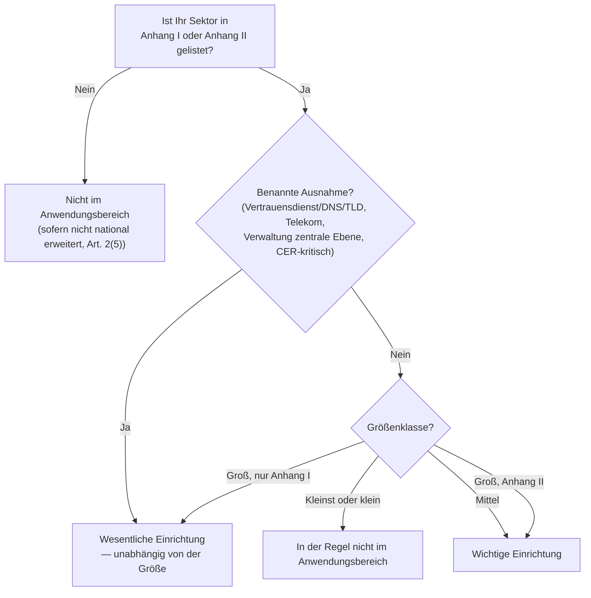

<!--
author:   André Dietrich
email:    LiaScript@web.de
version:  3.0.0
language: de
narrator: Deutsch Female

edit:     true

logo:     assets/images/preview-card.png

comment:  Einheit 2 von „NIS2 Ready" — der zweistufige Test zum Anwendungsbereich (erst Sektor, dann Größe) zur Einordnung als wesentliche vs. wichtige Einrichtung unter NIS2.

import: https://raw.githubusercontent.com/liaScript/mermaid_template/master/README.md
-->

# Sind Sie im Anwendungsbereich? Wesentliche vs. wichtige Einrichtungen

    --{{0}}--
Willkommen zurück. In den nächsten vierzig Minuten lesen Sie weniger und wenden dafür deutlich mehr an: Am Ende wissen Sie genau, ob NIS2 auf Ihre Organisation zutrifft — und wenn ja, welcher der beiden Kategorien sie zuzuordnen ist. Der größte Teil Ihrer Zeit fließt heute in ein einziges Arbeitsblatt, nicht in neue Theorie.

> **NIS2 Ready — Cybersecurity-Compliance für die öffentliche Verwaltung und kritische Infrastrukturen**
>
> *Einheit 2 von 6 · Übung · ~40 Minuten · baut auf der Orientierung aus Einheit 1 auf, steht aber für sich*

## Nordholm Nahverkehr ist sich nicht sicher

    --{{0}}--
Lernen wir die Fallorganisation dieser Einheit kennen, bevor wir uns dem Test widmen.

**Nordholm Nahverkehr** ist der regionale Nahverkehrsbetreiber der Stadt Nordholm — Busse und Straßenbahnen, rund 180 Beschäftigte, eine Tochtergesellschaft der Stadtverwaltung Nordholm (der Kommunalverwaltung aus Einheit 1, wobei beide vollständig getrennte IT-Systeme betreiben).

    --{{1}}--
Die Ausgangslage: Die neue IT-Leitung hat gerade ein Memo über NIS2 gelesen und die naheliegende Frage gestellt — *trifft das überhaupt auf uns zu?* — und drei unterschiedliche Vermutungen von drei Kolleginnen und Kollegen erhalten.

      {{1}}
> [!WARNING] Drei Vermutungen, drei verschiedene Antworten
> *„Dafür sind wir nicht groß genug." · „Wir sind Verkehr, nicht Energie — das ist etwas für Versorgungsunternehmen." · „Unsere IT ist größtenteils ausgelagert, das ist also Sache des Dienstleisters."*

    --{{2}}--
Alle drei Vermutungen klingen plausibel. Alle drei sind genau die Art von Vermutung, vor der Einheit 1 gewarnt hat. Diese Einheit ersetzt das Raten durch einen Test, den Sie tatsächlich durchführen können — an Nordholm Nahverkehr und anschließend an Ihrer eigenen Organisation.

### Zuerst der Sektor, dann die Größe — nicht umgekehrt

    --{{0}}--
Wenn Sie schon mit der DSGVO zu tun hatten, lautet Ihr Instinkt vermutlich „große Organisation = erfasst, kleine Organisation = ausgenommen". Lassen Sie diesen Instinkt hier los — NIS2 funktioniert anders.

> [!IMPORTANT] Den DSGVO-Instinkt korrigieren
> Der NIS2-Anwendungsbereich ist **zuerst sektorgetrieben, erst danach größengetrieben**. Ein kleiner Verkehrsbetreiber in einem gelisteten Sektor kann im Anwendungsbereich liegen, während ein viel größeres Unternehmen außerhalb jedes gelisteten Sektors es nicht ist. Die Größe kommt erst ins Spiel, *nachdem* die Sektorfrage geklärt ist.

## Der zweistufige Anwendungsbereichs-Test

    --{{0}}--
Hier ist er — der gesamte Test, um den diese Einheit gebaut ist. Zwei Fragen, in dieser Reihenfolge gestellt. Halten Sie die Reihenfolge nicht ein, erhalten Sie die falsche Antwort.

1. **Ist Ihr Sektor in Anhang I oder Anhang II** der Richtlinie gelistet?
2. **Wenn ja** — erfüllt Ihre Organisation den Größenschwellenwert (mit einer kurzen Liste benannter Ausnahmen, die unabhängig von der Größe gelten)?

### Schritt 1 — Ist Ihr Sektor gelistet?

    --{{0}}--
Achtzehn Sektoren, aufgeteilt auf zwei Anhänge. Sektoren nach Anhang I bergen die Möglichkeit des Status „wesentlich"; Sektoren nach Anhang II sind stets höchstens „wichtig".

**Anhang I — 11 Sektoren mit „hoher Kritikalität":**

| #  | Sektor                                                                             |
|----|------------------------------------------------------------------------------------|
| 1  | Energie (Elektrizität, Fernwärme/-kälte, Öl, Gas, Wasserstoff)                     |
| 2  | Verkehr (Luft, Schiene, Wasser, Straße)                                            |
| 3  | Bankwesen                                                                          |
| 4  | Finanzmarktinfrastrukturen                                                         |
| 5  | Gesundheit                                                                         |
| 6  | Trinkwasser                                                                        |
| 7  | Abwasser                                                                           |
| 8  | Digitale Infrastruktur (Cloud, Rechenzentren, DNS, TLD-Registries, CDNs, Telekom…)|
| 9  | Verwaltung von IKT-Diensten (B2B — Managed-Service-/Sicherheitsdienstleister)      |
| 10 | Öffentliche Verwaltung (zentrale und regionale Ebene)                              |
| 11 | Weltraum                                                                           |

**Anhang II — 7 „sonstige kritische" Sektoren:**

| # | Sektor |
| --- | --- |
| 1 | Post- und Kurierdienste |
| 2 | Abfallbewirtschaftung |
| 3 | Chemie (Herstellung, Produktion, Vertrieb) |
| 4 | Lebensmittel (Produktion, Verarbeitung, Großhandel) |
| 5 | Verarbeitendes Gewerbe/Herstellung von Waren (Medizinprodukte, Elektronik, elektrische Ausrüstungen, Maschinen, Kraftfahrzeuge, sonstige Fahrzeuge) |
| 6 | Anbieter digitaler Dienste (Online-Marktplätze, Suchmaschinen, soziale Netzwerke) |
| 7 | Forschung (Forschungseinrichtungen) |

> [!NOTE] Nicht gelistet heißt nicht immer „sicher"
> Einige Mitgliedstaaten dehnen NIS2 auf zusätzliche Fälle aus — die kommunale Verwaltung sowie Bildungs-/Forschungseinrichtungen, die kritische Forschung betreiben, sind beide ausdrücklich als nationale Opt-ins zugelassen (Art. 2(5)). Wenn Sie unsicher sind, ist „nicht gelistet" eine gute Ausgangsannahme, klären Sie dies aber mit Ihrer Compliance-Leitung, statt es als endgültig zu behandeln.

### Schritt 2 — Erfüllt Ihre Organisation den Größenschwellenwert?

    --{{0}}--
Wenn Schritt 1 mit „ja" endete, entscheidet Schritt 2, welcher der beiden Kategorien Sie zuzuordnen sind — und ob die Größe für Ihren Fall überhaupt eine Rolle spielt.

| Größenklasse             | Beschäftigtenzahl | Jahresumsatz    (Mio. €) | Bilanzsumme (Mio. €) |
|--------------------------|------------------:|-------------------------:|---------------------:|
| Kleinstunternehmen       |          $ 10 < $ |                        2 |                    2 |
| Kleines Unternehmen      |          $ 50 < $ |                       10 |                   10 |
| Mittleres Unternehmen    |         $ 250 < $ |                       50 |                   43 |
| Großes Unternehmen (überschreitet mittleres) | $ 250 <=$ |               50 |                   43 |

    --{{1}}--
Als Faustregel: Mittlere und große Organisationen in einem gelisteten Sektor liegen im Anwendungsbereich. Kleinst- und kleine Organisationen in der Regel nicht — *in der Regel*, denn eine kurze Liste benannter Ausnahmen setzt die Größe vollständig außer Kraft.

      {{1}}
> [!NOTE] Benannte Ausnahmen — im Anwendungsbereich unabhängig vom Größentest
> Eine Handvoll Einrichtungstypen sind erfasst, egal wie klein sie sind, oder gelten selbst bei nur „mittlerer" Größe als **wesentliche Einrichtung**: qualifizierte Vertrauensdiensteanbieter, Namensregister der Domänen oberster Stufe (TLD) und DNS-Diensteanbieter; Anbieter öffentlicher elektronischer Kommunikationsnetze oder -dienste; Einrichtungen der öffentlichen Verwaltung der **zentralen** Ebene; sowie Einrichtungen, die gesondert als kritische Infrastruktur nach der EU-Richtlinie zur Resilienz kritischer Einrichtungen (CER) eingestuft sind. Wenn keine davon auf Ihre Organisation zutrifft, gilt der gewöhnliche Test „erst Sektor, dann Größe".

    --{{2}}--
Hier der gesamte Test als ein Ablauf — zuerst der Sektor, dann die Größe, mit den benannten Ausnahmen, die abzweigen.

      {{2}}

## Wesentlich oder wichtig? Was sich tatsächlich unterscheidet

    --{{0}}--
Beide Bezeichnungen klingen ähnlich, und das aus gutem Grund: Das, was Sie *tun müssen*, ändert sich zwischen ihnen kaum. Was sich ändert, ist, wie genau Sie beaufsichtigt werden.

- **Gleich für beide:** Die zehn Risikomanagementmaßnahmen nach Art. 21 und die Meldepflichten nach Art. 23 gelten gleichermaßen — „wichtig" statt „wesentlich" zu sein bedeutet keinen leichteren Pflichtenkatalog. *Einheit 3 geht alle zehn Maßnahmen im Detail durch.*
- **Unterschiedlich: das Aufsichtsregime.** Wesentliche Einrichtungen unterliegen einer proaktiven Ex-ante-Aufsicht — routinemäßige Inspektionen und Prüfungen, unabhängig davon, ob etwas schiefgelaufen ist. Wichtige Einrichtungen unterliegen nur einer reaktiven Ex-post-Aufsicht, ausgelöst durch Hinweise auf ein Problem. *Einheit 5 behandelt genau, wie jedes Regime in der Praxis aussieht und wer persönlich in der Verantwortung steht.*

> [!TIP] Wenn Sie sich eine Sache aus diesem Abschnitt merken
> „Wichtig" ist nicht „NIS2 light". Es sind dieselben Pflichten, nur anders kontrolliert.

## Durchgerechnetes Beispiel: Nordholm Nahverkehr durch den Test führen

    --{{0}}--
Führen wir den tatsächlichen Test an Nordholm Nahverkehr durch — dieselben zwei Schritte, die Sie anschließend an Ihrer eigenen Organisation anwenden werden.

**Schritt 1 — Sektor.** Nordholm Nahverkehr betreibt sowohl Busse als auch Straßenbahnen. Das Straßenbahnnetz ordnet den Betrieb eindeutig Anhang I, Sektor 2 (Verkehr → Schiene) als Eisenbahnverkehrsunternehmen zu. *Dieses Detail ist wichtig: Ein reiner Busbetreiber bewegt sich unter manchen nationalen Umsetzungen in echt graueren Bereichen — genau deshalb hält die Wahl eines Betreibers, der auch Schiene betreibt, dieses Beispiel sauber, und deshalb lohnt es sich für Ihren eigenen Fall, „die genaue Dienstdefinition zu prüfen, nicht die alltägliche Berufsbezeichnung" im Kopf zu behalten.*

    --{{1}}--
Sektorfrage: **geklärt, ja.** Jetzt die Größe.

      {{1}}
**Schritt 2 — Größe.** Rund 180 Beschäftigte, ein Jahresumsatz deutlich unter 50 Mio. € — das ist ein **mittleres** Unternehmen. Keine der benannten Ausnahmen greift: Nordholm Nahverkehr ist kein Telekommunikationsanbieter, kein Vertrauensdiensteanbieter, keine Einrichtung der zentralen Ebene und keine nach CER eingestufte kritische Einrichtung.

    --{{2}}--
Sektor: Anhang I, Verkehr. Größe: mittel, keine benannte Ausnahme. Folgen Sie dem Flussdiagramm, dann gibt es nur ein Ergebnis, bei dem man landet.

      {{2}}
> [!NOTE] Ergebnis: Wichtige Einrichtung
> Nordholm Nahverkehr ist eine **wichtige Einrichtung** nach NIS2 — im Anwendungsbereich, den vollständigen Maßnahmen nach Art. 21 und den Meldepflichten nach Art. 23 unterworfen, unter dem reaktiven (Ex-post-)Aufsichtsregime. Nicht „wesentlich", nicht „ausgenommen" — eine echte, konkrete, überprüfbare Antwort statt dreier konkurrierender Vermutungen.

## Wenden Sie es nun auf Ihre eigene Organisation an

    --{{0}}--
Dieselben zwei Schritte, ausgerichtet auf Ihre eigene Organisation oder den Teil davon, für den Sie verantwortlich sind. Arbeiten Sie ehrlich durch — eine unklare Antwort ist hier ein nützliches Ergebnis, kein gescheitertes.

**Schritt 1 — Sektorprüfung.** Kreuzen Sie alles an, was einen Dienst, den Ihre Organisation erbringt, plausibel beschreibt:

[[ ]] Energie, Verkehr, Bankwesen oder Finanzmarktinfrastrukturen
[[ ]] Gesundheit, Trinkwasser oder Abwasser
[[ ]] Digitale Infrastruktur, Cloud-/Rechenzentrumsdienste oder Managed IT-/Sicherheitsdienste (B2B)
[[ ]] Öffentliche Verwaltung (zentrale oder regionale Ebene)
[[ ]] Weltraum
[[ ]] Post/Kurier, Abfallbewirtschaftung, Chemie oder Lebensmittelproduktion/-vertrieb
[[ ]] Verarbeitendes Gewerbe (Medizinprodukte, Elektronik, elektrische Ausrüstungen, Maschinen, Fahrzeuge)
[[ ]] Digitale Dienste (Marktplatz, Suchmaschine, soziale Plattform) oder Forschung
[[ ]] Nichts davon, soweit ich das beurteilen kann

**Schritt 2 — Größenprüfung.** Was beschreibt Ihre Organisation am besten?

[[ ]] Kleinst oder klein (unter 50 Beschäftigte und unter 10 Mio. € Umsatz)
[[ ]] Mittel (50–249 Beschäftigte oder 10–50 Mio. € Umsatz)
[[ ]] Groß (250+ Beschäftigte oder über 50 Mio. € Umsatz und 43 Mio. € Bilanzsumme)
[[ ]] Eine der benannten Ausnahmen greift (Telekom, Vertrauensdienst, DNS/TLD, Verwaltung zentrale Ebene oder CER-kritisch) unabhängig von der Größe

**Ihre vorläufige Einstufung, basierend auf dem Flussdiagramm oben:**

[[___ ___ ___]]

**Eine Information, die Sie mit Ihrer Compliance- oder IT-Leitung bestätigen müssten, um sicher zu sein:**

[[___ ___ ___]]

> [!NOTE] Nicht benotet und nicht endgültig
> Dieses Arbeitsblatt liefert Ihnen eine *begründete erste Antwort*, keine offizielle Feststellung — die Mitgliedstaaten führen das maßgebliche Verzeichnis der wesentlichen/wichtigen Einrichtungen. Behandeln Sie ein selbstbewusstes „wichtig"- oder „wesentlich"-Ergebnis hier als „das gilt es zu überprüfen", nicht als eingetragene Einstufung.

## Zusammenfassung & Selbstkontrolle

    --{{0}}--
Drei kurze Fragen, nicht benotet, nur ein Bauchgefühl-Check zum zweistufigen Test selbst.

**1. Was ist die richtige Reihenfolge des NIS2-Anwendungsbereichs-Tests?**

- [(X)] Zuerst den Sektor prüfen (Anhang I/II), dann die Größe
- [( )] Zuerst die Größe prüfen, dann den Sektor
- [( )] Es gibt keine feste Reihenfolge — beides funktioniert
******

> Die Reihenfolge ist entscheidend: Die Größe wird erst relevant, wenn die Sektorfrage geklärt ist. Die Reihenfolge umzukehren ist genau der DSGVO-artige Fehler, den diese Einheit korrigiert.

******

**2. Eine Organisation ist mittelgroß, tätig in einem Anhang-II-Sektor und ohne benannte Ausnahme. Was ist sie?**

- [( )] Wesentliche Einrichtung
- [(X)] Wichtige Einrichtung
- [( )] Außerhalb des Anwendungsbereichs
******

> Einrichtungen nach Anhang II sind stets höchstens „wichtig" — große Unternehmen nach Anhang I (oder eine benannte Ausnahme) sind die einzigen Wege zu „wesentlich".

******

**3. Richtig oder falsch: „wichtige" Einrichtungen haben weniger Cybersicherheitspflichten als „wesentliche" Einrichtungen.**

- [( )] Richtig
- [(X)] Falsch
******

> Falsch — die Maßnahmen nach Art. 21 und die Meldepflichten nach Art. 23 sind für beide gleich. Nur das Aufsichtsregime unterscheidet sich (proaktiv vs. reaktiv).

******

### Bevor Sie gehen: Eine kurze Reflexion

Denken Sie an Ihre Antworten zu Schritt 1/Schritt 2 oben zurück. Wenn Ihr vorläufiges Ergebnis „wichtig" oder „wesentlich" lautete — wer in Ihrer Organisation könnte Ihnen das diese Woche tatsächlich bestätigen?

[[___ ___ ___]]

### Als Nächstes

**Einheit 3 — Die 10 Maßnahmen, die Sie wirklich brauchen.** Jetzt, da Sie wissen, *ob* NIS2 zutrifft, treffen wir das Klinikum Ostheide, ein regionales Krankenhausnetz, und übertragen die zehn Maßnahmen nach Art. 21 auf eine reale IT/OT-Umgebung — und dann auf Ihre.

**Quellen:**

1. Richtlinie (EU) 2022/2555 (NIS2), Art. 2–3 (Anwendungsbereich, wesentliche und wichtige Einrichtungen) — `data/cybersichert.pdf`
2. Richtlinie (EU) 2022/2555 (NIS2), Anhänge I–II (Sektorlisten) — `data/cybersichert.pdf`
3. Empfehlung 2003/361/EG der Kommission (KMU-Größenklassendefinitionen, referenziert durch NIS2 Art. 2(1)) — Volltext unter `data/cybersichert.pdf`, Anmerkung zu Art. 2
4. Kursagenda — `journal.md` → `## Agenda`
