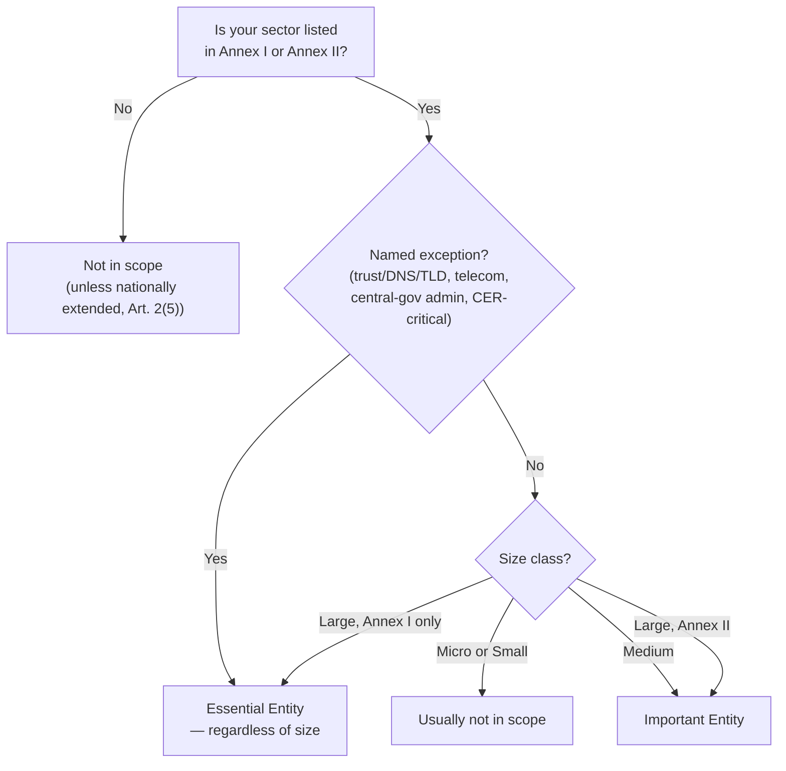

<!--
author:   André Dietrich
email:    LiaScript@web.de
version:  1.0.0
language: en
narrator: English Female

logo:     assets/images/preview-card.png

comment:  Unit 2 of "NIS2 Ready" — the two-step scope test (sector, then size) for determining essential vs. important entity status under NIS2.

import: https://raw.githubusercontent.com/liaScript/mermaid_template/master/README.md
-->

# Are You in Scope? Essential vs. Important Entities

    --{{0}}--
Welcome back. In the next forty minutes, you'll do less reading and a lot more applying: by the end, you'll know exactly whether NIS2 applies to your organization — and to which of two categories. Most of your time today goes to one worksheet, not new theory.

> **NIS2 Ready — Cybersecurity Compliance for Public Administration & Critical Infrastructure**
>
> *Unit 2 of 6 · exercise · ~40 minutes · builds on Unit 1's orientation, but stands on its own*

## Nordholm Nahverkehr Isn't Sure

    --{{0}}--
Let's meet this unit's case organization before we meet the test.

**Nordholm Nahverkehr** is the regional public-transport operator for the city of Nordholm — buses and trams, about 180 staff, a subsidiary of Stadtverwaltung Nordholm (the municipal administration from Unit 1, though the two run entirely separate IT systems).

    --{{1}}--
Here's the situation: their new IT lead just read a memo about NIS2 and asked the obvious question — *does this even apply to us?* — and got three different guesses from three colleagues.

      {{1}}
> [!WARNING] Three guesses, three different answers
> *"We're not big enough for this." · "We're transport, not energy — this is for utilities." · "Our IT is mostly outsourced, so it's the vendor's problem."*

    --{{2}}--
All three guesses sound reasonable. All three are exactly the kind of guess Unit 1 warned you about. This unit replaces the guessing with a test you can actually run — on Nordholm Nahverkehr, and then on your own organization.

### Sector First, Size Second — Not the Other Way Around

    --{{0}}--
If you've dealt with GDPR before, your instinct is probably "big organization = covered, small organization = exempt." Drop that instinct here — NIS2 works differently.

> [!IMPORTANT] Correcting the GDPR-style instinct
> NIS2 scope is **sector-driven first, size-driven second**. A small transport operator in a listed sector can be in scope while a much larger company outside any listed sector is not. Size only enters the picture *after* the sector question is settled.

## The Two-Step Scope Test

    --{{0}}--
Here it is — the entire test this unit is built around. Two questions, asked in order. Skip the order and you'll get the wrong answer.

1. **Is your sector listed in Annex I or Annex II** of the directive?
2. **If yes** — does your organization meet the size threshold (with a short list of named exceptions that apply regardless of size)?

### Step 1 — Is Your Sector Listed?

    --{{0}}--
Eighteen sectors, split into two annexes. Annex I sectors carry the possibility of "essential" status; Annex II sectors are always, at most, "important."

**Annex I — 11 "high-criticality" sectors:**

| #  | Sector                                                                             |
|----|------------------------------------------------------------------------------------|
| 1  | Energy (electricity, district heating/cooling, oil, gas, hydrogen)                 |
| 2  | Transport (air, rail, water, road)                                                 |
| 3  | Banking                                                                            |
| 4  | Financial market infrastructure                                                    |
| 5  | Health                                                                             |
| 6  | Drinking water                                                                     |
| 7  | Waste water                                                                        |
| 8  | Digital infrastructure (cloud, data centres, DNS, TLD registries, CDNs, telecoms…) |
| 9  | ICT service management (B2B — managed service/security providers)                  |
| 10 | Public administration (central and regional government)                            |
| 11 | Space                                                                              |

**Annex II — 7 "other critical" sectors:**

| # | Sector |
| --- | --- |
| 1 | Postal and courier services |
| 2 | Waste management |
| 3 | Chemicals (manufacture, production, distribution) |
| 4 | Food (production, processing, wholesale distribution) |
| 5 | Manufacturing (medical devices, electronics, electrical equipment, machinery, motor vehicles, other transport equipment) |
| 6 | Digital providers (online marketplaces, search engines, social networking platforms) |
| 7 | Research organizations |

> [!NOTE] Not listed doesn't always mean "safe"
> A few member states extend NIS2 to additional cases — local-government administration and education/research bodies doing critical research are both explicitly allowed as national opt-ins (Art. 2(5)). If you're unsure, "not listed" is a good default assumption, but confirm with your compliance lead rather than treating it as final.

### Step 2 — Does Your Organization Meet the Size Threshold?

    --{{0}}--
If Step 1 landed on "yes," Step 2 decides which of two categories you're in — and whether size even matters for your case.

| Size class             | Staff headcount | Annual turnover    (million €) | Balance sheet (million €) |
|------------------------|----------------:|-------------------------------:|--------------------------:|
| Micro                  |        $ 10 < $ |                      2 million |                 2 million |
| Small                  |        $ 50 < $ |                     10 million |                10 million |
| Medium                 |       $ 250 < $ |                     50 million |                43 million |
| Large (exceeds medium) |       $ 250 <=$ |                     50 million |                43 million |

    --{{1}}--
As a rule: medium and large organizations in a listed sector are in scope. Micro and small organizations usually are not — *usually*, because a short list of named exceptions overrides size entirely.

      {{1}}
> [!NOTE] Named exceptions — in scope regardless of the size test
> A handful of entity types are covered no matter how small they are, or count as **essential** even at only "medium" size: qualified trust service providers, top-level-domain registries and DNS service providers; providers of public electronic-communications networks or services; public administration entities of **central** government; and entities separately designated as critical infrastructure under the EU's Critical Entities Resilience (CER) Directive. If none of these apply to your organization, the ordinary sector-then-size test governs.

    --{{2}}--
Here's the whole test as one flow — sector first, then size, with the named exceptions branching off.

      {{2}}

## Essential or Important? What Actually Differs

    --{{0}}--
Both labels sound similar, and for good reason: what you're *required to do* barely changes between them. What changes is how closely you're watched.

- **Same for both:** the ten Art. 21 risk-management measures and the Art. 23 incident-reporting duties apply equally — being "important" instead of "essential" is not a lighter set of obligations. *Unit 3 walks through all ten measures in detail.*
- **Different: the supervision regime.** Essential entities face proactive, ex-ante oversight — routine inspections and audits, whether or not anything has gone wrong. Important entities face reactive, ex-post oversight only, triggered by evidence of a problem. *Unit 5 covers exactly what each regime looks like in practice, and who's personally on the hook.*

> [!TIP] If you remember one thing from this section
> "Important" is not "NIS2 lite." It's the same duties, checked differently.

## Worked Example: Walking Nordholm Nahverkehr Through the Test

    --{{0}}--
Let's run the actual test on Nordholm Nahverkehr — the same two steps you'll use on your own organization next.

**Step 1 — Sector.** Nordholm Nahverkehr operates both buses and trams. The tram network puts it squarely under Annex I, Sector 2 (Transport → rail) as a railway undertaking. *This detail matters: a bus-only operator sits in genuinely grayer territory under some national transpositions — which is exactly why picking an operator that also runs rail keeps this worked example clean, and why "check the precise service definition, not the everyday job title" is worth remembering for your own case.*

    --{{1}}--
Sector question: **settled, yes.** Now size.

      {{1}}
**Step 2 — Size.** About 180 staff, annual turnover well under €50 million — that's a **medium**-sized enterprise. None of the named exceptions apply: Nordholm Nahverkehr isn't a telecom provider, a trust service provider, a central-government body, or a CER-designated critical entity.

    --{{2}}--
Sector: Annex I, transport. Size: medium, no named exception. Follow the flowchart, and there's only one place that lands.

      {{2}}
> [!NOTE] Result: Important Entity
> Nordholm Nahverkehr is an **important entity** under NIS2 — in scope, subject to the full Art. 21 measures and Art. 23 reporting duties, under the reactive (ex-post) supervision regime. Not "essential," not "exempt" — a real, specific, checkable answer instead of three competing guesses.

## Now Apply It to Your Own Organization

    --{{0}}--
Same two steps, aimed at your own organization or the part of it you're responsible for. Work through it honestly — an unclear answer here is a useful result, not a failed one.

**Step 1 — Sector check.** Tick anything that plausibly describes a service your organization provides:

[[ ]] Energy, transport, banking, or financial market infrastructure
[[ ]] Health, drinking water, or waste water
[[ ]] Digital infrastructure, cloud/data-centre services, or managed IT/security services (B2B)
[[ ]] Public administration (central or regional government)
[[ ]] Space
[[ ]] Postal/courier, waste management, chemicals, or food production/distribution
[[ ]] Manufacturing (medical devices, electronics, electrical equipment, machinery, vehicles)
[[ ]] Digital services (marketplace, search engine, social platform) or research
[[ ]] None of the above, as far as I can tell

**Step 2 — Size check.** Which best describes your organization?

[[ ]] Micro or small (under 50 staff, and under €10 million turnover)
[[ ]] Medium (50–249 staff, or €10–50 million turnover)
[[ ]] Large (250+ staff, or over €50 million turnover and €43 million balance sheet)
[[ ]] One of the named exceptions applies (telecom, trust service, DNS/TLD, central-government admin, or CER-critical) regardless of size

**Your tentative classification, based on the flowchart above:**

[[___ ___ ___]]

**One piece of information you'd need to confirm with your compliance or IT lead to be certain:**

[[___ ___ ___]]

> [!NOTE] Not graded, and not final
> This worksheet gives you a *reasoned first answer*, not an official determination — member states maintain the authoritative registry of essential/important entities. Treat a confident "important" or "essential" result here as "go verify this," not as a filed classification.

## Wrap-Up & Self-Check

    --{{0}}--
Three quick questions, not graded, just a gut-check on the two-step test itself.

**1. What is the correct order of the NIS2 scope test?**

- [(X)] Check the sector first (Annex I/II), then check size
- [( )] Check size first, then check the sector
- [( )] There is no fixed order — either works
******

> The order matters: size only becomes relevant once the sector question is settled. Reversing it is exactly the GDPR-style mistake this unit corrects.

******

**2. An organization is medium-sized, operates in an Annex II sector, and has no named exception. What is it?**

- [( )] Essential entity
- [(X)] Important entity
- [( )] Out of scope
******

> Annex II entities are always, at most, "important" — Annex I large enterprises (or a named exception) are the only routes to "essential."

******

**3. True or false: "important" entities have fewer cybersecurity obligations than "essential" entities.**

- [( )] True
- [(X)] False
******

> False — the Art. 21 measures and Art. 23 reporting duties are the same for both. Only the supervision regime differs (proactive vs. reactive).

******

### Before You Go: One Quick Reflection

Think back to your Step 1/Step 2 answers above. If your tentative result was "important" or "essential" — who in your organization could actually confirm that for you this week?

[[___ ___ ___]]

### Up Next

**Unit 3 — The 10 Measures You Actually Need.** Now that you know *whether* NIS2 applies, we'll meet Klinikum Ostheide, a regional hospital network, and map the ten Art. 21 measures onto a real IT/OT environment — and then onto yours.

**References:**

1. Directive (EU) 2022/2555 (NIS2), Art. 2–3 (scope, essential and important entities) — `data/cybersichert.pdf`
2. Directive (EU) 2022/2555 (NIS2), Annexes I–II (sector lists) — `data/cybersichert.pdf`
3. Commission Recommendation 2003/361/EC (SME size-class definitions, referenced by NIS2 Art. 2(1)) — full text at `data/cybersichert.pdf`, Art. 2 note
4. Course Agenda — `journal.md` → `## Agenda`
